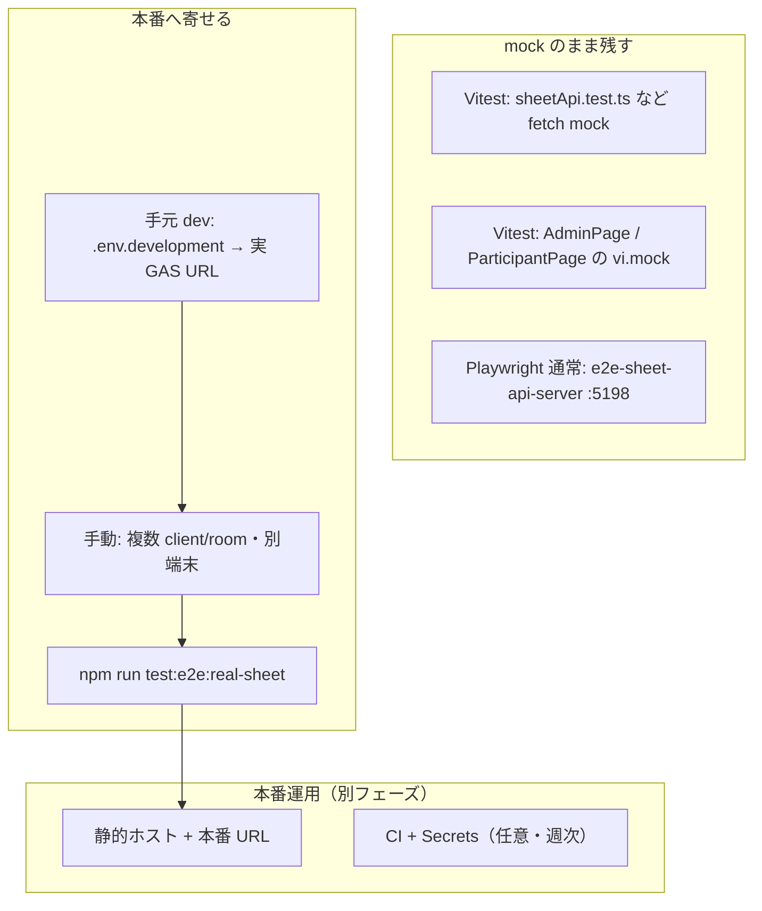
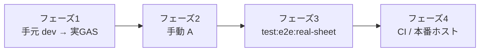

# ExpertEye360 — mock から本番（実 GAS / 実シート）への移行ガイド

**目的**: 開発・テストで mock に依存している箇所を整理し、**何を本番に寄せるか・何は mock のまま残すか・どの順で進めるか**を一冊にまとめる。

**位置づけ**: 手順書（作業メモ）。API 契約の正本は [SPREADSHEET-DATA.md](./SPREADSHEET-DATA.md)、GAS セットアップは [gas/README.md](../gas/README.md)、手動受け入れは [HUMAN-TEST-SPEC.md](./HUMAN-TEST-SPEC.md)、残タスクの受け入れ条件は [REMAINING-IMPLEMENTATION.md](./REMAINING-IMPLEMENTATION.md) §A。

**最終確認日**: 2026-06-04（TDD ハイブリッド方針・フェーズ 1 スモーク追加）

**テストの進め方（正本リンク）**: [TEST-DESIGN.md §2.0.4](./TEST-DESIGN.md#204-機能ごとの実装フロー6-ステップ)

---

## 目次

- [0. 結論（先に読む）](#0-結論先に読む)
- [0.5 テストの進め方（TDD ハイブリッド）](#05-テストの進め方tdd-ハイブリッド)
- [1. mock と本番の定義](#1-mock-と本番の定義)
- [2. レイヤー別 — 移行するか残すか](#2-レイヤー別--移行するか残すか)
- [3. 識別子の対応（mock E2E と GAS デモ）](#3-識別子の対応mock-e2e-と-gas-デモ)
- [4. 移行フェーズ（推奨順）](#4-移行フェーズ推奨順)
- [5. フェーズ 1 — 手元開発を実 GAS にする](#5-フェーズ-1--手元開発を実-gas-にする)
- [6. フェーズ 2 — 手動受け入れ（A ランク）](#6-フェーズ-2--手動受け入れa-ランク)
- [7. フェーズ 3 — 実 GAS の自動テスト（opt-in）](#7-フェーズ-3--実-gas-の自動テストopt-in)
- [8. フェーズ 4 以降 — CI・本番ホスト（任意）](#8-フェーズ-4-以降--cici本番ホスト任意)
- [9. 移行完了の判断基準](#9-移行完了の判断基準)
- [10. よくある失敗と対処](#10-よくある失敗と対処)
- [11. 関連ファイル一覧](#11-関連ファイル一覧)
- [12. 改訂](#12-改訂)

---

## 0. 結論（先に読む）

**全面本番化はまだ早い。** 次の三層を **併用** するのがこのリポジトリの想定である。

1. **Vitest + `fetch` mock** — 速い契約固定（**本番にしない**）
2. **Playwright + Sheet API mock（5198）** — 代表 UI フローの回帰（**デフォルトは mock のまま**）
3. **実 GAS + Google スプレッドシート** — 手元開発の正・リリース前の穴埋め（**今から寄せる対象**）

**今すぐ進めてよいこと** — フェーズ 1（`.env.development` で `sheet` + 実 Web App URL）とフェーズ 2（手動 A チェック）。

**まだ待つこと** — `npm run test:e2e` のデフォルトを実シートに差し替える、mock サーバー削除、PR 毎の実 GAS CI。

**テスト方針** — 全面 TDD（既存機能も先に Red）ではなく、**契約は Vitest mock で固定し、実 GAS で未証明のギャップだけ Red → Green**（[§0.5](#05-テストの進め方tdd-ハイブリッド)）。

---

## 0.5 テストの進め方（TDD ハイブリッド）

本番移行は「新機能の一括 TDD」ではなく、**保存先の差し替え + 未検証リスクの穴埋め**として進める。[TEST-DESIGN.md §2.0.4](./TEST-DESIGN.md#204-機能ごとの実装フロー6-ステップ) の 6 ステップをフェーズごとに適用する。

#### 原則

**既に Green のもの** — `npm test`（Vitest・fetch mock）、`npm run test:e2e`（5198 mock）は **回帰の正**。本番移行中も **常に Green を維持**する。

**全面 Red から書き直さない** — 5 問フロー・入室・PDF ロジックなど、mock / local で固定済みの振る舞いを実 GAS 用に重複実装しない。

**Red → Green を書く対象** — 実 GAS / 実シートで **まだ失敗しうる**項目だけ（[REMAINING-IMPLEMENTATION.md](./REMAINING-IMPLEMENTATION.md) §A の残り、§6 フェーズ 2 以降）。

#### フェーズと 6 ステップの対応

**フェーズ 1（手元 dev → 実 GAS）**

1. **受け入れ条件** — §5.4 の 4 項目（送信が管理者に見える、コード NG 時の UI 等）
2. **振る舞いテスト** — `npm run smoke:phase1-sheet`（settings + `rooms/verify`。API 層のみ）
3. **最小実装** — 両 Web の `.env.development` を `VITE_STORAGE_BACKEND=sheet` + 実 URL に揃える（既存コード変更は原則不要）
4. **単体** — 不要（storage / 画面は既存テストでカバー）
5. **手動** — §5.3 ブラウザ（受講者送信 → 管理者一覧）
6. **リファクタ** — env example の整備のみ

**フェーズ 2（手動 A）**

1. **受け入れ条件** — §6 のチェック 1〜6
2. **振る舞いテスト** — 自動化できる項目はフェーズ 3 へ先送り
3. **手動** — 別端末・複数 room など **A ランクは人間が必須**

**フェーズ 3（実 GAS 自動・opt-in）**

1. **Red** — `e2e/real-sheet-api.spec.ts` または同型に **未カバー 1 件**を追加（例: 研修コード変更後の旧コード拒否）
2. **Green** — GAS / シート側を直す
3. **回帰** — `npm run test:e2e`（mock）と `npm test` が Green のまま

#### TDD と回帰の使い分け（再掲）

**Vitest / mock E2E で既に Green** — **回帰テスト**。本番移行後も毎回 `npm test` / `npm run test:e2e` を実行する。

**実 GAS で未確認のリスク** — **TDD スライス**。1 受け入れ条件 = 1 テスト（`test:e2e:real-sheet` の拡張または手動 A）。

**手元の設定変更のみ** — **スモーク**。`npm run smoke:phase1-sheet`。

---

## 1. mock と本番の定義

#### mock（本書での意味）

ローカルまたはテスト実行時に、**Google スプレッドシート / GAS を経由しない**永続化・API 層。

#### 本番（本書での意味）

**GAS Web App** が **実際のスプレッドシート** を読み書きする経路。開発用デモ client でも「本番経路」と呼ぶ（本番ホスティング済みかどうかとは別）。

#### local（混同注意）

`VITE_STORAGE_BACKEND=local` はブラウザ `localStorage`。**mock でも本番でもない**開発用フォールバック。受講者 5173 と管理者 5174 は別オリジンで共有されない。

---

## 2. レイヤー別 — 移行するか残すか



#### Vitest（`shared/src/**/*.test.ts`）

**方針** — **移行しない**

**理由** — `sheetApi.test.ts` は GAS の内部実装に依存せず、URL・クエリ・JSON 契約だけを固定する。実 GAS を叩くと遅く・不安定・シートを汚す。

**正本** — [TEST-TEMPLATES.md](./TEST-TEMPLATES.md) T3

#### UI 単体（`*.test.tsx` の `vi.mock`）

**方針** — **移行しない**

**理由** — storage / `useAppData` を mock した配線スモーク。結合は E2E または手動で見る。

#### Playwright 通常（`npm run test:e2e`）

**実体** — [scripts/e2e-sheet-api-server.mjs](../scripts/e2e-sheet-api-server.mjs)（`127.0.0.1:5198`）

**設定** — [playwright.config.ts](../playwright.config.ts) が `VITE_SHEET_API_BASE=http://127.0.0.1:5198/exec` で participant / admin を起動

**方針** — **デフォルトは mock のまま**。リグレッション用の高速層として維持。

#### 手元開発（`npm run dev:participant` / `dev:admin`）

**方針** — **実 GAS に移行してよい**（推奨）

**条件** — 両 Web の `.env.development` に `VITE_STORAGE_BACKEND=sheet` と実 `VITE_SHEET_API_BASE` を設定。

#### 実 GAS E2E（opt-in）

**実体** — [e2e/real-sheet-api.spec.ts](../e2e/real-sheet-api.spec.ts)、[scripts/run-real-sheet-e2e.mjs](../scripts/run-real-sheet-e2e.mjs)

**方針** — **リリース前・週次で実行**。通常 E2E の代替ではなく追加確認。

#### 旧 E2E 共有ストレージ（`scripts/e2e-storage-server.mjs`）

**方針** — **本番移行の対象外**（廃止方向）。Sheet API mock に置き換え済み。残っていても本番経路では使わない。

---

## 3. 識別子の対応（mock E2E と GAS デモ）

mock Playwright と GAS `setupDemo()` では **client / room / コードが異なる**。混同すると 403 や「コードが合わない」になる。

#### Sheet API mock（`npm run test:e2e`）

**`VITE_CLIENT_ID`** — `client-demo`

**代表 `roomId`** — `room-demo-1`（verify 後）

**研修コード（平文・mock 内）** — `DEMO-2026`

**管理者 token（mock 内）** — `admin-demo`

**GAS URL** — 使わない（`http://127.0.0.1:5198/exec`）

#### GAS デモ（[gas/README.md](../gas/README.md) の `setupDemo`）

**`clientId`** — `lipronext-demo`

**`roomId`** — `demo-room-001`

**研修コード** — `demo-2026`

**管理者コード** — `admin-demo-2026`

**GAS URL** — デプロイごとに異なる（`https://script.google.com/macros/s/.../exec`）

#### 手元開発で実 GAS を使うとき

**`.env.development` の `VITE_CLIENT_ID`** — マスター `clients` に登録した値（デモなら `lipronext-demo`）

**研修コード・管理者コード** — GAS / シート側の値（上記デモ値）

**管理画面の回答取得 `roomId`** — Sheet の `settings.rooms` から解決（local seed の `room-demo-1` と混同しない）。詳細は [AI-history/260604-v2.md](../AI-history/260604-v2.md) の 403 修正メモ。

---

## 4. 移行フェーズ（推奨順）



**フェーズ 1** — 開発の保存先を実 GAS にする（`.env.development`）

**フェーズ 2** — [HUMAN-TEST-SPEC.md](./HUMAN-TEST-SPEC.md) の A 相当を実環境で実施

**フェーズ 3** — `npm run test:e2e:real-sheet` を定期実行

**フェーズ 4** — GitHub Actions に E2E mock を載せる → 必要なら Secrets で実 GAS を週次

各フェーズは **前フェーズが Green / チェック済み** になってから次へ進める。

---

## 5. フェーズ 1 — 手元開発を実 GAS にする

**TDD スライス名** — 「手元開発の保存先を実 GAS にする」（[§0.5](#05-テストの進め方tdd-ハイブリッド)）

### 5.0 進捗チェックリスト（リポジトリ作業）

- [x] `participant-web/.env.development` — `VITE_STORAGE_BACKEND=sheet`、実 `VITE_SHEET_API_BASE`、`VITE_CLIENT_ID`（2026-06-04 確認）
- [x] `admin-web/.env.development` — 上記と **同一** URL / client（2026-06-04 確認）
- [x] `.env.development.example` — sheet 用の雛形を両 Web に追加
- [x] `npm run smoke:phase1-sheet` — スクリプト追加（[scripts/phase1-sheet-smoke.mjs](../scripts/phase1-sheet-smoke.mjs)）
- [x] `npm run smoke:phase1-sheet` — Green（settings + `rooms/verify` → `demo-room-001`、2026-06-04）
- [x] §5.3 ブラウザ — 受講者送信 → 管理者一覧・誤コード UI ロック（手動・TDD ステップ 5）

### 5.1 前提

- GAS プロジェクトをデプロイ済み（[gas/README.md](../gas/README.md)）
- マスター `clients` とクライアント用ブックが存在する
- Web App URL を控えている

### 5.2 環境変数（両 Web 共通）

`participant-web/.env.development.example` を `.env.development` にコピーし、コメントを外して URL を埋める。`admin-web` も **同じ 3 変数** を設定する。

```text
VITE_STORAGE_BACKEND=sheet
VITE_SHEET_API_BASE=https://script.google.com/macros/s/XXXXXXXX/exec
VITE_CLIENT_ID=lipronext-demo
```

**任意（相互リンク）** — `VITE_ADMIN_ORIGIN` / `VITE_PARTICIPANT_ORIGIN` はそのまま使える。

**Git** — `.env.development` はコミットしない（[README.md](../README.md)・CI と同じ）。

### 5.2b 自動スモーク（TDD ステップ 2）

契約は `sheetApi.test.ts`（mock）が正。実 GAS では **到達性** だけを先に固定する。

```bash
npm run smoke:phase1-sheet
```

**確認内容** — 両 Web が `sheet`、同一 API base / client、`GET settings` が `AppSettings` 形式、`POST rooms/verify`（既定研修コード `demo-2026`）が `roomId` を返す。

**研修コードを変えた GAS デモ** — `PHASE1_TRAINING_CODE=あなたのコード npm run smoke:phase1-sheet`

### 5.3 起動とブラウザ確認（TDD ステップ 5）

```bash
npm run install:all
npm run smoke:phase1-sheet   # 先に Green
npm run dev:participant      # 5173
npm run dev:admin            # 5174
```

**ブラウザで確認（順番固定）**

1. 受講者 — 研修コード `demo-2026`（デモの場合）→ 名前・所属 → 短い回答送信
2. 管理者 — 管理者コード `admin-demo-2026` → 回答タブで **同一回答** が見える
3. 研修コードをわざと間違える → 名前欄が出ない
4. 管理者コードをわざと間違える → 管理 UI が出ない

（`GET settings` の JSON は `smoke:phase1-sheet` で代替可。）

### 5.4 フェーズ 1 完了条件

- `npm run smoke:phase1-sheet` が Green
- 受講者送信と管理者一覧が **同一実シート** でつながる
- 研修コード NG 時に名前欄が出ない
- 管理者コード NG 時に管理 UI が出ない
- `npm test` と `npm run test:e2e`（mock）が **引き続き Green**
- 別端末共有はフェーズ 1 必須ではない（フェーズ 2 の A で本格確認）

---

## 6. フェーズ 2 — 手動受け入れ（A ランク）

[REMAINING-IMPLEMENTATION.md](./REMAINING-IMPLEMENTATION.md) §A の「残り」と [TEST-DESIGN.md](./TEST-DESIGN.md) §8 Phase 2.5 の未チェック項目を、**実 GAS 上で**埋める。

#### チェック 1 — 別端末で回答が管理者に届く

**手順** — 端末 A で受講者送信 → 端末 B で管理者が同じ `client` + 研修回で一覧確認

**成功** — 送信 ID・名前・5 問内容が一致

#### チェック 2 — 別 `room` に漏れない

**手順** — `room A` に送信 → 管理者で `room B` の一覧（または別 room クエリ）に含まれない

**成功** — 混在なし。エラー時も画面が壊れない

#### チェック 3 — 別 `client` に漏れない

**手順** — 可能なら 2 つ目の client 用ブックを用意し、同一 `roomId` 文字列でも他 client に見えないことを確認

**成功** — [HUMAN-TEST-SPEC.md §6](./HUMAN-TEST-SPEC.md#6-client--room-分離)

**補足** — 第 2 client が無い場合は、フェーズ 3 の `E2E_REAL_OTHER_CLIENT_ID` で API 層の拒否を先に確認し、client 2 冊目は運用で追加する。

#### チェック 4 — 研修コード変更（実シート）

**手順** — 管理者で研修コードを変更 → 旧コードで受講者入室失敗 → 新コードで成功

**成功** — mock E2E と同型の挙動が実シートでも再現（[REMAINING-IMPLEMENTATION.md](./REMAINING-IMPLEMENTATION.md) §E の「残り」）

#### チェック 5 — 管理者コード変更（実シート）

**手順** — 管理者コード変更 → 旧コード拒否 → 新コードで再入室

**成功** — 管理 UI が復帰する

#### チェック 6 — API エラー時の UI

**手順** — わざと不正 `token` や無効 `client` を試す（DevTools でも可）

**成功** — 白画面にならず、再試行またはメッセージが出る

### フェーズ 2 完了条件

上記 1〜6 を記録（日付・担当・使用 URL・client / room）し、Phase 2.5 の **A** 項目を [TEST-DESIGN.md §8](./TEST-DESIGN.md#8-phase-完了チェックリスト) で [x] にできる状態。

---

## 7. フェーズ 3 — 実 GAS の自動テスト（opt-in）

### 7.1 コマンド

```bash
npm run test:e2e:real-sheet
```

**読み込み順** — 環境変数 `E2E_REAL_*` → なければ `participant-web/.env.development` / `admin-web/.env.development` の `VITE_SHEET_API_BASE` / `VITE_CLIENT_ID`

### 7.2 明示的に渡す例（PowerShell）

```powershell
$env:E2E_REAL_SHEET_API_BASE="https://script.google.com/macros/s/XXXXXXXX/exec"
$env:E2E_REAL_CLIENT_ID="lipronext-demo"
$env:E2E_REAL_ADMIN_TOKEN="admin-demo-2026"
$env:E2E_REAL_TRAINING_CODE="demo-2026"
npm run test:e2e:real-sheet
```

### 7.3 テストの範囲

**含む** — `e2e/real-sheet-api.spec.ts` の API 直叩き（verify → POST responses → GET responses、別 client / 別 room で ID が返らない）

**含まない** — 5 問 UI 一通り（それは `npm run test:e2e` の mock 側）

### 7.4 データ汚染への注意

- テストは `real-sheet-e2e-{uuid}` の ID で回答を 1 件追加する
- デモシートを共有する場合は、定期的に `responses` の E2E 行を整理するか、検証専用 client ブックを分ける

### 7.5 フェーズ 3 完了条件

- `npm run test:e2e:real-sheet` がローカルで Green
- `npm run test:e2e`（mock）も引き続き Green（回帰が壊れていない）

---

## 8. フェーズ 4 以降 — CI・本番ホスト（任意）

#### GitHub Actions（最小 CI）

**現状** — [`.github/workflows/ci.yml`](../.github/workflows/ci.yml) は Vitest + typecheck + build のみ。実 GAS は触らない。

**次の一手** — 別 workflow で `npm run test:e2e`（mock）を載せる。実 GAS は PR 毎非推奨（Secrets・クォータ・データ汚染）。

#### 本番ホスト

**内容** — 静的ビルド + iframe URL に `?client=`。`VITE_*` はビルド時に埋め込む。

**ドキュメント** — [TECHNICAL-SPEC.md §8](./TECHNICAL-SPEC.md#8-未決定オープン項目) の未決定項目を解消しながら進める。

#### mock サーバー削除の条件

次をすべて満たしてから検討する。

- フェーズ 2 の手動 A が完了
- フェーズ 3 が定期 Green
- チーム合意で「mock E2E なしでもリリースできる」

削除対象は主に [scripts/e2e-sheet-api-server.mjs](../scripts/e2e-sheet-api-server.mjs) と [playwright.config.ts](../playwright.config.ts) の 5198 `webServer`。削除前に `test:e2e` を実 GAS 常時実行に切り替える設計が必要。

---

## 9. 移行完了の判断基準

**「開発の正」が本番経路になった**

- 日常の結合確認は `VITE_STORAGE_BACKEND=sheet` + 実 GAS
- `local` は UI 単体・オフラインのみ

**「リリース前の穴」が実環境で埋まった**

- [REMAINING-IMPLEMENTATION.md](./REMAINING-IMPLEMENTATION.md) §A の残り（複数 client/room、コード変更の実確認）が手動または real-sheet E2E で確認済み

**「速い回帰」が残っている**

- `npm test`（108 tests 相当）Green
- `npm run test:e2e`（mock）Green

**完了していなくてもよいもの（別タスク）**

- OJT UI・Sheet 全回答削除
- 実 PDF 目視
- CI への実 GAS 常時実行

---

## 10. よくある失敗と対処

#### `Sheet API request failed: 403`（管理画面）

**原因** — 回答取得の `roomId` が local seed（例 `room-demo-1`）のまま。実シートの room（例 `demo-room-001`）と不一致。

**対処** — 管理画面は Sheet 読込後の `settings.rooms` から room を決める（固定 UI オプションを使わない）。 [AI-history/260604-v2.md](../AI-history/260604-v2.md) 参照。

#### 研修コードは合っているのに進めない

**原因** — mock 用コード（`DEMO-2026`）を GAS デモ（`demo-2026`）に入力している、または逆。

**対処** — [§3 識別子の対応](#3-識別子の対応mock-e2e-と-gas-デモ) を確認。

#### `test:e2e:real-sheet` が Missing env で終了

**原因** — `.env.development` が無い、または `VITE_SHEET_API_BASE` / `VITE_CLIENT_ID` 未設定。

**対処** — §7.2 のように `E2E_REAL_*` を明示するか、フェーズ 1 の env を先に作る。

#### CORS / preflight で POST が失敗

**原因** — GAS のデプロイ設定、または `Content-Type` が `application/json` になっている。

**対処** — フロントは `text/plain;charset=utf-8` で JSON 文字列を送る（[gas/README.md](../gas/README.md)）。Web App の「アクセスできるユーザー」を見直す。

#### 5173 で送ったが 5174 に出ない（`local` のまま）

**原因** — `VITE_STORAGE_BACKEND=local` のまま。

**対処** — 両 Web を `sheet` にし、同じ `VITE_CLIENT_ID` と実 GAS URL に揃える。

---

## 11. 関連ファイル一覧

#### mock（Playwright 通常）

- [scripts/e2e-sheet-api-server.mjs](../scripts/e2e-sheet-api-server.mjs)
- [playwright.config.ts](../playwright.config.ts)
- [e2e/participant-admin-flow.spec.ts](../e2e/participant-admin-flow.spec.ts)
- [e2e/embed-layout.spec.ts](../e2e/embed-layout.spec.ts)

#### 実 GAS（opt-in）

- [e2e/real-sheet-api.spec.ts](../e2e/real-sheet-api.spec.ts)
- [playwright.real-sheet.config.ts](../playwright.real-sheet.config.ts)
- [scripts/run-real-sheet-e2e.mjs](../scripts/run-real-sheet-e2e.mjs)

#### 契約・実装

- [shared/src/storage/sheet.ts](../shared/src/storage/sheet.ts)
- [shared/src/sheetApi.test.ts](../shared/src/sheetApi.test.ts)
- [gas/Code.gs](../gas/Code.gs)

#### フェーズ 1 スモーク

- [scripts/phase1-sheet-smoke.mjs](../scripts/phase1-sheet-smoke.mjs) — `npm run smoke:phase1-sheet`

#### 環境

- `participant-web/.env.development`（Git 外）
- `admin-web/.env.development`（Git 外）
- `participant-web/.env.development.example` / `admin-web/.env.development.example`

---

## 12. 改訂

**0.1**（2026-06-04）— 初版。レイヤー別方針、フェーズ 1〜4、識別子対応、完了基準、トラブルシュート

**0.2**（2026-06-04）— §0.5 TDD ハイブリッド。フェーズ 1 進捗チェックリスト・`smoke:phase1-sheet`・example 雛形
