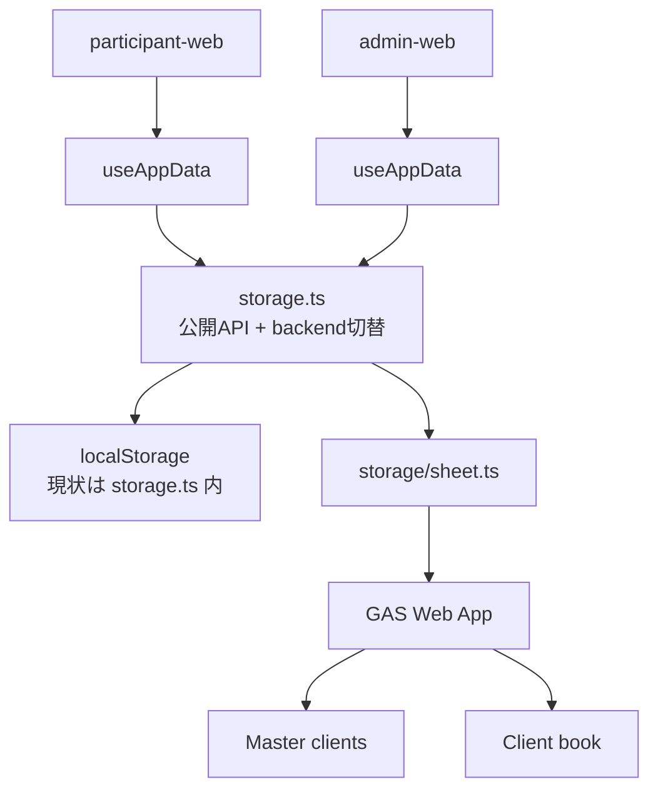

# ExpertEye360 — 残り実装と再設計メモ

**目的**: ここまでの実装済み範囲と未実装範囲を分け、次の設計をやり直すための作業メモとしてまとめる。

**位置づけ**: 本書は再設計の入口。既存の正本は引き続き [README.md](../README.md)、[TECHNICAL-SPEC.md](./TECHNICAL-SPEC.md)、[SPREADSHEET-DATA.md](./SPREADSHEET-DATA.md)、[TEST-DESIGN.md](./TEST-DESIGN.md)。mock から実 GAS への移行手順は [MOCK-TO-PRODUCTION.md](./MOCK-TO-PRODUCTION.md)。

---

## 目次

- [1. 現在できていること](#1-現在できていること)
- [2. 暫定実装として扱うもの](#2-暫定実装として扱うもの)
- [3. 残り実装の受け入れ仕様](#3-残り実装の受け入れ仕様)
  - [A. 本番永続化（GAS + Google スプレッドシート）](#a-本番永続化gas--google-スプレッドシート)
  - [B. storage 正式設計（local / sheet 切替）](#b-storage-正式設計local--sheet-切替)
  - [C. Sheet API 契約テスト](#c-sheet-api-契約テスト)
  - [D. 画面の Sheet API 配線](#d-画面の-sheet-api-配線)
  - [E. Playwright の本番近似化](#e-playwright-の本番近似化)
  - [F. PDF](#f-pdf)
  - [G. OJT](#g-ojt)
  - [H. UI / Hook テスト](#h-ui--hook-テスト)
- [4. 再設計方針](#4-再設計方針)
- [6. コードベース分離（URL 固定方針）](#6-コードベース分離url-固定方針)
- [5. 次に着手するなら](#5-次に着手するなら)

---

## 1. 現在できていること

### 受講者フロー

**実装** — あり

- 研修コード入力
- 名前・所属入力
- 5 問フロー（気づき → 共有・行動 → 判断基準 → 一言メモ）
- 確信度
- 送信完了

**テスト** — `shared` Unit と Playwright 代表 E2E あり

### 管理者画面

**実装** — あり

- 管理者コード入室（local）
- 研修コード設定（local）
- 研修コード設定（Sheet backend）
- シーン・カード編集
- 回答一覧・詳細

**未完了** — 実在する複数 `client` / 複数 `room` の手動確認（**デモのためステイ**）、PDF 目視確認、OJT UI

**UI 応答性（2 秒以内）** — `appDataLoad.ts` / `useAppData.ts` で初回以外は非ブロッキング再読込、並列 fetch、保存後の楽観反映、storage debounce を実装済み（`appDataLoad.test.ts` Green）

### shared ロジック

**実装** — あり

- `choices`
- `judgmentFlow`
- `sceneQuestions`
- `cardSlots`
- `selection`
- `validateStep`
- `submission`
- `storage`（local / sheet 切替）
- `storage/sheet.ts`（Sheet API）
- `rooms/access-code`（Sheet backend 研修コード変更）
- `pdfExport`（生成 payload と `Uint8Array` の入口）
- `ojtExport`（確認項目テキスト生成の入口）

**テスト** — `npm test` は 14 files / 89 tests Green

### Playwright

**実装** — あり

- `playwright.config.ts`
- `e2e/participant-admin-flow.spec.ts`
- `e2e/embed-layout.spec.ts`
- `npm run test:e2e`

**状態** — mock E2E 6 tests Green + 実 GAS / 実シート 1 test Green

**注意** — 受講者 → 管理者共有の本番同等確認は、ライブ GAS の手動疎通・Sheet API mock の Playwright・**別端末 GitHub Pages（2026-06-05）** で Green。複数 `client` / 複数 `room` の実環境分離確認はデモのためステイ（[MOCK-TO-PRODUCTION.md §6.1](./MOCK-TO-PRODUCTION.md#61-フェーズ-2-実施記録2026-06-05)）。

---

## 2. 暫定実装として扱うもの

### E2E 用共有ストレージ

**対象** — `scripts/e2e-storage-server.mjs`

**目的** — Playwright で `participant-web` と `admin-web` の別ポート間共有を先に検証するための補助。

**扱い** — 本番仕様ではない。現在の Playwright は Sheet API mock 経路へ移行済み。残す場合も local backend 用の開発補助として扱う。

### `storage.ts` の E2E 分岐

**対象** — `shared/src/storage.ts`

**目的** — `navigator.webdriver` かつ `127.0.0.1` のときだけ E2E 用共有ストレージへ同期する。

**扱い** — 開発補助。正式な storage 設計では `local` / `sheet` 切替に整理する。

---

## 3. 残り実装の受け入れ仕様

各項目は、実装前に Red にするテスト・人間が見る受け入れ条件・コード上の期待値を分けて整理する。

---

### A. 本番永続化（GAS + Google スプレッドシート）

**最小実装済み**

- GAS Web App
- Google スプレッドシートへの実保存・実読込
- マスターブック `clients`
- クライアント用ブック `settings` / `rooms` / `responses` / `audit_logs`
- `clientId` によるクライアント解決
- `roomId` による研修回分離
- 管理者 `token` 照合
- 研修コードのハッシュ照合
- 管理画面からの研修コード変更（`rooms.accessCodeHash` 更新）

**残り**

- 研修コード変更後の旧コード拒否・新コード入室を Sheet backend 実環境で確認（別端末では未記録）
- 複数 `client` / 複数 `room` の手動分離確認（**デモのためステイ**）
- API エラー時 UI の手動確認（未記録）
- 本番運用向けの監査・バックアップ・エラー文言整理

**2026-06-05 確認済み**

- 別端末（GitHub Pages）で受講者送信 → 管理者が同一 `client` の回答を確認（フェーズ 2 チェック 1）

**目的** — 受講者・管理者・別端末が同じ研修データを共有し、契約組織と研修回ごとにデータを分離する。

**受け入れ条件**

- `client` が正しい場合だけ、当該クライアント用ブックの `settings` / `responses` を読み書きできる。
- `client` が存在しない、または `enabled=false` の場合は API がエラーを返し、別クライアントのデータを返さない。
- 受講者は研修コードを `POST rooms/verify` で検証し、成功した `roomId` にだけ回答を送信できる。
- 管理者は管理者コード（`token`）が正しい場合だけ、設定保存・回答一覧参照ができる。
- `responses` は `room_id` で分離され、別 room の回答が混ざらない。
- 平文の研修コード・管理者コードはシートに保存しない。

**成功条件**

- 受講者が別端末・別ブラウザから送信した回答を、管理者が同じ `client` + `room` で確認できる。
- 別 `client` または別 `room` の管理画面には、その回答が表示されない。
- API エラー時に画面が壊れず、ユーザー向けのエラー表示または再試行導線が出る。
- `npm test` と本番近似 Playwright が Green になる。

**どのようにテストするか**

- `sheetApi.test.ts` で `fetch` mock を使い、URL クエリ・JSON body・レスポンス parse・エラー処理を検証する。
- dev GAS または同型 mock を使い、Playwright で受講者送信 → 管理者確認を通す。
- 手動で 2 つの `client`、2 つの `room` を用意し、回答が漏れないことを確認する。
- 不正 `client`、不正 `room`、不正 `token` をそれぞれ試し、画面が壊れないことを確認する。

**コード上の期待値**

- `GET settings?client=client-a` は `AppSettings` を返す。
- `POST settings?client=client-a`（body `{ token, settings }`）は `AppSettings` を保存し、必要に応じて `audit_logs` に追記する。
- `POST rooms/verify?client=client-a` は `{ accessCode }` を受け取り、成功時 `{ roomId }` を返す。
- `POST responses?client=client-a&room=room-a` は `ParticipantSubmission` を 1 行として保存する。
- `POST responses/query?client=client-a&room=room-a`（body `{ token }`）は `room-a` の `ParticipantSubmission[]` だけを返す（旧 `GET responses?token=` も後方互換で残る）。
- `client` 不正は 400、`token` 不正は 401、無効 `client` / `room` は 403 相当のエラーになる。

---

### B. storage 正式設計（local / sheet 切替）

**最小実装済み**

- `VITE_STORAGE_BACKEND=local|sheet`
- `shared/src/storage.ts` の async API
- 受講者・管理者 `useAppData` のローディング・エラー設計

**残り**

- 必要なら `storage/local.ts` / `storage/index.ts` へ分割
- Sheet backend の保存中 UI の細分化
- E2E 用共有ストレージ分岐を local backend 補助として残すか削除するかの整理

**目的** — 画面側が保存先の物理実装を意識せず、開発では local、本番では Sheet API を使えるようにする。

**受け入れ条件**

- `VITE_STORAGE_BACKEND=local` では現行 localStorage 実装が動く。
- `VITE_STORAGE_BACKEND=sheet` では `storage/sheet.ts` を経由して API を呼ぶ。
- `participant-web` / `admin-web` は storage の公開 API だけを呼び、`localStorage` や `fetch` を直接扱わない。
- Sheet API 利用時は読み込み中・保存中・エラー状態を UI が扱える。
- E2E 用共有ストレージ分岐は正式な本番経路として扱わない。

**成功条件**

- local backend で既存 Unit / E2E が Green。
- sheet backend で API 契約テストが Green。
- backend 切替時に UI の呼び出し箇所が大きく分岐しない。
- `shared/src/storage.ts` が巨大な条件分岐の置き場にならない。

**どのようにテストするか**

- `storage.test.ts` で local backend の保存・読込・破損 JSON 復帰を確認する。
- `sheetApi.test.ts` で sheet backend の API 契約を確認する。
- `useAppData.test.ts` でロード中、成功、失敗、再読込を確認する。
- Playwright で `VITE_STORAGE_BACKEND=sheet` の代表フローを通す。

**コード上の期待値**

- `storage/local.ts` は localStorage だけを扱う。
- `storage/sheet.ts` は `fetch` と API 契約だけを扱う。
- `storage/index.ts` は backend 選択だけを扱う。
- 公開 API は `loadSettings` / `saveSettings` / `loadResponses` / `appendResponse` / `verifyTrainingCode` 相当を提供する。
- Sheet API に合わせ、公開 API は `Promise` を返す設計に寄せる。

---

### C. Sheet API 契約テスト

**実装済み**

- TC-005: `client` 欠落・不正
- TC-006: API 500 / ネットワーク失敗
- TC-007: 全リクエストに `client` が付く
- TC-008: `room` 別の responses 分離
- TC-009: 不正 `room` / 未登録コード
- TC-011: 管理者操作の `token` / 監査ログ対象
- TC-012: 不正管理者 `token`
- TC-013: 管理者コード変更 API
- 追加: `rooms/access-code` による研修コード変更 API

**残り**

- 契約テストで固定した `client` / `room` 分離を、Sheet backend の Playwright または複数端末手動で確認する

**目的** — GAS 実装前に、フロントと API の通信契約を固定する。

**受け入れ条件**

- すべての API 呼び出しで `client` が URL クエリに含まれる。
- 回答系 API では `room` が URL クエリに含まれる。
- 管理者操作では `token` が **POST ボディ**に含まれる（URL クエリには出さない／SEC-SECRET-01）。
- API エラーは `throw` または Result 型のいずれかに統一して扱う。
- room 分離のテストは、別 room の回答が配列に含まれないことまで検証する。

**成功条件**

- TC-001〜013 と `rooms/access-code` 契約がすべて Green。
- テスト名が日本語で、何をしたら何になるか読める。
- GAS の内部列名や Apps Script の実装詳細に依存しない。

**どのようにテストするか**

- Vitest で `fetch` を mock する。
- `makeSettings` / `makeSubmission` を使って実型に近いデータを送る。
- `fetch` の URL、method、body、レスポンス parse を検証する。
- 400 / 401 / 403 / 500 とネットワーク失敗をそれぞれ検証する。

**コード上の期待値**

- `loadSheetSettings(clientId, token?)` は `GET settings?client=...` を呼ぶ。
- `saveSheetSettings(clientId, token, settings)` は `POST settings?client=...` を呼び、body に `{ token, settings }` を送る。
- `loadSheetResponses(clientId, roomId, token)` は `POST responses/query?client=...&room=...` を呼び、body に `{ token }` を送る。
- `appendSheetResponse(clientId, roomId, submission)` は `POST responses?client=...&room=...` を呼び、body に `ParticipantSubmission` を送る。
- `verifyTrainingCodeViaApi(clientId, accessCode)` は `POST rooms/verify?client=...` を呼び、成功時 `{ roomId }` を返す。

---

### D. 画面の Sheet API 配線

**最小実装済み**

- 受講者の `rooms/verify` を Sheet API へ接続
- 受講者の `appendResponse` を Sheet API へ接続
- 管理者の `loadSettings` / `saveSettings` を Sheet API へ接続
- 管理者の `loadResponses` を Sheet API へ接続
- 管理者コードの API token 化
- 管理者画面からの研修コード変更

**残り**

- Sheet backend の保存中 UI の細分化（送信中・保存中ラベル。初回以外の全画面ブロッキングは解消済み）
- API エラー表示の代表 E2E / 手動確認
- Sheet backend の全回答削除

**目的** — 受講者 UI と管理者 UI を、本番の共有データストアへ接続する。

**受け入れ条件**

- 受講者は `?client=` が無い場合、分かるエラーを表示して送信できない。
- 研修コード検証中は二重送信できない。
- 研修コード検証成功後だけ名前・所属欄が表示される。
- 回答送信中は送信ボタンが多重押下されない。
- 管理者は管理者コード検証成功後だけ設定・回答一覧に入れる。
- 管理者の設定保存・回答一覧取得は Sheet API 経由になる。
- API 失敗時は再試行できる表示になる。

**成功条件**

- `VITE_STORAGE_BACKEND=sheet` で、受講者送信 → 管理者回答表示が動く。
- `local` backend でも従来の開発確認が壊れない。
- エラー時に画面が白くならない。
- 入室スキップや room 無視のショートカットが結合確認の正になっていない。

**どのようにテストするか**

- `useAppData.test.ts` で読み込み成功・失敗・再読込を検証する。
- `ParticipantPage.test.tsx` で研修コード前後の表示、送信中、失敗表示を薄く検証する。
- `AdminPage.test.tsx` で管理者コード前後の表示、回答一覧取得、保存失敗表示を薄く検証する。
- Playwright で本番近似の受講者 → 管理者フローを通す。

**コード上の期待値**

- 画面は `storage` 公開 API だけを呼ぶ。
- `clientId` は URL クエリまたは環境値から解決される。
- `roomId` は `rooms/verify` 成功後に state / sessionStorage に保持される。
- `appendResponse` には検証済み `roomId` を含む `ParticipantSubmission` が渡る。
- 管理者 API 呼び出しには検証済み `token` が付く。

---

### E. Playwright の本番近似化

**今回最小実装済み**

- E2E 用共有ストレージから Sheet API mock への置き換え
- 受講者 → 管理者確認を Sheet API mock 経路で Green
- 別 `room` に漏れない代表確認（mock 管理 endpoint）
- 別 `client` の同一 `room` に漏れない代表確認（mock 管理 endpoint）
- 研修コード変更後の旧コード拒否・新コード入室確認（Sheet API mock）
- 管理者コード変更後の旧コード拒否・新コード再入室確認（Sheet API mock）
- 実 GAS / 実シートで `client` / `room` 不一致時に回答が返らない代表確認

**残り**

- 実在する複数 `client` / 複数 `room` を用意した手動確認

**目的** — リリース前に、人間の代表操作に近い形で本番の主要リスクを自動確認する。

#### 今回の TDD スライス

**目的** — 既存の E2E 用共有ストレージではなく、Sheet API と同じ URL / JSON 契約を持つ mock 経由で、受講者送信から管理者確認までの代表経路を固定する。

**受け入れ条件** — `npm run test:e2e` が `VITE_STORAGE_BACKEND=sheet` 相当で起動し、`POST rooms/verify`、`POST responses`、`POST responses/query`（管理者 token はボディ）が Sheet API mock に届く。受講者の回答は同一 `client` + `room` の管理者一覧に表示され、別 `room` の一覧には混ざらない。

**成功条件** — E2E 用共有ストレージサーバー（`scripts/e2e-storage-server.mjs` / `127.0.0.1:5199`）なしで Playwright が Green になる。不正 room / token は mock 側でエラーにでき、失敗時はどの API 契約が壊れたか分かる。

**どのようにテストするか** — Playwright の `webServer` で participant / admin / Sheet API mock を起動する。テスト開始時に mock を reset し、受講者で 5 問送信後、管理者が管理者コードで入室して回答一覧を確認する。さらに mock の管理用 endpoint で別 room の responses が空であることを確認する。

**コード上の期待値** — Vite dev server は `VITE_STORAGE_BACKEND=sheet`、`VITE_SHEET_API_BASE=http://127.0.0.1:5198/exec`（`127.0.0.1` は HTTPS 必須の例外）、`VITE_CLIENT_ID=client-demo` で起動する。Sheet API mock は `?path=settings|rooms/verify|responses|responses/query` と `client` / `room` を本番 GAS と同じ形で受け、管理者 `token` はボディ優先で読む。

#### 次の TDD スライス

**目的** — 同じ `roomId` を使っていても、`clientId` が違う組織の回答一覧に受講者回答が漏れないことを固定する。

**受け入れ条件** — `client-demo` の受講者が `room-demo-1` に送信した回答は、`client-demo` + `room-demo-1` では見える。`client-other` + `room-demo-1` では同じ `submission.id` / 受講者名が返らない。

**成功条件** — `npm run test:e2e` が Green になり、失敗時は `client` 分離の破れだと分かるテスト名になっている。

**どのようにテストするか** — Playwright で `client-demo` の受講者送信を実行する。その後 Sheet API mock の管理用 endpoint から `client-demo` と `client-other` の同一 `room` responses を取得し、前者にだけ対象回答が存在することを assert する。

**コード上の期待値** — Sheet API mock は responses を `client` + `room` の複合キーで保持する。管理用確認 endpoint も `client` query を受け取り、指定された client の responses だけを返す。

**状態** — 完了済み（Sheet API mock / `npm run test:e2e` Green）

#### 次の TDD スライス（研修コード変更）

**目的** — 管理者が Sheet backend 経由で研修コードを変更したあと、旧コードでは受講者入室できず、新コードだけで入室できることを固定する。

**受け入れ条件** — 管理者が `room-demo-1` の研修コードを `NEXT-2026` に保存できる。保存後、受講者画面で旧コード `DEMO-2026` は名前・所属入力へ進まず、新コード `NEXT-2026` は名前・所属入力へ進む。

**成功条件** — `npm run test:e2e` が Green になり、失敗時は研修コード変更後の旧コード拒否 / 新コード入室のどちらが壊れたか分かる。

**どのようにテストするか** — Playwright で管理者コード入室後、研修コード欄を変更して保存する。別ページの受講者画面を開き、旧コードで警告が出ること、新コードで名前入力欄が表示されることを assert する。

**コード上の期待値** — Sheet API mock は `POST rooms/access-code?client=...`（body `{ token, roomId, nextAccessCode }`）を受け取り、該当 room の `accessCode` を更新する。`POST rooms/verify` は更新後の room 設定で照合する。

**状態** — 完了済み（Sheet API mock / `npm run test:e2e` Green）

#### 次の TDD スライス（管理者コード変更）

**目的** — 管理者コードを変更したあと、旧コードでは管理 UI に入れず、新コードだけで再入室できることを固定する。

**受け入れ条件** — 管理者が現行コード `admin-demo` と新コード `admin-next` を入力して保存できる。ロック後、旧コード `admin-demo` は拒否され、新コード `admin-next` では管理 UI に戻れる。

**成功条件** — `npm run test:e2e` が Green になり、失敗時は管理者コード変更後の旧コード拒否 / 新コード入室のどちらが壊れたか分かる。

**どのようにテストするか** — Playwright で管理者ログイン後、管理者コード変更フォームを操作する。ロックして旧コードで入室失敗を assert し、その後新コードで入室成功を assert する。

**コード上の期待値** — Sheet API mock は `POST admin/token?client=...`（body `{ token, nextAdminToken }`）を受け取り、管理者 token を更新する。`responses/query` や `rooms/access-code` の token 照合は更新後の token を使う。

**状態** — 完了済み（Sheet API mock / `npm run test:e2e` Green）

#### 次の TDD スライス（実 GAS / 実シート分離）

**目的** — Sheet API mock ではなく、実 GAS / 実 Google スプレッドシートで `client` / `room` 不一致時に回答が返らないことを確認する。

**受け入れ条件** — 実 GAS の `rooms/verify` で研修コードを検証し、得られた `roomId` に一意な E2E 回答を `POST responses` で保存できる。同じ `client` + `room` + 管理者 token ではその回答が取得できる。別 `client` または別 `room` への `POST responses/query` では、その回答 ID が返らない。

**成功条件** — opt-in の実環境テスト `npm run test:e2e:real-sheet` が Green。通常の `npm run test:e2e` は実データに触れず、mock E2E のまま Green。

**どのようにテストするか** — Playwright の API テストとして実 GAS URL へ直接 fetch する。`.env.development` の `VITE_SHEET_API_BASE` / `VITE_CLIENT_ID` と、実環境用の管理者 token / 研修コードを runner で `E2E_REAL_*` に渡す。テスト用回答 ID は毎回一意にし、別 `client` / 別 `room` のレスポンス本文に含まれないことを assert する。

**コード上の期待値** — 実環境テストは `E2E_REAL_SHEET=1` のときだけ実行する。`storage/sheet.ts` と同じ `?path=...&client=...&room=...`（管理者 `token` はボディ。回答取得は `responses/query`）、`text/plain;charset=utf-8` JSON body を使い、GAS の `{ ok: false, status, error }` はエラー応答として扱う。

**状態** — 完了済み（`npm run test:e2e:real-sheet` Green）

**受け入れ条件**

- `npm run test:e2e` が `VITE_STORAGE_BACKEND=sheet` 相当で動く。
- 受講者送信結果が管理者の同一 `client` + `room` に表示される。
- 別 `room` の管理者一覧には表示されない。
- 不正研修コードでは名前・所属欄が出ない。
- 不正管理者コードでは管理 UI が出ない。
- iframe 25% / 40% の代表レイアウトが崩れない。

**成功条件**

- E2E 用共有ストレージサーバーなしで `npm run test:e2e` が Green。
- 失敗時に、どのユーザーフローが壊れたか分かるテスト名になっている。
- CI または手元で再現性がある。

**どのようにテストするか**

- Playwright の `webServer` で participant / admin / mock Sheet API を起動する。
- `participant-admin-flow.spec.ts` で 5 問送信と管理者確認を実行する。
- `embed-layout.spec.ts` で iframe サイズと主要表示を確認する。
- 別 room / 不正コードは独立した `test` に分ける。

**コード上の期待値**

- E2E mock は本番 Sheet API と同じ URL / JSON 契約を持つ。
- テストは UI の細かい CSS ではなく、ユーザーが見える文言・ボタン・送信結果を assert する。
- `test-results/` と `playwright-report/` は git 管理しない。

---

### F. PDF

**最小実装済み**

- 管理者画面の PDF ダウンロード UI（回答詳細から `generateParticipantPdf` を呼ぶ代表導線）
- 開ける最小 PDF 構造（`xref` / `trailer` / `startxref` / `%%EOF`）
- 日本語・英語・数字の UTF-16BE text 出力と最低限の装飾（タイトル帯・区切り線）
- `pdf.html` の主要デザイン要素（ブランド、タイトル、4 分割サマリー、設問カード風レイアウト、濃紺アクセント）の反映
- 目視フィードバック（副題削除、設問番号の太字相当化、灰色ラベルの濃度・サイズ調整、DOC/DATE/PAGE の分割配置）の反映
- ヘッダーの `EXPERT EYE 360` / `DOC` / `DATE` / `PAGE` の太字相当化と `DATE` / `PAGE` の重なり防止
- `DOC EE360-RR-0428` の削除、`DATE` / `PAGE` の同一行整列、件数表示 `全 5 件` の数字太字相当化
- タイトル上の短いアクセント線の削除
- 名前・所属・一言メモの長文折り返しと、行数に応じた設問カードの可変高さ
- 名前・所属は 10 文字以内、一言メモは 30 文字以内の入力上限とバリデーション
- コンテンツ量に応じた PDF の複数ページ化と実ページ数に合わせた `PAGE n / total` 表示

**未実装**

- 実 PDF の目視確認

**実装済み入口** — `shared/src/pdfExport.ts`

**目的** — 講師・管理者が受講者 1 件分の研修結果を保存・共有できるようにする。

**受け入れ条件**

- 管理者画面で回答済み 1 件を選択できる。
- 選択した回答から PDF ダウンロードを実行できる。
- PDF は 1 送信 1 ファイルで生成される。
- PDF にはシーン名、名前、所属、確信度、5 問分の出題カードと選択回答、一言メモが含まれる。
- `rounds` が不足している古い回答でもクラッシュしない。

**成功条件**

- `pdfExport.test.ts` が現行のブラウザ側 PDF 生成実装で Green。
- `AdminPage` の PDF ダウンロード代表テストが Green。
- 手動で生成 PDF を開き、必要項目が読める。

**どのようにテストするか**

- `pdfExport.test.ts` で PDF バイナリ、payload、主要文字列、欠損 rounds を検証する。
- `AdminPage.test.tsx` で回答詳細から PDF 生成関数が呼ばれることを検証する。
- Playwright または手動で実ダウンロードを確認する。
- 実 PDF の目視確認は人間向け受け入れで行う。

**コード上の期待値**

- `generateParticipantPdf({ submission, scene })` が PDF 相当の `Uint8Array` または `Blob` を返す。
- PDF 先頭は `%PDF` 相当になる。
- `buildParticipantPdfPayload()` は trim 済みの `participantName` / `affiliation` を含む。
- `confidenceLevel` は `getConfidenceLabel()` の表示文言に変換される。
- 管理者 UI は選択中回答と `sceneId` に対応する `Scene` を渡す。

#### 今回の TDD スライス

**目的** — 管理者が回答詳細から PDF 生成を実行できる UI 導線を固定する。

**受け入れ条件** — 管理者画面の回答一覧で 1 件を選択すると、回答詳細に PDF ダウンロードボタンが表示される。クリックすると選択中の `ParticipantSubmission` と対応する `Scene` が `generateParticipantPdf` に渡る。

**成功条件** — `AdminPage.test.tsx` が Green。既存の `pdfExport.test.ts`、`npm test`、必要な E2E が Green。

**どのようにテストするか** — `AdminPage.test.tsx` で `useAppData` に 1 件の回答と対応シーンを返させる。回答タブを開き、回答を選択して PDF ボタンをクリックし、`generateParticipantPdf({ submission, scene })` が呼ばれたことを assert する。

**コード上の期待値** — `AdminPage` は回答詳細表示時だけ PDF ボタンを出す。ボタンは `@shared/pdfExport` の `generateParticipantPdf` を呼び、返った `Uint8Array` を `Blob` 化して `download` 付きリンクで保存させる。シーンが見つからない回答ではボタンを出さない。

**状態** — 完了済み（`AdminPage.test.tsx` / `npm test` Green）

#### 次の TDD スライス（開ける PDF）

**目的** — ダウンロードした PDF が PDF ビューアで壊れたファイルとして扱われないように、最低限の PDF ファイル構造を固定する。

**受け入れ条件** — `generateParticipantPdf()` が返すバイナリは `%PDF-1.4` で始まり、`xref`、`trailer`、`startxref`、`%%EOF` を含む。`startxref` の値は実際の `xref` 位置を指す。

**成功条件** — `pdfExport.test.ts` が Green。管理者画面の PDF ダウンロード UI テスト、`npm test`、必要な E2E が Green。

**どのようにテストするか** — `pdfExport.test.ts` で `generateParticipantPdf()` の戻り値を Latin-1 文字列に変換し、PDF ヘッダ・xref・trailer・startxref・EOF と、xref offset の整合を assert する。

**コード上の期待値** — `generateParticipantPdf()` は JSON 文字列をそのまま返すのではなく、Catalog / Pages / Page / Font / Contents オブジェクト、xref table、trailer、startxref を持つ最小 PDF を生成する。

**状態** — 完了済み（`pdfExport.test.ts` / `npm test` Green）

#### 次の TDD スライス（日本語対応・装飾）

**目的** — PDF 内の日本語が `?` などに置き換わらず、英語・数字と一緒に読める形で出力され、結果票として見やすい最低限の装飾を持つようにする。

**受け入れ条件** — `generateParticipantPdf()` が Type0 / `UniJIS-UTF16-H` の日本語対応フォント指定を持ち、日本語・英語・数字を UTF-16BE の PDF text として出力する。タイトル、基本情報、設問ブロックには背景色や区切り線などの装飾命令が含まれる。

**成功条件** — `pdfExport.test.ts` が Green。管理者画面の PDF ダウンロード UI テスト、`npm test`、必要な E2E が Green。

**どのようにテストするか** — `pdfExport.test.ts` で PDF 本文を Latin-1 文字列として読み、Type0 font / `UniJIS-UTF16-H`、UTF-16BE hex 化された日本語・英語・数字、背景矩形や罫線の描画命令を assert する。

**コード上の期待値** — `generateParticipantPdf()` は Helvetica 前提の ASCII 置換ではなく、CJK Type0 font と UTF-16BE hex string を使って text operator を出力する。本文はタイトル帯、基本情報、設問ごとの区切りを持つ。

**状態** — 完了済み（`pdfExport.test.ts` / `npm test` Green）

#### 次の TDD スライス（HTML デザイン参照）

**目的** — ユーザーが用意した `pdf.html` のデザインを PDF 出力の参照元として扱い、出力 PDF が同じ情報設計と主要な装飾を持つようにする。

**受け入れ条件** — `pdf.html` にあるブランド `EXPERT EYE 360`、タイトル `研修結果レポート`、4 分割サマリー（シーン・名前・所属・確信度）、`設問別 回答`、2 桁の設問番号、濃紺アクセントが PDF に反映される。

**成功条件** — `pdfExport.test.ts` が Green。管理者画面の PDF ダウンロード UI テスト、`npm test`、必要な E2E が Green。

**どのようにテストするか** — `pdfExport.test.ts` で `pdf.html` を読み込み、正本に含まれる主要文言を確認する。その上で `generateParticipantPdf()` の PDF 本文に、同じ主要文言の UTF-16BE hex text、2 桁設問番号、HTML の `--navy: #0F2A47` に対応する描画色が含まれることを assert する。

**コード上の期待値** — `generateParticipantPdf()` は `pdf.html` の情報設計に合わせ、ブランド、タイトル、サマリー、設問カード風の構造を PDF content stream に出力する。PDF は引き続き Type0 / `UniJIS-UTF16-H` と UTF-16BE text を使う。

**状態** — 完了済み（`pdfExport.test.ts` / `npm test` Green）

#### 次の TDD スライス（PDF 目視フィードバック反映）

**目的** — 実 PDF の目視で気になったテキスト量・文字の読みやすさ・ヘッダーのはみ出しを修正し、`pdf.html` に近い見た目へ寄せる。

**受け入れ条件** — タイトル下の `研修結果 / Training Result` は出力しない。設問番号は大きすぎない太字相当のフォントで出す。設問カード内の灰色ラベルはつぶれて見えにくい薄色・小サイズを避ける。上部メタ情報は `DOC` / `DATE` / `PAGE` を長い 1 行にせず、DATE が右端にはみ出しにくい配置にする。

**成功条件** — `pdfExport.test.ts` が Red → Green。`npm test`、lint、差分チェックが Green。

**どのようにテストするか** — `pdfExport.test.ts` で PDF content stream を読み、不要な副題が含まれないこと、設問番号が太字用フォントと小さめサイズで出ること、灰色ラベルが濃い色・8pt で出ること、長い DOC/DATE/PAGE 連結テキストではなく分割された DATE/PAGE テキストが含まれることを assert する。

**コード上の期待値** — `buildMinimalPdf()` は日本語本文用 Type0 フォントに加え、ASCII の設問番号用に Helvetica-Bold を `/F2` として持つ。`questionField()` はラベルを濃いめの色・8pt で描く。ヘッダーのメタ情報は短い複数テキストに分ける。

**状態** — 完了済み（`pdfExport.test.ts` / `npm test` Green）

#### 次の TDD スライス（PDF ヘッダーの太字化・重なり防止）

**目的** — PDF 出力時に上部ヘッダーだけが HTML 見本より細く見えたり、`DATE` と `PAGE` が重なったりする問題を修正する。

**受け入れ条件** — `EXPERT EYE 360`、`DOC EE360-RR-0428`、`DATE 2025.10.28`、`PAGE 1 / 1` は ASCII 用の太字相当フォント `/F2` で出力する。`DATE` と `PAGE` は同じ y 座標でも十分に離れた x 座標に置き、`10.2P8AGE` のように文字が重ならない。

**成功条件** — `pdfExport.test.ts` が Red → Green。`npm test`、lint、差分チェックが Green。

**どのようにテストするか** — `pdfExport.test.ts` で PDF content stream を読み、ヘッダー 4 要素が UTF-16BE text ではなく `/F2` の PDF literal text として出ること、`DATE` と `PAGE` の x 座標が離れていることを assert する。

**コード上の期待値** — `buildContentStream()` は上部ヘッダーの ASCII 文字列に `latinTextAt(..., "F2")` を使い、`DATE` と `PAGE` の x 座標を重ならない値にする。

**状態** — 完了済み（`pdfExport.test.ts` / `npm test` Green）

#### 次の TDD スライス（件数表示とヘッダー整列）

**目的** — PDF 出力時に `全 5 件` の数字が細く見える問題と、上部メタ情報の並びがばらつく問題を修正する。

**受け入れ条件** — `全 5 件` は `全` / `件` の日本語部分と数字 `5` を分け、数字は ASCII 用の太字相当フォント `/F2` で出力する。`DOC EE360-RR-0428` は出力しない。上部メタ情報は `DATE 2025.10.28` と `PAGE 1 / 1` のみを同じ y 座標に揃えて出力する。

**成功条件** — `pdfExport.test.ts` が Red → Green。`npm test`、lint、差分チェックが Green。

**どのようにテストするか** — `pdfExport.test.ts` で PDF content stream を読み、`DOC EE360-RR-0428` が含まれないこと、`DATE` と `PAGE` が同じ y 座標かつ `/F2` で出ること、件数の `5` が `/F2` の literal text で出ることを assert する。

**コード上の期待値** — `buildContentStream()` は `DOC` を描画せず、`DATE` と `PAGE` を同一行に揃える。件数表示は `textAt()` と `latinTextAt(..., "F2")` を組み合わせて描画する。

**状態** — 完了済み（`pdfExport.test.ts` / `npm test` Green）

#### 次の TDD スライス（長文の折り返し・可変高さ）

**目的** — 名前・所属・一言メモなどの記載欄に長文が入っても、PDF 上で文字が重なったり欄外にはみ出したりせず読める状態にする。

**受け入れ条件** — `participantName`、`affiliation`、各設問の `roundNote` は欄幅に応じて複数行に折り返される。長文を 1 つの text operator で横に流し込まない。複数行になった欄は行数に応じてセルまたは設問カードの高さが増える。長文カードの次の設問カードは増えた高さ分だけ下に配置され、前のメモ文字と重ならない。

**成功条件** — `pdfExport.test.ts` が Red → Green。`npm test`、lint、差分チェックが Green。

**どのようにテストするか** — `pdfExport.test.ts` で長い名前・所属・一言メモを持つ回答を生成し、PDF content stream を検査する。長文全体が 1 つの `<...> Tj` に含まれないこと、分割された文字列が複数の `Tj` と異なる y 座標で出ること、長文を含む設問カードの矩形高さが増えること、次設問のカード y 座標が通常間隔より大きく下がることを assert する。

**コード上の期待値** — PDF 生成は文字列を固定文字数で折り返す `wrapText()` と複数行描画用の helper を持つ。`summaryCell()` と `questionField()` は折り返し行を描画し、`questionCard()` は各欄の最大行数からカード高さを計算して返す。`buildContentStream()` は前カードの高さに応じて次カードの y 座標を更新する。

**状態** — 完了済み（`pdfExport.test.ts` / `npm test` Green）

#### 次の TDD スライス（記載欄の文字数制限）

**目的** — 名前・所属・一言メモに長すぎる文字列が入らないようにし、PDF 出力前の入力段階でレイアウト崩れの原因を抑える。

**受け入れ条件** — 名前は 10 文字以内、所属は 10 文字以内、一言メモは各設問 30 文字以内。ラベルに `（10文字以内）` / `（30文字以内）` を表示する。11 文字以上・31 文字以上のときは `next` で進めず、`10文字以内で入力してください` / `30文字以内で入力してください` を表示する。

**成功条件** — `validateStep.test.ts` が Red → Green。`npm test`、lint、差分チェックが Green。

**どのようにテストするか** — `validateStep.test.ts` で名前・所属の 10 / 11 文字境界と、一言メモの 30 / 31 文字境界を assert する。10 / 30 文字は通過し、11 / 31 文字はそれぞれのエラーメッセージを返す。

**コード上の期待値** — 上限値とエラーメッセージは `shared/src/validateStep.ts` の定数として定義し、`validateParticipantStep()` が trim 後の文字数で判定する。`ParticipantPage` はラベルに文字数上限を表示し、超過時はナビの警告欄に共通メッセージを出す。

**状態** — 完了済み（`validateStep.test.ts` / `npm test` Green）

#### 次の TDD スライス（PDF 複数ページ化）

**目的** — 設問カードの内容量が増えても、PDF 上でカードや文字がページ下端に重なったり欄外にはみ出したりしないようにする。

**受け入れ条件** — 設問カードの高さと残り領域を計算し、下余白を割るカードは次ページへ送る。PDF の `/Pages /Count` は実ページ数と一致する。上部ヘッダーの `PAGE n / total` は各ページの実番号に合わせる。次ページに送られた設問カードはページ上部の設問一覧領域から描画される。

**成功条件** — `pdfExport.test.ts` が Red → Green。`npm test`、lint、差分チェックが Green。

**どのようにテストするか** — `pdfExport.test.ts` で高さが大きい設問カードを 5 件持つ回答を生成する。PDF 本文に `/Count 2`、`PAGE 1 / 2`、`PAGE 2 / 2` が含まれること、5 問目が 1 ページ目の下端ではなく 2 ページ目上部の座標に描画されることを assert する。

**コード上の期待値** — PDF 生成は設問カードごとの高さを測り、ページごとの content stream を生成する。`buildMinimalPdf()` はページ数に応じて Page object と Contents object を動的に作る。

**状態** — 完了済み（`pdfExport.test.ts` / `npm test` Green）

---

### G. OJT

**未実装**

- OJT 出力形式の決定
- 管理者画面の OJT 出力 UI
- ファイル出力
- OJT チェックリスト編集 UI の要否

**実装済み入口** — `shared/src/ojtExport.ts`

**目的** — 研修後に OJT 担当者が次の指導で確認すべきポイントを受講者回答から整理できるようにする。

**受け入れ条件**

- 管理者が回答済み 1 件を選択し、OJT 確認項目を生成できる。
- `scene.veteranTemplate.ojtChecklist` がある場合は、その項目を元に回答情報を付加できる。
- チェックリストが空でも、受講者回答から最低限の確認項目を生成できる。
- 出力文言に「正解」「不正解」「点数」「スコア」など評価・採点表現を含めない。
- 出力形式は画面表示、テキストコピー、ファイル出力のいずれかに固定する。

**成功条件**

- `ojtExport.test.ts` が Green。
- 管理者画面で OJT 出力を確認できる。
- 空チェックリスト・空メモ・一部未回答でもクラッシュしない。
- OJT 担当者が次に確認する観点として読める文になっている。

**どのようにテストするか**

- `ojtExport.test.ts` で checklist あり、checklist なし、スコア表現なしを検証する。
- `AdminPage.test.tsx` で回答詳細から OJT 出力を表示 / ダウンロードできることを検証する。
- 手動で代表回答を作り、出力文言が OJT 用として自然か確認する。

**コード上の期待値**

- `buildOjtExportItems({ submission, scene })` は `string[]` を返す。
- 重複した選択ラベルは必要に応じて重複除去される。
- `participantName`、`affiliation`、`scene.displayName`、回答要約が出力に含まれる。
- 出力は採点結果ではなく、確認観点として構成される。

---

### H. UI / Hook テスト

**未実装**

- `participant-web/src/hooks/useAppData.test.ts`
- `admin-web/src/hooks/useAppData.test.ts`
- `participant-web/src/pages/ParticipantPage.test.tsx`
- `admin-web/src/pages/AdminPage.test.tsx`

**目的** — shared で固定済みのロジックが、画面から正しく呼ばれていることを薄く確認する。

**受け入れ条件**

- `useAppData` は storage の成功・失敗・再読込を画面側に渡せる。
- `ParticipantPage` は研修コード前後、名前・所属、未入力警告、送信完了の代表表示を確認できる。
- `AdminPage` は管理者コード前後、回答一覧、回答詳細、PDF / OJT ボタンの代表表示を確認できる。
- UI テストは 5 問フロー全体の詳細を重複して持たない。

**成功条件**

- `*.test.tsx` が安定して Green。
- shared の Unit と E2E の間を埋めるスモークになっている。
- DOM の細かい構造変更に弱すぎない。

**どのようにテストするか**

- Testing Library + Vitest を導入する。
- storage API を mock し、画面に出る文言とボタン状態を assert する。
- 5 問の詳細フローは Playwright と shared Unit に任せる。
- PDF / OJT は関数を mock し、呼び出しと UI 表示だけ確認する。

**コード上の期待値**

- `useAppData` は `settings`、`responses`、`loading`、`error`、`refresh`、保存系関数を返す。
- `ParticipantPage` は shared の `validateParticipantStep` / `buildSubmission` / `verifyTrainingCode` 相当を経由する。
- `AdminPage` は shared の storage / `pdfExport` / `ojtExport` を経由する。
- UI テスト対象は「ユーザーに見える文言」と「主要ボタン」のみを中心にする。

---

## 4. 再設計方針

### 4.1 最初に決めること

#### storage API の同期 / 非同期

**選択肢 A** — 既存の `loadSettings()` / `loadResponses()` を同期のまま保つ

**メリット** — UI の変更が少ない

**デメリット** — Sheet API と相性が悪い。同期 XHR や暫定コードが残りやすい

**選択肢 B** — storage 公開 API を `async` にする

**メリット** — 本番 API と自然に合う

**デメリット** — `useAppData` と画面にローディング / エラー状態が必要

**推奨** — 選択肢 B。ここで一度きれいに切り替える。

#### 本番 API の最小スコープ

**最小スコープ**

1. `GET settings`
2. `POST settings`（body `{ token, settings }`）
3. `POST rooms/verify`
4. `POST responses/query`（body `{ token }`。旧 `GET responses` は後方互換）
5. `POST responses`

**後続**

1. `GET rooms`
2. `POST rooms`
3. `PUT responses`
4. `POST reset`
5. `POST clients/provision`
6. 管理者コード変更
7. `audit_logs`

### 4.2 推奨アーキテクチャ

### 4.3 実装順

#### Step 1

**内容** — `sheetApi.test.ts` の残り契約を追加

**状態** — 完了済み（TC-005〜013 と `rooms/access-code` まで Green）

#### Step 2

**内容** — `storage/sheet.ts` を契約テストに合わせて拡張

**状態** — 完了済み（`sheetApi.test.ts` が Green）

#### Step 3

**内容** — storage を `local` / `sheet` に分割し、`VITE_STORAGE_BACKEND` で切替

**状態** — `VITE_STORAGE_BACKEND` 切替は完了済み。`storage/local.ts` / `storage/index.ts` へのファイル分割は未実施だが必須ではない

#### Step 4

**内容** — `useAppData` を async storage に対応

**状態** — 最小対応済み。専用 `useAppData.test.ts` は未

#### Step 5

**内容** — GAS 最小 API を実装

**状態** — 完了済み（settings / responses / rooms verify / admin token / rooms access-code）

#### Step 6

**内容** — Playwright を Sheet API dev / mock に差し替え

**完了条件** — E2E 用共有ストレージなしで `npm run test:e2e` が Green

**状態** — 完了済み（Sheet API mock / `VITE_STORAGE_BACKEND=sheet`）

#### Step 7

**内容** — PDF / OJT / UI テストへ進む

**完了条件** — 管理者画面から PDF / OJT を出力できる

---

---

## 6. コードベース分離（URL 固定方針）

**正本**: 本節。プロダクト要件の入口は [README.md §入室とマルチテナント](../README.md#入室とマルチテナント)。API 契約は [SPREADSHEET-DATA.md §2](./SPREADSHEET-DATA.md)。

**最終確認日**: 2026-06-08

### 6.0 プロダクト方針（ブレ禁止）

#### URL

**受講者・管理者の配布 URL はクライアントごとに変えない。** 同一の participant / admin の URL を全員に渡す。

#### 分離の鍵

**研修コード** — 受講者が入力。一致した **研修回（room）** の回答だけに保存される（**実装済み**）。

**管理者コード** — 管理者が入力。`adminRoomScope` に応じて room を特定（**実装済み**）。
- `adminCode`（既定）: 管理者コードが room を特定（ISOLATE-1）
- `trainingCode`（デモ配布）: **共有管理者コード + 研修コード** で room を特定（DEMO-SCOPE-1）

#### clientId の位置づけ

**`clientId` はデプロイ設定（`VITE_CLIENT_ID`）で固定**する。エンドユーザー向け URL に `?client=` を付けて配布する運用は **採用しない**。

**補足** — `resolveClientId`（URL `?client=` 優先）は開発・運用の上書き用。**プロダクトの分離モデルではない**。

#### やらないこと（本フェーズ群）

- URL を会社ごとに変える配布
- `?client=` をユーザー向けマルチテナント入口にする
- 1 つの管理者コードで全研修回を横断閲覧（研修コードなし）

### 6.1 フェーズ一覧

#### ISOLATE-1 — shared: 管理者コード → room 特定

**状態** — 実装済み（`adminRoom.test.ts` Green）

#### ISOLATE-2 — 管理者 UI: room スコープ

**状態** — 実装済み（Vitest Green）

#### ISOLATE-3 — GAS: room 単位 adminTokenHash

**状態** — 実装済み（Vitest + mock E2E Green）

#### ISOLATE-4 — E2E: コード分離の代表確認

**状態** — 実装済み（`e2e/isolate-code-separation.spec.ts` Green）

#### ADMIN-2STEP-1 — 管理者 2 段階入室（研修コードゲート）

**状態** — 実装中（TDD）

各フェーズは [TEST-DESIGN.md §2.0.4](./TEST-DESIGN.md#204-機能ごとの実装フロー6-ステップ) の 6 ステップ（受け入れ条件 → テスト → Red → 最小実装 → Green）で進める。

---

### 6.2 ISOLATE-1 — 管理者コードから room を特定（shared）

**目的** — URL を変えず、管理者コード入力だけで「どの研修回の管理者か」を決める共有ロジックを固定する。

**受け入れ条件**

- 各 room に `adminAccessCode` があるとき、入力コードが一致する room だけ返す。
- room A の管理者コードでは room B に一致しない。
- 不一致・空入力は `null`。
- 後方互換: room が 1 つだけで `settings.adminAccessCode` のみのときも動く。

**成功条件**

- `adminRoom.test.ts` が Green。
- 既存 Vitest を壊さない。

**どのようにテストするか**

- `shared/src/adminRoom.test.ts` で 2 room 設定（0403/2001、0505/3001）を fixture 化し、一致・不一致・後方互換を assert する。

**コード上の期待値**

- `TrainingRoom.adminAccessCode?: string`
- `resolveAdminRoomByCode(settings, adminCode): TrainingRoom | null`
- テストファイル: `shared/src/adminRoom.test.ts`

**状態** — TDD 実装済み（Vitest Green）

---

### 6.3 ISOLATE-2 — 管理者 UI で room をスコープ（実装済み）

**目的** — 管理者入室後、回答一覧・研修コード設定・全削除が **確定した room だけ** になる。

**受け入れ条件**

- 管理者コード `2001` で入室 → `room-0403` の操作対象。
- 管理者コード `3001` では `room-0505` が対象（`room-0403` ではない）。
- `primaryTrainingRoom(settings)` 固定依存をやめる。

**成功条件** — `AdminPage.test.tsx` / `useAppData.test.tsx` / `appDataLoad.test.ts` Green。既存 Vitest を壊さない。

**どのようにテストするか** — 2 room fixture で入室・研修コード保存・`loadResponsesAsync` の roomId を assert。

**コード上の期待値**

- `SESSION_ADMIN_ROOM_KEY` / `getAdminSessionRoomId` / `setAdminSessionRoomId`
- `resolveAdminScopeRoom(settings)` — セッション room 優先
- `resolveResponsesRoomId(settings, adminRoomId?)`
- `useAppData({ adminToken, adminRoomId })`
- `AdminPage` ログインが `resolveAdminRoomByCode` → セッション room 保存

**状態** — TDD 実装済み（Vitest Green）

---

### 6.4 ISOLATE-3 — GAS room 単位の管理者 token（実装済み）

**目的** — API 層でも、room A の管理者 token で room B の回答を取れないようにする。

**受け入れ条件**

- `rooms` シートに `adminTokenHash` 列を追加。
- `POST responses/query` / `responses/clear` / `rooms/access-code` で token が **当該 room** の hash と一致しないと 401。
- `room.adminTokenHash` が空の room は `clients.adminTokenHash` にフォールバック（既存デモ互換）。
- `POST settings` は client token または **いずれかの room token** で許可（シーン設定は client 共有のため）。

**成功条件** — `adminTokenVerify.test.ts` Green。`e2e-sheet-api-server.mjs` と GAS が同型の照合。

**コード上の期待値**

- `shared/src/adminTokenVerify.ts` — 照合ロジックの正本（Vitest）
- `gas/Code.gs` — `verifyAdminTokenForRoom_` / `verifyAdminTokenForSettings_`
- `rooms` ヘッダに `adminTokenHash`。`setupDemo` / `resetDemoAdminToken` で room にも hash を設定
- 既存シート: `adminTokenHash` 列が無い room は client hash フォールバック

**状態** — TDD 実装済み（Vitest + mock E2E Green）

---

### 6.5 ISOLATE-4 — E2E 分離の代表確認（実装済み）

**目的** — デモ配布前に、コードだけで漏洩しないことを自動確認する。

**受け入れ条件**

- 同一 URL で room A（DEMO-2026 / admin-demo）と room B（OTHER-2026 / admin-other）に回答を送る。
- admin-demo 入室 → RoomA のみ表示、RoomB は非表示。
- admin-other 入室 → RoomB のみ表示、RoomA は非表示。
- mock API: admin-other で room-demo-1 の `responses/query` は 403。

**成功条件** — `npm run test:e2e` Green（`e2e/isolate-code-separation.spec.ts`）。

**どのようにテストするか** — Playwright で受講者 2 回送信 → 管理者 2 パターンで回答タブを assert。API 直叩きで token 不一致 403 を assert。

**コード上の期待値** — テストファイル: `e2e/isolate-code-separation.spec.ts`

**状態** — TDD 実装済み（E2E Green）

---

### 6.6 DEMO-SCOPE-1 — 共有管理者コード + 研修コードで room 確定（デモ配布）

**目的** — 多数クライアントが同一 URL で体験できる一方、他社の回答を見せない。デモではコード変更による体験不能を防ぐ。

**受け入れ条件**

- `settings.adminRoomScope === 'trainingCode'` のとき、管理者入室は **共有管理者コード + 研修コード** の 2 入力。
- 共有管理者コードが正しく、研修コードが room A に一致 → room A だけが操作対象。
- 同じ共有管理者コードでも、研修コード B → room B のみ（room A の回答は見えない）。
- 管理者画面から **研修コード変更・管理者コード変更・3DVista ツアー URL 編集 UI を削除**（API は GAS に残すが UI なし）。「基本」タブは研修回の表示と **受講者向け研修コードの保存** のみ。
- `adminRoomScope` 未指定または `'adminCode'` のときは ISOLATE-1〜2 の既存挙動を維持。

**注** — 管理者入室 UI の 2 段階化は [§6.7 ADMIN-2STEP-1](#67-admin-2step-1--管理者-2-段階入室研修コードゲート) が正本（DEMO-SCOPE-1 の「同一画面 2 入力」は置き換え）。

**成功条件**

- `adminScopedLogin.test.ts` / `AdminPage.test.tsx` / `e2e/isolate-code-separation.spec.ts` が Green。
- 既存 Vitest・mock E2E を壊さない。

**どのようにテストするか**

- shared: 2 room fixture で共有 admin + 研修コード照合・不一致・スコープ判定を assert。
- AdminPage: デモスコープ設定で 2 入力ログイン、コード変更 UI 非表示を assert。
- E2E: 同一 `admin-demo` + 異なる研修コードで回答タブのクロス閲覧拒否を assert。

**コード上の期待値**

- `AppSettings.adminRoomScope?: 'adminCode' | 'trainingCode'`
- `isTrainingCodeScopedAdmin(settings)` / `verifySharedAdminAccessCode` / `resolveAdminRoomByTrainingCode` / `canChangeAccessCodes`
- `AdminPage`: 入室フォームに研修コード欄、base タブで変更 UI を条件非表示
- E2E mock: `adminRoomScope: 'trainingCode'`、room ごとの `adminAccessCode` を外す

**状態** — TDD 実装済み（Vitest + mock E2E Green）。入室 UI は §6.7 ADMIN-2STEP-1 で 2 段階化予定。

---

### 6.7 ADMIN-2STEP-1 — 管理者 2 段階入室（研修コードゲート）

**目的** — 管理者コードは「研修コードを入力していい権限」だけ与え、研修コード入力で **1 room = 1 管理画面** を確定する。受講者は管理者が保存した研修コードのうち一致した room にだけ回答する。

**プロダクト方針（ブレ禁止）**

1. **管理者コード** — 正しければ **研修コード入力画面（ゲート）** に進む。シーン・カード・回答タブはまだ出さない。
2. **研修コード** — 入力・決定すると、その room 専用の管理画面（基本 / シーン・カード / 回答）に入る。
3. **1 研修コード = 1 管理画面（room）** — コードが違えばシーン・カード・回答もすべて別。
4. **受講者研修コード** — 管理者が「基本」タブで保存したコード。受講者入力が room の `accessCode` と一致した回答だけ、その room の管理画面に表示される。

**受け入れ条件**

- `adminRoomScope === 'trainingCode'` のとき:
  - **第 1 画面**: 管理者コードのみ。成功 → 研修コードゲート（第 2 画面）。**タブは出ない**。
  - **第 2 画面**: 研修コードのみ。成功 → 従来の管理画面。`roomId` をセッションに保存。
  - 第 1 画面に研修コード欄を **出さない**（同時入力は不可）。
  - 第 2 画面に管理者コード欄を **出さない**。
  - 「管理者コード入力に戻る」で第 1 画面へ。ゲート・room セッションをクリア。
  - 入室後の初期タブは **基本**。
- 管理者コード変更 UI・3DVista ツアー URL 編集 UI は **出さない**（従来どおり）。
- 「基本」タブの **研修コードを保存** は残す（受講者向けコードの設定）。
- `adminRoomScope` 未指定 / `'adminCode'` は **1 段階入室**（ISOLATE-1〜2）を維持。

**成功条件**

- `adminEntry.test.ts`（ゲートセッション）/ `AdminPage.test.tsx`（2 段階 UI）/ `e2e/isolate-code-separation.spec.ts`（E2E 2 段階 login）が Green。
- 既存 Vitest・mock E2E を壊さない。

**どのようにテストするか**

- shared: `SESSION_ADMIN_GATE_KEY` / `isAdminTrainingGateActive` / `setAdminTrainingGateActive`。ゲートのみ・フル入室・ログアウト時クリアを assert。
- AdminPage: デモスコープで (1) 管理者コードのみ → ゲート表示・タブ非表示 (2) 研修コード → room 確定・基本タブ (3) 別研修コード → 別 room。
- E2E: `loginAdmin` を 2 クリックに分割。ゲート通過前に「シーン・カード」タブが無いことを assert。

**コード上の期待値**

- `shared/src/adminEntry.ts` — `SESSION_ADMIN_GATE_KEY`, `enterAdminTrainingGate()`, `isAdminTrainingGateActive()`, `isAdminWorkspaceActive()`（**ゲート中は常に false**、`adminAuth && roomId`）
- `AdminPage.tsx` — 3 **画面**（タブではない）: `data-admin-phase="admin-code"` / `"training-gate"` / `"workspace"`
- ゲート入室時は `enterAdminTrainingGate` で **必ず** `adminAuth` と `roomId` をクリア
- 第 1 ボタン文言: `続ける`、第 2 ボタン文言: `入室する`
- 第 2 画面見出し: `研修コード`
- ゲート画面に `.a-tabs`（基本 / シーン・カード / 回答）は **存在しない**

**状態** — TDD 実装済み（Vitest + E2E Green）

---

### 6.8 ISOLATE-LOCAL-1 — localStorage 回答の room 分離

**目的** — Sheet API 以外（localStorage / E2E 共有 cookie）でも、管理者は **入室した room の回答だけ** 見える。研修コード `2001` の回答が `0403` の管理画面に漏れない。

**受け入れ条件**

- `loadResponsesAsync({ roomId })`（local）は `submission.roomId` が一致する行だけ返す。
- `saveResponsesAsync([], { roomId })`（local）はその room だけ削除し、他 room は残す。
- `useAppData` は `adminToken` が無いとき `responses` を空にする。
- 受講者送信時は `roomId` を付与（既存 `ParticipantPage`）。

**成功条件**

- `responseScope.test.ts` / `storage.test.ts` / `useAppData.test.tsx` が Green。
- §6.7 のゲート単独画面テストが Green。

**どのようにテストするか**

- fixture: `room-2001` と `room-0403` に別名の回答を保存 → room ごとに load で 1 件のみ。
- room-0403 全削除後、room-2001 の回答が残ることを assert。

**コード上の期待値**

- `shared/src/responseScope.ts` — `filterResponsesByRoomId`, `omitResponsesForRoomId`
- `storage.ts` — local 分岐で上記を使用
- `useAppData.ts` — `adminToken` 無しで `setResponsesState([])`

**状態** — TDD 実装済み

---

## 5. 次に着手するなら

**ADMIN-2STEP-1 実装中。** 次は PDF 目視・実 GAS への `adminTokenHash` 列追加（手動）・本番 hardening など [§5 旧メモ](#5-次に着手するなら) を参照。
