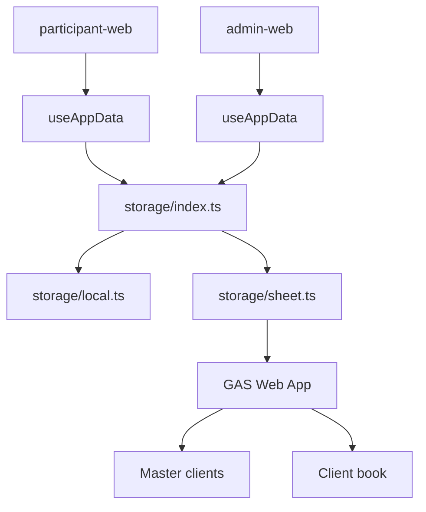

# ExpertEye360 — 残り実装と再設計メモ

**目的**: ここまでの実装済み範囲と未実装範囲を分け、次の設計をやり直すための作業メモとしてまとめる。

**位置づけ**: 本書は再設計の入口。既存の正本は引き続き [README.md](../README.md)、[TECHNICAL-SPEC.md](./TECHNICAL-SPEC.md)、[SPREADSHEET-DATA.md](./SPREADSHEET-DATA.md)、[TEST-DESIGN.md](./TEST-DESIGN.md)。

---

## 目次

- [1. 現在できていること](#1-現在できていること)
- [2. 暫定実装として扱うもの](#2-暫定実装として扱うもの)
- [3. 残り実装の受け入れ仕様](#3-残り実装の受け入れ仕様)
  - [A. 本番永続化（GAS + Google スプレッドシート）](#a-本番永続化gas--google-スプレッドシート)
  - [B. storage 正式設計（local / sheet 切替）](#b-storage-正式設計local--sheet-切替)
  - [C. Sheet API 契約テスト](#c-sheet-api-契約テスト)
  - [D. 画面の Sheet API 配線](#d-画面の-sheet-api-配線)
  - [E. Playwright の本番近似化](#e-playwright-の本番近似化)
  - [F. PDF](#f-pdf)
  - [G. OJT](#g-ojt)
  - [H. UI / Hook テスト](#h-ui--hook-テスト)
- [4. 再設計方針](#4-再設計方針)
- [5. 次に着手するなら](#5-次に着手するなら)

---

## 1. 現在できていること

### 受講者フロー

**実装** — あり

- 研修コード入力
- 名前・所属入力
- 5 問フロー（気づき → 共有・行動 → 判断基準 → 一言メモ）
- 確信度
- 送信完了

**テスト** — `shared` Unit と Playwright 代表 E2E あり

### 管理者画面

**実装** — あり

- 管理者コード入室（local）
- 研修コード設定（local）
- シーン・カード編集
- 回答一覧・詳細

**未完了** — Sheet backend の研修コード変更 UI、PDF / OJT UI

### shared ロジック

**実装** — あり

- `choices`
- `judgmentFlow`
- `sceneQuestions`
- `cardSlots`
- `selection`
- `validateStep`
- `submission`
- `storage`（local / sheet 切替）
- `storage/sheet.ts`（Sheet API）
- `pdfExport`（生成 payload と `Uint8Array` の入口）
- `ojtExport`（確認項目テキスト生成の入口）

**テスト** — `npm test` は 13 files / 75 tests Green

### Playwright

**実装** — あり

- `playwright.config.ts`
- `e2e/participant-admin-flow.spec.ts`
- `e2e/embed-layout.spec.ts`
- `npm run test:e2e`

**状態** — 4 tests Green（E2E 用共有ストレージ経由）

**注意** — 受講者 → 管理者共有の本番同等確認は、ライブ GAS の手動疎通では Green。Playwright はまだ E2E 用の暫定共有ストレージで Green にしている。

---

## 2. 暫定実装として扱うもの

### E2E 用共有ストレージ

**対象** — `scripts/e2e-storage-server.mjs`

**目的** — Playwright で `participant-web` と `admin-web` の別ポート間共有を先に検証するための補助。

**扱い** — 本番仕様ではない。Sheet API が本配線されたら、E2E も Sheet API dev / mock 経路へ置き換える。

### `storage.ts` の E2E 分岐

**対象** — `shared/src/storage.ts`

**目的** — `navigator.webdriver` かつ `127.0.0.1` のときだけ E2E 用共有ストレージへ同期する。

**扱い** — 開発補助。正式な storage 設計では `local` / `sheet` 切替に整理する。

---

## 3. 残り実装の受け入れ仕様

各項目は、実装前に Red にするテスト・人間が見る受け入れ条件・コード上の期待値を分けて整理する。

---

### A. 本番永続化（GAS + Google スプレッドシート）

**最小実装済み**

- GAS Web App
- Google スプレッドシートへの実保存・実読込
- マスターブック `clients`
- クライアント用ブック `settings` / `rooms` / `responses` / `audit_logs`
- `clientId` によるクライアント解決
- `roomId` による研修回分離
- 管理者 `token` 照合
- 研修コードのハッシュ照合

**残り**

- 管理画面からの研修コード変更（`rooms.accessCodeHash` 更新）
- 複数 `client` / 複数 `room` の手動分離確認
- Sheet backend の Playwright 化
- 本番運用向けの監査・バックアップ・エラー文言整理

**目的** — 受講者・管理者・別端末が同じ研修データを共有し、契約組織と研修回ごとにデータを分離する。

**受け入れ条件**

- `client` が正しい場合だけ、当該クライアント用ブックの `settings` / `responses` を読み書きできる。
- `client` が存在しない、または `enabled=false` の場合は API がエラーを返し、別クライアントのデータを返さない。
- 受講者は研修コードを `POST rooms/verify` で検証し、成功した `roomId` にだけ回答を送信できる。
- 管理者は管理者コード（`token`）が正しい場合だけ、設定保存・回答一覧参照ができる。
- `responses` は `room_id` で分離され、別 room の回答が混ざらない。
- 平文の研修コード・管理者コードはシートに保存しない。

**成功条件**

- 受講者が別端末・別ブラウザから送信した回答を、管理者が同じ `client` + `room` で確認できる。
- 別 `client` または別 `room` の管理画面には、その回答が表示されない。
- API エラー時に画面が壊れず、ユーザー向けのエラー表示または再試行導線が出る。
- `npm test` と本番近似 Playwright が Green になる。

**どのようにテストするか**

- `sheetApi.test.ts` で `fetch` mock を使い、URL クエリ・JSON body・レスポンス parse・エラー処理を検証する。
- dev GAS または同型 mock を使い、Playwright で受講者送信 → 管理者確認を通す。
- 手動で 2 つの `client`、2 つの `room` を用意し、回答が漏れないことを確認する。
- 不正 `client`、不正 `room`、不正 `token` をそれぞれ試し、画面が壊れないことを確認する。

**コード上の期待値**

- `GET settings?client=client-a` は `AppSettings` を返す。
- `POST settings?client=client-a&token=...` は `AppSettings` を保存し、必要に応じて `audit_logs` に追記する。
- `POST rooms/verify?client=client-a` は `{ accessCode }` を受け取り、成功時 `{ roomId }` を返す。
- `POST responses?client=client-a&room=room-a` は `ParticipantSubmission` を 1 行として保存する。
- `GET responses?client=client-a&room=room-a&token=...` は `room-a` の `ParticipantSubmission[]` だけを返す。
- `client` 不正は 400、`token` 不正は 401、無効 `client` / `room` は 403 相当のエラーになる。

---

### B. storage 正式設計（local / sheet 切替）

**最小実装済み**

- `VITE_STORAGE_BACKEND=local|sheet`
- `shared/src/storage.ts` の async API
- 受講者・管理者 `useAppData` のローディング・エラー設計

**残り**

- 必要なら `storage/local.ts` / `storage/index.ts` へ分割
- Sheet backend の保存中 UI の細分化
- E2E 用共有ストレージ分岐の置き換え

**目的** — 画面側が保存先の物理実装を意識せず、開発では local、本番では Sheet API を使えるようにする。

**受け入れ条件**

- `VITE_STORAGE_BACKEND=local` では現行 localStorage 実装が動く。
- `VITE_STORAGE_BACKEND=sheet` では `storage/sheet.ts` を経由して API を呼ぶ。
- `participant-web` / `admin-web` は storage の公開 API だけを呼び、`localStorage` や `fetch` を直接扱わない。
- Sheet API 利用時は読み込み中・保存中・エラー状態を UI が扱える。
- E2E 用共有ストレージ分岐は正式な本番経路として扱わない。

**成功条件**

- local backend で既存 Unit / E2E が Green。
- sheet backend で API 契約テストが Green。
- backend 切替時に UI の呼び出し箇所が大きく分岐しない。
- `shared/src/storage.ts` が巨大な条件分岐の置き場にならない。

**どのようにテストするか**

- `storage.test.ts` で local backend の保存・読込・破損 JSON 復帰を確認する。
- `sheetApi.test.ts` で sheet backend の API 契約を確認する。
- `useAppData.test.ts` でロード中、成功、失敗、再読込を確認する。
- Playwright で `VITE_STORAGE_BACKEND=sheet` の代表フローを通す。

**コード上の期待値**

- `storage/local.ts` は localStorage だけを扱う。
- `storage/sheet.ts` は `fetch` と API 契約だけを扱う。
- `storage/index.ts` は backend 選択だけを扱う。
- 公開 API は `loadSettings` / `saveSettings` / `loadResponses` / `appendResponse` / `verifyTrainingCode` 相当を提供する。
- Sheet API に合わせ、公開 API は `Promise` を返す設計に寄せる。

---

### C. Sheet API 契約テスト

**未実装**

- TC-005: `client` 欠落・不正
- TC-006: API 500 / ネットワーク失敗
- TC-007: 全リクエストに `client` が付く
- TC-008: `room` 別の responses 分離
- TC-009: 不正 `room` / 未登録コード
- TC-011: `audit_logs`
- TC-012: 不正管理者 `token`
- TC-013: 管理者コード変更 API

**目的** — GAS 実装前に、フロントと API の通信契約を固定する。

**受け入れ条件**

- すべての API 呼び出しで `client` が URL クエリに含まれる。
- 回答系 API では `room` が URL クエリに含まれる。
- 管理者操作では `token` が URL クエリまたはヘッダに含まれる。
- API エラーは `throw` または Result 型のいずれかに統一して扱う。
- room 分離のテストは、別 room の回答が配列に含まれないことまで検証する。

**成功条件**

- TC-001〜013 がすべて Green。
- テスト名が日本語で、何をしたら何になるか読める。
- GAS の内部列名や Apps Script の実装詳細に依存しない。

**どのようにテストするか**

- Vitest で `fetch` を mock する。
- `makeSettings` / `makeSubmission` を使って実型に近いデータを送る。
- `fetch` の URL、method、body、レスポンス parse を検証する。
- 400 / 401 / 403 / 500 とネットワーク失敗をそれぞれ検証する。

**コード上の期待値**

- `loadSheetSettings(clientId, token?)` は `GET settings?client=...` を呼ぶ。
- `saveSheetSettings(clientId, token, settings)` は `POST settings?client=...&token=...` を呼ぶ。
- `loadSheetResponses(clientId, roomId, token)` は `GET responses?client=...&room=...&token=...` を呼ぶ。
- `appendSheetResponse(clientId, roomId, submission)` は `POST responses?client=...&room=...` を呼び、body に `ParticipantSubmission` を送る。
- `verifyTrainingCodeViaApi(clientId, accessCode)` は `POST rooms/verify?client=...` を呼び、成功時 `{ roomId }` を返す。

---

### D. 画面の Sheet API 配線

**未実装**

- 受講者の `rooms/verify` を Sheet API へ接続
- 受講者の `appendResponse` を Sheet API へ接続
- 管理者の `loadSettings` / `saveSettings` を Sheet API へ接続
- 管理者の `loadResponses` を Sheet API へ接続
- 管理者コードの API token 化
- エラー表示
- ローディング表示

**目的** — 受講者 UI と管理者 UI を、本番の共有データストアへ接続する。

**受け入れ条件**

- 受講者は `?client=` が無い場合、分かるエラーを表示して送信できない。
- 研修コード検証中は二重送信できない。
- 研修コード検証成功後だけ名前・所属欄が表示される。
- 回答送信中は送信ボタンが多重押下されない。
- 管理者は管理者コード検証成功後だけ設定・回答一覧に入れる。
- 管理者の設定保存・回答一覧取得は Sheet API 経由になる。
- API 失敗時は再試行できる表示になる。

**成功条件**

- `VITE_STORAGE_BACKEND=sheet` で、受講者送信 → 管理者回答表示が動く。
- `local` backend でも従来の開発確認が壊れない。
- エラー時に画面が白くならない。
- 入室スキップや room 無視のショートカットが結合確認の正になっていない。

**どのようにテストするか**

- `useAppData.test.ts` で読み込み成功・失敗・再読込を検証する。
- `ParticipantPage.test.tsx` で研修コード前後の表示、送信中、失敗表示を薄く検証する。
- `AdminPage.test.tsx` で管理者コード前後の表示、回答一覧取得、保存失敗表示を薄く検証する。
- Playwright で本番近似の受講者 → 管理者フローを通す。

**コード上の期待値**

- 画面は `storage` 公開 API だけを呼ぶ。
- `clientId` は URL クエリまたは環境値から解決される。
- `roomId` は `rooms/verify` 成功後に state / sessionStorage に保持される。
- `appendResponse` には検証済み `roomId` を含む `ParticipantSubmission` が渡る。
- 管理者 API 呼び出しには検証済み `token` が付く。

---

### E. Playwright の本番近似化

**未実装**

- E2E 用共有ストレージから Sheet API dev / mock への置き換え
- 受講者 → 管理者確認を Sheet API 経路で Green
- 別 `room` に漏れない確認
- 不正研修コード・不正管理者コードの E2E

**目的** — リリース前に、人間の代表操作に近い形で本番の主要リスクを自動確認する。

**受け入れ条件**

- `npm run test:e2e` が `VITE_STORAGE_BACKEND=sheet` 相当で動く。
- 受講者送信結果が管理者の同一 `client` + `room` に表示される。
- 別 `room` の管理者一覧には表示されない。
- 不正研修コードでは名前・所属欄が出ない。
- 不正管理者コードでは管理 UI が出ない。
- iframe 25% / 40% の代表レイアウトが崩れない。

**成功条件**

- E2E 用共有ストレージサーバーなしで `npm run test:e2e` が Green。
- 失敗時に、どのユーザーフローが壊れたか分かるテスト名になっている。
- CI または手元で再現性がある。

**どのようにテストするか**

- Playwright の `webServer` で participant / admin / mock Sheet API を起動する。
- `participant-admin-flow.spec.ts` で 5 問送信と管理者確認を実行する。
- `embed-layout.spec.ts` で iframe サイズと主要表示を確認する。
- 別 room / 不正コードは独立した `test` に分ける。

**コード上の期待値**

- E2E mock は本番 Sheet API と同じ URL / JSON 契約を持つ。
- テストは UI の細かい CSS ではなく、ユーザーが見える文言・ボタン・送信結果を assert する。
- `test-results/` と `playwright-report/` は git 管理しない。

---

### F. PDF

**未実装**

- `jsPDF` 本実装
- 管理者画面の PDF ダウンロード UI
- ファイル名ルール
- 実 PDF の目視確認
- PDF に含める項目の最終レイアウト

**実装済み入口** — `shared/src/pdfExport.ts`

**目的** — 講師・管理者が受講者 1 件分の研修結果を保存・共有できるようにする。

**受け入れ条件**

- 管理者画面で回答済み 1 件を選択できる。
- 選択した回答から PDF ダウンロードを実行できる。
- PDF は 1 送信 1 ファイルで生成される。
- PDF にはシーン名、名前、所属、確信度、5 問分の出題カードと選択回答、一言メモが含まれる。
- `rounds` が不足している古い回答でもクラッシュしない。

**成功条件**

- `pdfExport.test.ts` が jsPDF 実装でも Green。
- `AdminPage` の PDF ダウンロード代表テストが Green。
- 手動で生成 PDF を開き、必要項目が読める。
- ファイル名が受講者名・日付・回答 ID などで一意に近い。

**どのようにテストするか**

- `pdfExport.test.ts` で PDF バイナリ、payload、主要文字列、欠損 rounds を検証する。
- `AdminPage.test.tsx` で回答詳細から PDF 生成関数が呼ばれることを検証する。
- Playwright または手動で実ダウンロードを確認する。
- 実 PDF の目視確認は人間向け受け入れで行う。

**コード上の期待値**

- `generateParticipantPdf({ submission, scene })` が PDF 相当の `Uint8Array` または `Blob` を返す。
- PDF 先頭は `%PDF` 相当になる。
- `buildParticipantPdfPayload()` は trim 済みの `participantName` / `affiliation` を含む。
- `confidenceLevel` は `getConfidenceLabel()` の表示文言に変換される。
- 管理者 UI は選択中回答と `sceneId` に対応する `Scene` を渡す。

---

### G. OJT

**未実装**

- OJT 出力形式の決定
- 管理者画面の OJT 出力 UI
- ファイル出力
- OJT チェックリスト編集 UI の要否

**実装済み入口** — `shared/src/ojtExport.ts`

**目的** — 研修後に OJT 担当者が次の指導で確認すべきポイントを受講者回答から整理できるようにする。

**受け入れ条件**

- 管理者が回答済み 1 件を選択し、OJT 確認項目を生成できる。
- `scene.veteranTemplate.ojtChecklist` がある場合は、その項目を元に回答情報を付加できる。
- チェックリストが空でも、受講者回答から最低限の確認項目を生成できる。
- 出力文言に「正解」「不正解」「点数」「スコア」など評価・採点表現を含めない。
- 出力形式は画面表示、テキストコピー、ファイル出力のいずれかに固定する。

**成功条件**

- `ojtExport.test.ts` が Green。
- 管理者画面で OJT 出力を確認できる。
- 空チェックリスト・空メモ・一部未回答でもクラッシュしない。
- OJT 担当者が次に確認する観点として読める文になっている。

**どのようにテストするか**

- `ojtExport.test.ts` で checklist あり、checklist なし、スコア表現なしを検証する。
- `AdminPage.test.tsx` で回答詳細から OJT 出力を表示 / ダウンロードできることを検証する。
- 手動で代表回答を作り、出力文言が OJT 用として自然か確認する。

**コード上の期待値**

- `buildOjtExportItems({ submission, scene })` は `string[]` を返す。
- 重複した選択ラベルは必要に応じて重複除去される。
- `participantName`、`affiliation`、`scene.displayName`、回答要約が出力に含まれる。
- 出力は採点結果ではなく、確認観点として構成される。

---

### H. UI / Hook テスト

**未実装**

- `participant-web/src/hooks/useAppData.test.ts`
- `admin-web/src/hooks/useAppData.test.ts`
- `participant-web/src/pages/ParticipantPage.test.tsx`
- `admin-web/src/pages/AdminPage.test.tsx`

**目的** — shared で固定済みのロジックが、画面から正しく呼ばれていることを薄く確認する。

**受け入れ条件**

- `useAppData` は storage の成功・失敗・再読込を画面側に渡せる。
- `ParticipantPage` は研修コード前後、名前・所属、未入力警告、送信完了の代表表示を確認できる。
- `AdminPage` は管理者コード前後、回答一覧、回答詳細、PDF / OJT ボタンの代表表示を確認できる。
- UI テストは 5 問フロー全体の詳細を重複して持たない。

**成功条件**

- `*.test.tsx` が安定して Green。
- shared の Unit と E2E の間を埋めるスモークになっている。
- DOM の細かい構造変更に弱すぎない。

**どのようにテストするか**

- Testing Library + Vitest を導入する。
- storage API を mock し、画面に出る文言とボタン状態を assert する。
- 5 問の詳細フローは Playwright と shared Unit に任せる。
- PDF / OJT は関数を mock し、呼び出しと UI 表示だけ確認する。

**コード上の期待値**

- `useAppData` は `settings`、`responses`、`loading`、`error`、`refresh`、保存系関数を返す。
- `ParticipantPage` は shared の `validateParticipantStep` / `buildSubmission` / `verifyTrainingCode` 相当を経由する。
- `AdminPage` は shared の storage / `pdfExport` / `ojtExport` を経由する。
- UI テスト対象は「ユーザーに見える文言」と「主要ボタン」のみを中心にする。

---

## 4. 再設計方針

### 4.1 最初に決めること

#### storage API の同期 / 非同期

**選択肢 A** — 既存の `loadSettings()` / `loadResponses()` を同期のまま保つ

**メリット** — UI の変更が少ない

**デメリット** — Sheet API と相性が悪い。同期 XHR や暫定コードが残りやすい

**選択肢 B** — storage 公開 API を `async` にする

**メリット** — 本番 API と自然に合う

**デメリット** — `useAppData` と画面にローディング / エラー状態が必要

**推奨** — 選択肢 B。ここで一度きれいに切り替える。

#### 本番 API の最小スコープ

**最小スコープ**

1. `GET settings`
2. `POST settings`
3. `POST rooms/verify`
4. `GET responses`
5. `POST responses`

**後続**

1. `GET rooms`
2. `POST rooms`
3. `PUT responses`
4. `POST reset`
5. `POST clients/provision`
6. 管理者コード変更
7. `audit_logs`

### 4.2 推奨アーキテクチャ

### 4.3 実装順

#### Step 1

**内容** — `sheetApi.test.ts` の残り契約を追加

**完了条件** — Red になる

#### Step 2

**内容** — `storage/sheet.ts` を契約テストに合わせて拡張

**完了条件** — `sheetApi.test.ts` が Green

#### Step 3

**内容** — storage を `local` / `sheet` に分割し、`VITE_STORAGE_BACKEND` で切替

**完了条件** — local Unit が Green、sheet 契約が Green

#### Step 4

**内容** — `useAppData` を async storage に対応

**完了条件** — 受講者・管理者の基本表示が壊れない

#### Step 5

**内容** — GAS 最小 API を実装

**完了条件** — dev GAS で settings / responses / rooms verify が動く

#### Step 6

**内容** — Playwright を Sheet API dev / mock に差し替え

**完了条件** — E2E 用共有ストレージなしで `npm run test:e2e` が Green

#### Step 7

**内容** — PDF / OJT / UI テストへ進む

**完了条件** — 管理者画面から PDF / OJT を出力できる

---

## 5. 次に着手するなら

**最初の作業** — `sheetApi.test.ts` に TC-005〜009 を追加する。

**理由** — 本番共有の一番危ない部分は `client` / `room` の漏洩なので、ここを最初に固定する。

**その次** — storage を async 化するかどうかを決める。

**推奨** — async 化して本番 API に合わせる。
