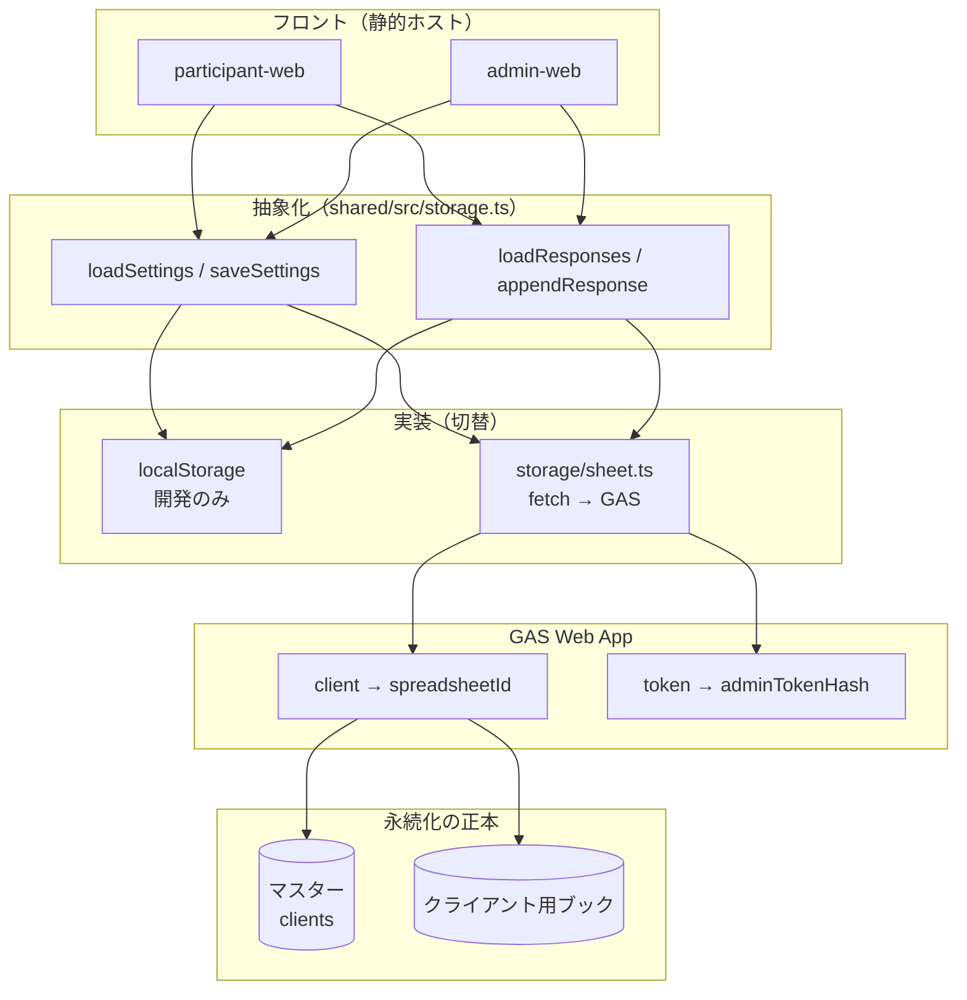
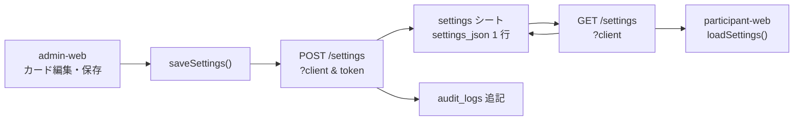
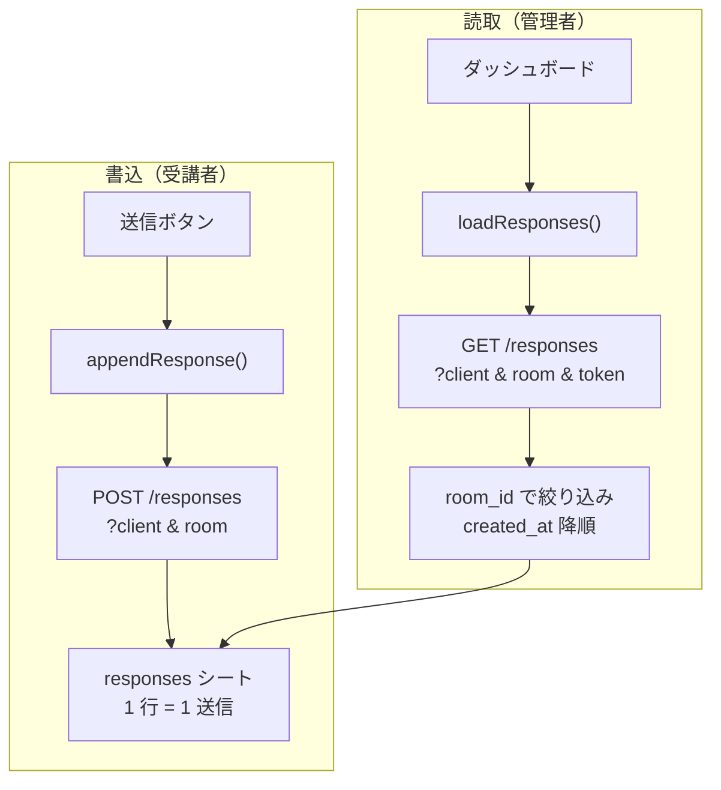
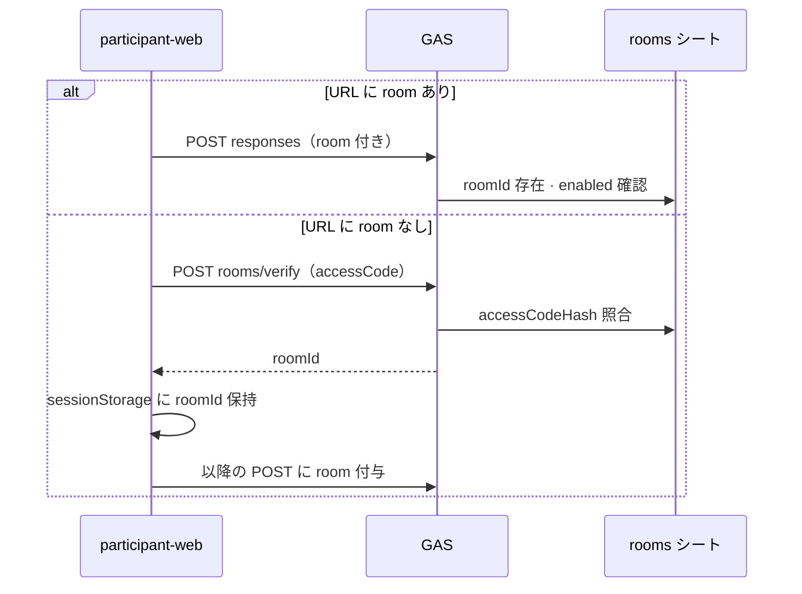
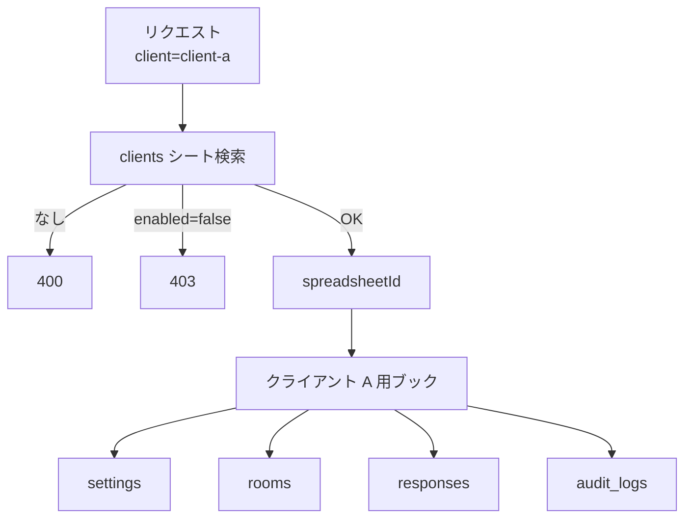

# ExpertEye360 — スプレッドシート永続化仕様

本書は、研修用 Web の **本番データストアとして Google スプレッドシートを用いる** 方針と、複数クライアント対応・API 契約・シート構成を定義する。

関連: [TECHNICAL-SPEC.md](./TECHNICAL-SPEC.md) §5、[TEST-DESIGN.md](./TEST-DESIGN.md)、[TDD-FEATURE-INVENTORY.md](./TDD-FEATURE-INVENTORY.md)

---

## 0. 現状の問題と解決策（優先順）

### 0.1 現状の問題（`localStorage` のみ・API 未実装時）

**P-01 — 受講者の回答が講師に届かない**

- 保存先が各ブラウザの `localStorage` のみ
- ローカル dev（5173 / 5174）は **別オリジン**でストレージが分離
- 別 PC・別端末間では共有されない（UI 文言「講師は管理者画面で確認」と矛盾しうる）

**P-02 — クライアント・研修回の混線**

- `clientId` 未実装時は、契約組織・工場単位のデータ分離ができない
- 同一ストレージに複数研修の回答が混ざりうる

**P-03 — 入室制限がない**

- URL を知っていれば誰でもアクセス可能
- 研修コード・ルームの概念が無い

### 0.2 解決策（実装の優先順）

**S-01 — Sheet API + スプレッドシート（必須）**

- 受講者・管理者が **同じ HTTPS API** を参照する
- 推奨: GAS Web App → Google スプレッドシート
- フロントは静的ホスト可。`localStorage` は開発用のみ
- **入室パスワードだけでは P-01 は解決しない**（共有ストアが先）

**S-02 — `clientId`（必須・複数クライアント時）**

- 埋め込み URL: `?client={clientId}`
- クライアントごとにスプレッドシート 1 冊（方式 A）で P-02 の組織単位分離

**S-03 — `roomId` / 研修コード（推奨・同一クライアントで複数研修がある場合）**

- URL または受講者の初回入力: `?client=...&room=...` または画面でコード入力
- `responses` に `room_id` を保存し、管理者一覧は **同一 room のみ** 表示
- 関係者以外の直アクセス抑止の **補助**（本格的認証の代替ではない）

**S-04 — ストレージ抽象化（Postgres 移行のため）**

- フロントは `loadSettings` / `saveSettings` / `loadResponses` / `appendResponse` の窓口のみ
- シートは API の裏側。将来 **PostgreSQL 等に API 実装を差し替え**可能（[§7](#7-将来-postgresql-等への移行)）

### 0.3 実装フェーズ（目安）

1. テンプレート用スプレッドシート 1 冊を用意（手作りはここだけ）
2. Vitest + `sheetApi.test.ts`（TDD・契約先行）
3. `storage/sheet.ts` + GAS（通常 API）
4. GAS `clients/provision`（クライアント追加の自動化）
5. URL から `clientId` 取得
6. `roomId` / 研修コード（必要なクライアントから）

---

## 1. 方針

**採用**

- 論理 DB として **Google スプレッドシート**
- フロント（`participant-web` / `admin-web`）は **静的ホスト可**（FileZilla 等）
- 読み書きは **HTTPS API** 経由（推奨実装: **Google Apps Script（GAS）Web App**）

**採用しない（本番の正）**

- 受講者・管理者間のデータ共有を `localStorage` のみで行う構成

**開発時**

- `localStorage` 実装（`shared/src/storage.ts`）は **オフライン開発・単体テスト用**として残す
- 本番ビルドは `VITE_STORAGE_BACKEND=sheet`（名称は実装時に確定）で API 経由に切替

---

## 1.1 データの流れ（図解）

システム全体の配置図・受講者／管理者のシーケンスは [TECHNICAL-SPEC.md §5.1](./TECHNICAL-SPEC.md#51-データの流れ図解) を参照。本節は **ストレージ層とシートへの書き込み** に焦点を当てる。

### 1.1.1 レイヤーと正本



| レイヤー | 役割 |
| --- | --- |
| フロント | UI のみ。直接スプレッドシートには触れない |
| `storage.ts` 窓口 | 本番・開発で **同じ関数シグネチャ**（Postgres 移行時も維持） |
| GAS | 認可・`client` 解決・シート行の読み書き |
| スプレッドシート | **唯一の共有正本**（受講者・管理者・端末をまたぐ） |

### 1.1.2 設定データ（settings）の流れ



- 受講者は **読取のみ**（カード文言・選択肢のマスタ）。
- 管理者保存は `settings` 上書き + `audit_logs`（§3.3）。

### 1.1.3 回答データ（responses）の流れ



| 項目 | 内容 |
| --- | --- |
| キー | `clientId` + `roomId`（URL または研修コード検証後） |
| 粒度 | 1 行 = `ParticipantSubmission` 1 件（`submission_json` に `rounds[5]`） |
| 更新 | 受講者は **追記のみ**。削除・一括クリアは管理者 + `audit_logs` |

### 1.1.4 研修回（rooms）と入室



- 平文の研修コードは **シートに保存しない**（`accessCodeHash` のみ）。
- 管理者の room 作成は `POST rooms` → `rooms` + `audit_logs`（§3.4）。

### 1.1.5 マスター解決からシート操作まで



---

## 2. 複数クライアント（テナント）

「クライアント」= 契約組織・工場研修単位など、**データを分離する単位**。

### 2.1 識別子 `clientId`

- 英小文字・数字・ハイフン（例: `acme-factory`, `client-01`）
- 埋め込み URL のクエリで渡す（要決定: パス形式も可）

```
https://{host}/participant/?client=acme-factory
https://{host}/admin/?client=acme-factory
```

3DVista の iframe `src` に同じ `client` を付与する。受講者・管理者で **同一 `clientId`** を使う。

### 2.2 ブック構成（採用）

**マスターブック 1 冊**（運用者・GAS のみ編集）と、**クライアントごとにスプレッドシート 1 冊**（クライアント A 用・B 用…）とする。

```
マスターブック
└── clients シート
    ├── clientId
    ├── spreadsheetId
    ├── displayName
    ├── enabled
    └── adminTokenHash

クライアント A 用スプレッドシート
├── settings
├── rooms
├── responses
└── audit_logs

クライアント B 用スプレッドシート
├── settings
├── rooms
├── responses
└── audit_logs
```

- GAS は `client` クエリでマスターの `clients` を引き、`spreadsheetId` のブックを開く
- `enabled=false` のクライアントは API が **403** を返す

### 2.2.1 クライアント用ブックは事前に手作り必須か

**いいえ。手作りは最小構成のやり方の一つ**であり、本仕様の推奨運用は **テンプレートからの自動プロビジョニング** である。

| 方式 | 誰がやるか | 向いている場面 |
| --- | --- | --- |
| **A. 手動** | 運用者がスプレッドシートをコピー・リネームし、マスター `clients` に 1 行追加 | 初回検証・クライアント数が極少 |
| **B. 自動（推奨）** | GAS がテンプレートを複製し、名前変更・初期データ投入・マスター登録まで実施 | 複数クライアントを増やす本番運用 |

**方式 B で GAS が行うこと（新規クライアント追加時）**

1. **テンプレート用スプレッドシート**（空の 4 シート: settings / rooms / responses / audit_logs）を 1 冊だけ事前に用意（全クライアント共通・1 回だけ）
2. `DriveApp` 等でテンプレートを **コピー**
3. コピー先のファイル名を **`displayName`（クライアント表示名）** に変更（例: `ExpertEye360 — 〇〇工場`）
4. `settings` にデモ seed 相当または空の `AppSettings` を 1 行書き込み
5. `rooms` / `responses` / `audit_logs` はヘッダ行のみ（またはテンプレに含める）
6. 管理者用 `adminToken` を生成し、**`adminTokenHash` のみ** マスター `clients` に保存（平文 token は API レスポンスで 1 回だけ返す）
7. マスター `clients` に行追加: `clientId`, `spreadsheetId`, `displayName`, `enabled=true`

**運用者が手でやるのは原則**

- テンプレート 1 冊の初回作成（またはリポジトリ手順書どおり 1 回セットアップ）
- 自動作成後、返却された **管理者 token** の保管・管理者 iframe URL の配布
- Google Drive の共有フォルダ・GAS 実行アカウントの権限（要決定）

**フロントからの追加（将来・管理者専用）**

- `POST clients/provision`（マスター token 必須）
- ボディ例: `{ "clientId", "displayName" }` → レスポンス: `{ "spreadsheetId", "adminToken" }`（token は再表示不可）

**採用しない構成（参考）**

- 1 冊に全クライアントをタブ分け（誤設定時の影響が大きい）
- 全行に `clientId` 列だけでフィルタ（運用は楽だが分離が弱い）

### 2.3 研修回（ルーム）`roomId`

**目的** — 同一 `clientId` 内で研修回ごとに回答を分ける（S-03）。**正本はクライアント用ブックの `rooms` シート**。

**識別子 `roomId`**

- 英小文字・数字・ハイフン（例: `2026-05-20-am`, `plant-tour-03`）
- `rooms` シートの主キー。URL の `room` パラメータはこの ID を渡す

**URL 例**

```
https://{host}/participant/?client=client-a&room=2026-05-20-am
https://{host}/admin/?client=client-a&room=2026-05-20-am
```

**受講者 UI（要決定）**

- URL に `room` が無い場合、step 0 付近で **研修コード入力** → GAS が `rooms` で検証（`accessCodeHash` 照合）→ 通過後 `roomId` を `sessionStorage` に保持
- コード不正・`enabled=false` の room は送信不可

**API**

- 回答系リクエストは `client` + `room` 必須
- `GET responses` は **当該 `room_id` の行のみ**

---

## 3. シート定義

### 3.1 マスターブック — `clients` シート

#### `clientId`

- **型**: 文字列
- **内容**: 主キー（例: `client-a`）

#### `spreadsheetId`

- **型**: 文字列
- **内容**: 当該クライアント用スプレッドシート ID

#### `displayName`

- **型**: 文字列
- **内容**: 運用表示名（例: 〇〇工場）

#### `enabled`

- **型**: 真偽
- **内容**: `false` なら API は 403

#### `adminTokenHash`

- **型**: 文字列
- **内容**: 管理者 API 用トークンのハッシュ（平文は置かない）

- GAS 実行アカウントのみマスターブックを読めること
- 管理者フロントは `token`（または Bearer）を送り、GAS が `adminTokenHash` と照合

### 3.2 クライアント用ブック — シート一覧

各クライアント（A, B, …）のスプレッドシートは **同じ 4 シート名** を持つ。

#### `settings`

- **役割**: 研修設定（`AppSettings` を JSON で 1 行保持）

#### `rooms`

- **役割**: 研修回マスタ・入室コード（S-03）

#### `responses`

- **役割**: 受講者回答（1 送信 = 1 行）

#### `audit_logs`

- **役割**: 設定変更・ルーム操作・一括削除等の監査ログ（追記のみ）

### 3.3 `settings` シートの列

#### `key`

- **型**: 文字列
- **内容**: 固定 `default`（将来拡張用）

#### `settings_json`

- **型**: 文字列
- **内容**: `AppSettings` の `JSON.stringify` 結果

#### `updated_at`

- **型**: ISO8601
- **内容**: 最終更新

**読取** — `key=default` の行から `settings_json` をパース → `normalizeSettings`（既存ロジック）

**書込** — 管理者保存時に上書き（楽観ロックは **要決定**: `updated_at` 比較）。`audit_logs` に 1 行追記

### 3.4 `rooms` シートの列

#### `roomId`

- **型**: 文字列
- **内容**: 主キー

#### `displayName`

- **型**: 文字列
- **内容**: 表示名（例: 2026/05/20 午前クラス）

#### `enabled`

- **型**: 真偽
- **内容**: `false` なら当該 room への受講者 POST を拒否

#### `accessCodeHash`

- **型**: 文字列
- **内容**: 研修入室コードのハッシュ（平文コードはシートに置かない）

#### `startsAt` / `endsAt`（任意）

- **型**: ISO8601
- **内容**: 研修期間。期間外は受付拒否（要決定）

**運用** — 管理者 UI またはシート直接で行を追加。受講者はコード入力 or URL の `room` で参加

### 3.5 `responses` シートの列

#### `id`

- **型**: 文字列
- **内容**: `ParticipantSubmission.id`（UUID 等）

#### `created_at`

- **型**: ISO8601
- **内容**: 送信日時

#### `participant_name`

- **型**: 文字列
- **内容**: 氏名

#### `affiliation`

- **型**: 文字列
- **内容**: 所属

#### `scene_id`

- **型**: 文字列
- **内容**: シーン ID

#### `scene_name`

- **型**: 文字列
- **内容**: 表示用シーン名

#### `confidence_level`

- **型**: 数値
- **内容**: 1〜5

#### `submission_json`

- **型**: 文字列
- **内容**: `ParticipantSubmission` 全体（`rounds` 含む）

#### `room_id`

- **型**: 文字列
- **内容**: `rooms.roomId` への参照（必須）

**一覧** — `room_id` で絞り込み、`created_at` 降順（新しい順）。現行 `appendResponse` の `unshift` と整合

**詳細** — `submission_json` をパースして管理者 UI の 5 設問表示に利用

**書込** — 受講者 `POST responses` のみ追記（更新・削除は管理者操作 + `audit_logs`）

### 3.6 `audit_logs` シートの列

#### `id`

- **型**: 文字列
- **内容**: ログ行 ID（UUID 等）

#### `at`

- **型**: ISO8601
- **内容**: 発生日時

#### `actor`

- **型**: 文字列
- **内容**: `admin` / `system` / `participant`（要決定: 受講者 POST は responses のみで十分なら省略可）

#### `action`

- **型**: 文字列
- **内容**: 例: `settings.save`, `room.create`, `responses.clear`

#### `target`

- **型**: 文字列
- **内容**: 例: `settings`, `room:{roomId}`, `responses`

#### `detail`

- **型**: 文字列
- **内容**: 短文 JSON またはメモ（差分の要約）

**原則** — 追記のみ。削除・改ざんは運用ポリシーで制限

---

## 4. API（GAS Web App 想定）

ベース URL は環境変数 `VITE_SHEET_API_BASE`（例: `https://script.google.com/macros/s/.../exec`）。

**共通クエリ**

- `client` — 必須（`clientId`）
- `room` — 推奨（`roomId`）。無い場合の扱いは API で定義（要決定: 拒否 or デフォルト room）
- `token` — 管理者操作で必須（`clients.adminTokenHash` と照合。**要決定**: ヘッダ `Authorization: Bearer` に移行可）
- 受講者 — `token` なし。`room` は `rooms` シートで存在・`enabled`・`accessCodeHash`（コード入力時）を検証

POST ボディは JSON。GAS はマスター `clients` で `spreadsheetId` を解決し、当該クライアント用ブックを操作する。

### 4.1 エンドポイント（案）

#### GET `settings`

- **用途**: 設定取得
- **対応 storage**: `loadSettings`

#### POST `settings`

- **用途**: 設定保存
- **対応 storage**: `saveSettings`

#### GET `responses`

- **用途**: 回答一覧
- **対応 storage**: `loadResponses`

#### POST `responses`

- **用途**: 回答 1 件追加
- **対応 storage**: `appendResponse`

#### PUT `responses`

- **用途**: 一覧置換（全削除等）
- **対応 storage**: `saveResponses`

#### GET `rooms`

- **用途**: 研修回一覧（管理者。有効な room のみ等は要決定）
- **シート**: `rooms`

#### POST `rooms`

- **用途**: 研修回の追加・更新（管理者）
- **シート**: `rooms` + `audit_logs`

#### POST `rooms/verify`（案）

- **用途**: 受講者の研修コード検証 → 成功時 `roomId` を返す
- **ボディ**: `accessCode`（平文はログに残さない）

#### POST `reset`

- **用途**: デモリセット（管理者のみ）
- **対応 storage**: `resetDemoData`
- **副作用**: `audit_logs` に記録

#### POST `clients/provision`（運用・スーパー管理者）

- **用途**: 新規クライアント用スプレッドシートの自動作成（§2.2.1 方式 B）
- **認証**: マスター運用 token（通常の `client` 別 `adminTokenHash` とは別でも可。**要決定**）
- **ボディ**: `clientId`, `displayName`（任意: 初期 `settings` の JSON）
- **レスポンス**: `spreadsheetId`, `adminToken`（初回のみ平文）, `clientId`
- **副作用**: マスター `clients` に 1 行追加、Drive 上にファイル作成

### 4.2 エラー応答

#### HTTP 400

- **意味**: `client` 不正
- **フロント（案）**: エラーメッセージ表示

#### HTTP 401

- **意味**: `token` 不正（`adminTokenHash` 不一致）
- **フロント（案）**: 管理者のみ再設定案内

#### HTTP 403

- **意味**: `client` 無効（`enabled=false`）または `room` 無効・期間外
- **フロント（案）**: エラーメッセージ表示

#### HTTP 409

- **意味**: 設定の競合
- **フロント（案）**: 再読込を促す

#### HTTP 500

- **意味**: GAS / シート障害
- **フロント（案）**: 再試行・問い合わせ

---

## 5. フロント実装方針（未実装・設計）

### 5.1 モジュール構成（予定）

#### `shared/src/storage.ts`

- **役割**: 公開 API 窓口（現状の関数名を維持）

#### `shared/src/storage/local.ts`

- **役割**: 現行 `localStorage` 実装を移動

#### `shared/src/storage/sheet.ts`

- **役割**: `fetch` で GAS API を呼ぶ実装

#### `shared/src/storage/index.ts`

- **役割**: `VITE_STORAGE_BACKEND` で切替

`useAppData` は **storage の公開 API のみ** 参照（変更不要を目標）。

### 5.2 非同期化

- シート API は **非同期**
- `loadSettings` 等を `async` にするか、フック側で `useEffect` + ローディング状態を追加（**要決定**。実装フェーズで TEST-DESIGN を更新）

---

## 6. セキュリティ・運用

- スプレッドシートの共有範囲は **サービスアカウント / 実行 GAS アカウント + 運用者** に限定
- 受講者 iframe からの **設定書込**は原則禁止（読取のみ、または token なしで settings GET のみ）
- 管理者 API は **`clients.adminTokenHash`** と照合（マスターブックのみ保持）
- 研修入室コードは **`rooms.accessCodeHash`**（クライアント用ブック）。平文は API 経由のみ一時的に受け取り、保存しない
- 個人情報（氏名・所属）の保持期間・削除手順はクライアント契約に従う（**要決定**）

---

## 7. 将来: PostgreSQL 等への移行

**方針（S-04）** — スプレッドシートは **第 1 世代の物理 DB** とし、論理モデルは API で固定する。

**崩れにくくする条件**

- フロントは `shared/src/storage.ts` の公開関数のみ使用（シート列・GAS を直接参照しない）
- API の JSON は `AppSettings` / `ParticipantSubmission` の型に一致
- `client` / `room` は最初からクエリ（またはパス）に含める

**移行時の作業**

- GAS を Node 等 + Postgres に差し替え
- シート行を DB テーブルへインポート
- フロントは `VITE_SHEET_API_BASE`（名称変更可）の向き先のみ変更

---

## 8. 制限・運用上の目安

**同時書込**

- 十数人規模の研修は問題になりにくい
- 大規模一斉送信は負荷試験（TECHNICAL-SPEC §8）

**行数**

- 回答は行追加
- 数万行超でシート操作が重くなったらアーカイブ or DB 移行を検討

**PDF / 集計**

- シート上の集計・エクスポートでも可
- アプリからは API 経由で同データを参照

---

## 9. 改訂履歴

**0.1**（2026-05-20）— 初版。スプレッドシートを本番 DB とし、複数クライアント・GAS API・シート列を定義。

**0.2**（2026-05-20）— 横並び表をやめ、縦書きブロック形式に統一。

**0.3**（2026-05-20）— §0 現状の問題と解決策（S-01〜04）、§2.3 `roomId`、§7 Postgres 移行方針を追記。

**0.4**（2026-05-20）— ブック構成を確定（マスター `clients` + クライアント別 4 シート: settings / rooms / responses / audit_logs）。

**0.5**（2026-05-20）— §2.2.1 テンプレートからの自動プロビジョニング（方式 B 推奨）、`POST clients/provision` を追記。

**0.6**（2026-05-20）— §1.1 データの流れ（図解）を追加。レイヤー・settings/responses/rooms・マスター解決の mermaid 図。
