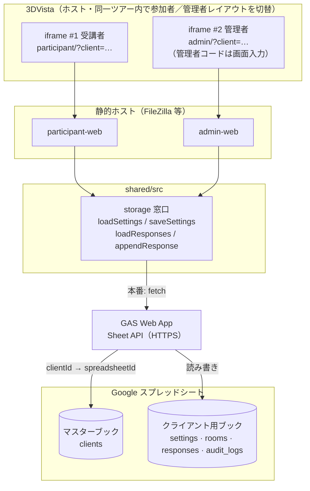
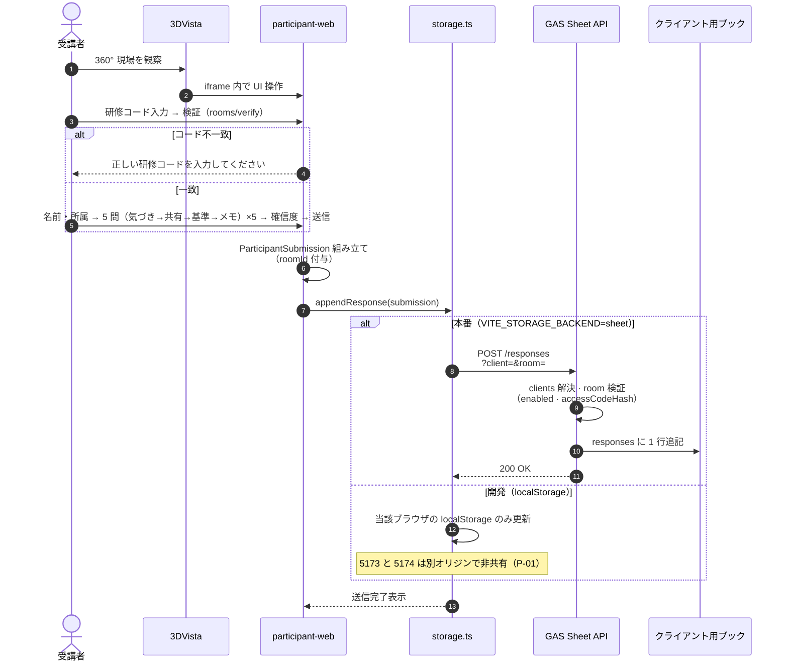
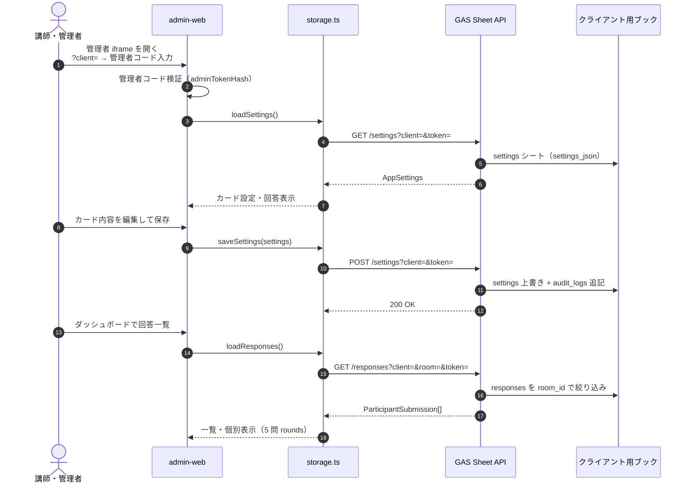
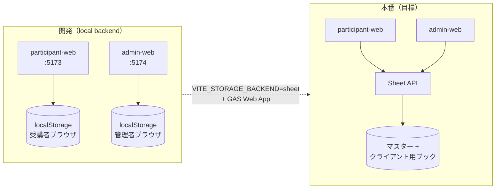
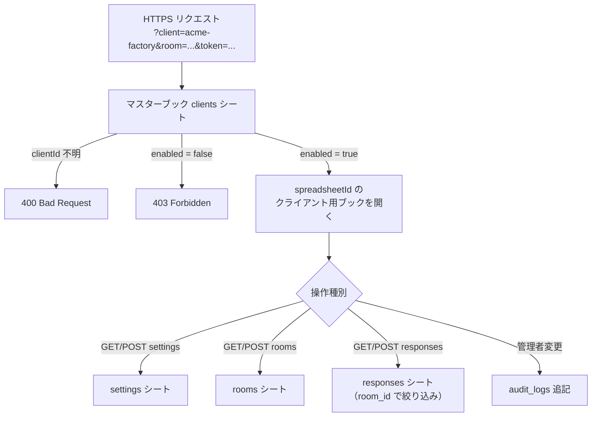
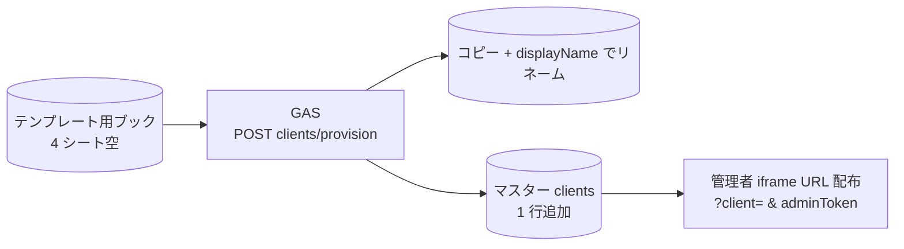

# ExpertEye360 技術仕様書

本書は、[README.md](../README.md) に記載のプロダクト要件を、実装・統合の観点で技術仕様として整理したものである。実装スタック（言語・フレームワーク・クラウド）が未定の項目は「要決定」とする。

## 目次

- [1. 文書情報](#1-文書情報)
- [2. システム構成](#2-システム構成)
  - [2.1 論理構成](#21-論理構成)
  - [2.2 責務境界](#22-責務境界)
  - [2.3 受講者／管理者の分離（アプリ・iframe・リポジトリ）](#23-受講者／管理者の分離)
  - [2.4 編集範囲の原則（README と同一前提）](#24-編集範囲の原則)
- [3. 3DVista 統合仕様](#3-3DVista-統合仕様)
  - [3.0 役割別入口（3DVista 側ボタン）](#30-役割別入口)
  - [3.1 埋め込み方式（iframe は 2 系統）](#31-埋め込み方式)
  - [3.2 埋め込み表示領域](#32-埋め込み表示領域)
  - [3.3 360°視界との関係](#33-360°視界との関係)
  - [3.4 Live Guide との関係](#34-Live-Guide-との関係)
- [4. 研修用Web 機能仕様（技術観点）](#4-研修用Web-機能仕様)
  - [4.1 管理者画面のスコープ](#41-管理者画面のスコープ)
  - [4.3 受講者回答フロー（5問 × 4画面サイクル）](#43-受講者回答フロー)
- [5. データ所有と永続化](#5-データ所有と永続化)
  - [5.0 現状の課題と解決方針](#50-現状の課題と解決方針)
  - [5.1 データの流れ（図解）](#51-データの流れ)
  - [5.2 物理ストア（採用）](#52-物理ストア)
  - [5.3 研修用Web が永続化するデータ（論理）](#53-研修用Web-が永続化するデータ)
  - [5.4 3DVista が保持するデータ（論理）](#54-3DVista-が保持するデータ)
  - [5.5 シーン識別子の連携（要決定）](#55-シーン識別子の連携)
- [6. 埋め込み Web の非機能要件](#6-埋め込み-Web-の非機能要件)
- [7. セキュリティ](#7-セキュリティ)
- [8. 未決定・オープン項目（一覧）](#8-未決定オープン項目)
- [9. 改訂履歴](#9-改訂履歴)

---


---

## 1. 文書情報

#### 対象システム

**内容** — ExpertEye360（研修用Web。3DVista 360°ツアーに埋め込み）

#### 前提プロダクト

**内容** — 3DVista（工場360°ツアー・任意で Live Guide）

#### 関連ドキュメント

**内容** — [README.md](../README.md)、[SPREADSHEET-DATA.md](./SPREADSHEET-DATA.md)

---

## 2. システム構成

### 2.1 論理構成

**受講者用 Web と管理者用 Web は別アプリ・別 iframe・別埋め込み URL とする。** 1 つの iframe に両方をまとめたり、受講者ツアーの 25% 帯に管理者 UI を載せたりしない。

```
┌──────────────────────────────────────────────────────────────┐
│ 3DVista 同一ツアー（ホスト）                                    │
│  参加者ボタン／管理者ボタンでレイアウトを切替（押下〜表示は 3DVista 側のみ） │
│                                                              │
│  【参加者レイアウト例】                                        │
│  ┌────────────────────────────────────────────────────────┐  │
│  │ 360°パノラマ（ビューポート高さの約75%想定）                 │  │
│  └────────────────────────────────────────────────────────┘  │
│  ┌────────────────────────────────────────────────────────┐  │
│  │ iframe #1: 受講者 Web のみ（幅100% × 高さ25%）              │  │
│  │   src = 受講者エントリ URL（例 …/participant/?client=…）  │  │
│  └────────────────────────────────────────────────────────┘  │
│                                                              │
│  【管理者レイアウト例】受講者の25%帯とは別配置                  │
│  ┌────────────────────────────────────────────────────────┐  │
│  │ iframe #2: 管理者 Web のみ（幅40% × 高さ100%）             │  │
│  │   src = 管理者エントリ URL（例 …/admin/?client=…）         │  │
│  └────────────────────────────────────────────────────────┘  │
│  ※ 同一画面の受講者25%帯に管理者 iframe を置かない              │
└──────────────────────────────────────────────────────────────┘
         │ HTTPS（両 iframe とも同一 Sheet API を参照）
         ▼
┌──────────────────────────────────────┐
│ Sheet API（GAS Web App 想定）           │
│  → Google スプレッドシート（論理 DB）   │
└──────────────────────────────────────┘
         ▲
         │ 静的ファイル配信のみ可（FileZilla 等）
┌──────────────────┐
│ participant-web  │
│ admin-web        │
└──────────────────┘
```

### 2.2 責務境界

#### 現場の空間表現・導線・遠隔案内

**担当** — 3DVista

#### テンプレート／回答／ダッシュボード／OJT出力

**担当** — 研修用Web（フロント＋バックエンド）

3DVista 本体の内部 API を拡張して判断ロジックを載せる構成にはしない。研修用Webは外部ホストのアプリケーションとして動作し、3DVista から埋め込み表示する。

### 2.3 受講者／管理者の分離（アプリ・iframe・リポジトリ）

#### 役割

**受講者 Web** — 現場を見ながら回答入力
**管理者 Web** — カード設定・回答の確認

#### 3DVista 埋め込み

**受講者 Web** — **専用 iframe 1 本**（参加者用レイアウト・同一ツアー内）
**管理者 Web** — **別 iframe 1 本**（管理者用レイアウト・同一ツアー内の別配置）

#### 埋め込み URL

**受講者 Web** — 受講者エントリのみ
**管理者 Web** — 管理者エントリのみ

#### 25% 高さ制約

**受講者 Web** — **適用する**（パノラマ下帯）
**管理者 Web** — **受講者帯には載せない**（管理者側は **幅40%×高さ100%** のフレーム想定・§3.2.2）

#### 同一 iframe への混在

**受講者 Web** — **禁止**
**管理者 Web** — **禁止**

本リポジトリのプロトタイプでは、上記を **別アプリ・別ディレクトリ**として実装する（単一の `frontend/` にまとめない）。

#### `participant-web/`

**内容** — 受講者 UI のみ（Vite + React）
**本番埋め込み URL（例）** — `https://{host}/participant/`（要決定）

#### `admin-web/`

**内容** — 管理者 UI のみ（Vite + React）
**本番埋め込み URL（例）** — `https://{host}/admin/`（要決定）

#### `shared/src/`

**内容** — 共有 TypeScript（型、シード、ストレージ）
**本番埋め込み URL（例）** — —

**永続化の前提**: 本番は **スプレッドシート（Google Sheets）+ Sheet API** で受講者・管理者・複数端末間を共有する（詳細は [SPREADSHEET-DATA.md](./SPREADSHEET-DATA.md)）。`localStorage` は **開発用フォールバック**のみ。ローカル開発（5173 / 5174）は別オリジンのため `localStorage` は非共有—本番同等の確認には Sheet API または同一オリジン + API を使う。

### 2.4 編集範囲の原則（README と同一前提）

- **3DVista のツアーコンテンツ**（360°画像、シーン構成、ホットスポット、導線、注釈、Live Guide、演出）は **既存3DVista側で維持**し、ExpertEye360 のアプリ・管理者画面から **編集しない**。
- **ExpertEye360 が変更するのは埋め込み Web のみ**（カード内容、回答・ダッシュボード・OJT、および **3DVistaシーンとの紐づけ**＝ツアーURL・シーン名／識別名・管理用メタデータ）。
- **管理者画面**は 3DVista エディタではない。**既存シーンへの紐づけと研修データ管理**にスコープを限定する（詳細は README「管理者画面でやること／やらないこと」）。

---

## 3. 3DVista 統合仕様

### 3.0 役割別入口（3DVista 側ボタン）

3DVista の **同一ツアー（プロジェクト）内** に **参加者ボタン** と **管理者ボタン** を置き、押した側に応じて **参加者用レイアウト**（パノラマ＋受講者 iframe 帯）または **管理者用レイアウト**（パノラマ＋管理者 iframe パネル）を表示する。**ボタンの UI・押下から表示切替までの挙動（シーン遷移・パネル表示等）はすべて 3DVista 側**であり、ExpertEye360（`participant-web` / `admin-web`）の機能要件・API には含めない（ボタン UI も提供しない）。

#### **参加者**が参加者ボタンを押す

**遷移先（3DVista 上）** — 参加者用レイアウト（パノラマ＋下部帯など、ツアー設計どおり）
**表示される Web** — **受講者 Web**（`participant` エントリ URL の iframe、§3.2.1）

#### **管理者**が管理者ボタンを押す

**遷移先（3DVista 上）** — 管理者用レイアウト（パネル・別シーンなど、ツアー設計どおり）
**表示される Web** — **管理者 Web**（`admin` エントリ URL の iframe、§3.2.2）

**設計上の整理**

- 入口ボタンは **同一ツアー内** に両方置ける。押下後は、それぞれ **正しい iframe（別 `src`・別配置）が載ったシーン／状態** に遷移させる（実装は 3DVista のみ）。
- §3.1 の禁止（1 つの iframe で受講者 UI と管理者 UI を切り替える／同居させる）は変わらない。ボタンは **どちらの iframe を見せるか** を 3DVista 側で切り替える導線であり、Web アプリ内で役割を切り替える仕組みではない。
- 受講者向け **25% 帯に管理者 Web を載せない**（§3.2.2）ことも変わらない。

### 3.1 埋め込み方式（iframe は 2 系統）

#### 方式

**受講者 iframe** — HTML **iframe**（3DVista がサポートする埋め込みに準拠）
**管理者 iframe** — 同上（**別要素・別 src**）

#### `src`

**受講者 iframe** — **受講者 Web のエントリ URL のみ**
**管理者 iframe** — **管理者 Web のエントリ URL のみ**

#### 設置場所

**受講者 iframe** — 参加者ボタンから開く参加者用レイアウト（シーン／パネル）
**管理者 iframe** — 管理者ボタンから開く管理者用レイアウト（**受講者 25% 帯とは別配置**。同一ツアー内の別シーン等）

#### 通信

**受講者 iframe** — 原則 HTTPS。証明書エラーは埋め込み失敗の原因になる
**管理者 iframe** — 同上

**禁止事項**

- 1 つの iframe の `src` で受講者 UI と管理者 UI を切り替える／同居させる
- 受講者向け 25% 帯に管理者 Web を埋め込む
- 「研修用 Web」とひとまとめにした単一 URL を 3DVista に渡す（必ず **participant 用**と **admin 用**の 2 URL を登録する）

**要決定**: 本番／検証のホスト名、パス、`frame-ancestors` 許可オリジン一覧。

### 3.2 埋め込み表示領域

#### 3.2.1 受講者 iframe（必須）

#### 幅

**仕様** — 受講者ツアーのビューポートに対して **100%**

#### 高さ

**仕様** — 同ビューポートに対して **25%**（帯状 UI。パノラマ約 75% を確保）

#### 配置

**仕様** — 上下いずれかは **ツアー設計で決定**（README では下部帯を想定）

#### 3DVista 側

**仕様** — 参加者ボタンから遷移するレイアウトに、上記比率の **受講者専用**フレームを 1 本用意し、受講者エントリ URL を設定（§3.0）

#### 研修用Web 側

**仕様** — **iframe に割り当てられた高さ内**で UI を完結（帯内スクロールは原則なし）。実装の詳細は **§3.2.3**

#### 3.2.2 管理者 iframe

#### 受講者 25% 帯

**仕様** — **使用しない**

#### サイズ

**仕様** — 管理者用ツアー画面のビューポートに対して **幅 40% × 高さ 100%**（パノラマ約 60% を確保する前提。README と同一）

#### 3DVista 側

**仕様** — 管理者ボタンから遷移するレイアウトに **管理者専用**フレームを 1 本（以上）用意し、管理者エントリ URL を設定（§3.0）。受講者 25% 帯とは別シーン／別配置とする

#### 研修用Web 側

**仕様** — 管理・一覧向け UI。受講者帯の 25% 制約は **適用しない**

#### 3.2.3 受講者 Web — レイアウト実装（必須）

3DVista が参加者用レイアウトに設けるフレームは、ビューポートに対しておおよそ **幅 100% × 高さ 25%** である。これは **ホスト側の配置比率** であり、研修用 Web の CSS が `25vh` や `height: 25%`（ビューポート基準）で組むこと**ではない**。

#### 実装の基準ボックス

**内容** — iframe 内の **`.p-shell`（`width:100%` `height:100%`）**。親 iframe の実ピクセル高に追従する

#### スケーリング単位

**内容** — **Container Query**（`.p-shell { container-type: size }`）の **`cqh` / `cqw` のみ**。帯が縮めば文字・余白・入力欄も比例して縮む

#### 禁止

**内容** — アプリ内での **`vh` / `vw` / `25vh` によるレイアウト**（iframe 内では親ページのビューポートを参照し、帯高とずれる）

#### 禁止

**内容** — **`clamp` の第 1 引数に大きな `rem` 下限**（帯が低くても要素が縮まず、はみ出す原因になる）

#### はみ出し

**内容** — 帯内 **スクロールなし**（`overflow: hidden`）。`flex` / `grid` の **`min-height: 0`** で子を縮め、ナビバーまで含めて収める

#### スタイルの置き場

**内容** — `shared/styles/participant-app.css`（`p-*`）。旧 `participant.css`（`ee-*`）は使用しない

#### ローカル確認

**内容** — `participant-web/public/embed-preview.html` は外側に **25vh** のモック枠を置くだけ。アプリ本体は iframe **100%×100%** 前提。高さを変えてもコンテンツが収まることを確認する

**受け入れ基準（目視）**

1. `embed-preview.html` でブラウザウィンドウの高さを変えても、step 0（名前・所属）〜各カード／メモ／送信まで **帯内に収まり、内部スクロールが出ない**。
2. 開発者ツールで iframe 要素の高さを直接変更しても、同様に収まる（＝本番の 3DVista フレーム高の変動に追従できる）。

#### 3.2.4 管理者 Web — レイアウト実装・ローカル確認

本番の 3DVista は管理者用フレームを **幅 40% × 高さ 100%** とする（README と同一）。アプリ側は iframe 内 **width/height 100%** と **Container Query（`cqh` / `cqw`）** で組み、**`vh` / `vw` / `40vw` によるレイアウトは使わない**（受講者と同じ原則）。

#### ローカル確認

**内容** — `admin-web/public/embed-preview.html` は外側に **40vw** のモック枠を置き、本番の **40%×100%** iframe を近似する。アプリ本体は iframe **100%×100%** 前提（README「管理者の見た目確認」と同じ URL）

**受け入れ基準（目視・管理者）**

1. `admin-web/public/embed-preview.html` でブラウザ幅を変えても、管理 UI が **割当枠内に収まる**（縦スクロールは一覧用途で可）。

### 3.3 360°視界との関係

- パノラマ操作領域と Web 帯が **同一ビューポート上で競合しない** レイアウトを 3DVista 側で担保する。
- 研修用Web は「常時表示／ホットスポットで開閉」等の UX は **要決定**（プロダクト要件として README に追記可能）。

### 3.4 Live Guide との関係

- Live Guide の音声・映像・シーン同期は 3DVista 側機能。
- 研修用Web は Live Guide を制御しない。講師が口頭で「回答画面を開いてください」と誘導する等の運用、または **要決定**: シーン ID を URL クエリで渡し同期する等の連携仕様。

---

## 4. 研修用Web 機能仕様（技術観点）

README の機能章（§1〜§8）に対応する実装単位の整理。機能 ID は **F3〜F8**。

#### F3

**機能** — 気づきカード＋一言
**技術的ポイント** — カード ID ＋ 自由記述。文字数上限・禁則文字（**要決定**）

#### F4

**機能** — 判断基準カード
**技術的ポイント** — 各ラウンド **1 枚のみ単一選択**（§4.3.10）。`criteriaOrdered` は 0〜1 件

#### F5

**機能** — 共有・行動カード
**技術的ポイント** — **単一選択**（1 枚）

#### F6

**機能** — 確信度
**技術的ポイント** — **必須**。1〜5 の 5 ボタン。ラベル文言は実装（`@shared/confidence` 等）を正とする

#### F7

**機能** — 講師・管理者ダッシュボード
**技術的ポイント** — **回答済み**一覧・詳細（実装済み）。一覧は **保存順**表示。**PDF 生成ロジック**は `shared/src/pdfExport.ts` の最小実装まで完了し、管理者回答詳細からの PDF ダウンロード UI 代表テスト、開ける最小 PDF 構造、日本語対応、`pdf.html` の主要デザイン要素反映、目視フィードバック反映、長文折り返し・可変高さ、コンテンツ量に応じた複数ページ化も Green（実 PDF 目視確認は未。仕様は [TEST-DESIGN.md §1.4](./TEST-DESIGN.md#14-f7-講師管理者ダッシュボードと-pdf-エクスポート)）

#### F8

**機能** — OJT 引き継ぎ
**技術的ポイント** — テンプレートの OJT 確認項目と回答内容を整形・エクスポート（形式は **要決定**。F7 の受講者 PDF とは別）

### 4.1 管理者画面のスコープ

- README に定義するとおり、管理者 API／UI は **ツアーURL登録・シーン識別子登録・カード設定・回答の確認**に限定する（OJT は将来・F8）。
- 360°画像差替え、ホットスポット編集、シーン遷移変更、Live Guide 設定、注釈・演出の変更など **3DVista 固有操作は提供しない**（バックエンドにそのためのエンドポイントも持たない設計とする）。

### 4.3 受講者回答フロー（5問 × 4画面サイクル）

受講者 iframe では、360° 現場を見ながら **5 問**（設問 1 〜 設問 5）に回答する。ここでの **「5 問」= 同じ 4 画面サイクルを 5 回繰り返す** ことを指す（確信度など別種の第 5 画面ではない）。

**1 問（1 ラウンド）**の画面遷移は **固定順**で、次のとおり。

1. **気づきカード選択** → `next`
2. **共有・行動カード選択** → `next`
3. **判断基準カード選択** → `next`
4. **一言メモ** → `next`
5. **次の設問**＝**次の気づきカード選択**（ラウンド 2 の先頭）

ラウンド 5 の一言メモの `next` のあと、**確信度・送信確認**へ進む（§4.3.4）。

#### 4.3.1 フロー全体

```
[入室] 研修コード入力 → 検証（管理者設定コードと一致）
    ↓ 失敗 → 「正しい研修コードを入力してください」（名前・所属は出さない）
[事前] 名前・所属（検証成功後のみ表示）
    ↓
┌─ 設問 1（ラウンド 1）────────────────────────────┐
│  気づきカード → 共有カード → 判断基準 → 一言メモ  │
└────────────────────────────── next ─────────────┘
    ↓
┌─ 設問 2（ラウンド 2）────────────────────────────┐
│  気づきカード → 共有カード → 判断基準 → 一言メモ  │
└────────────────────────────── next ─────────────┘
    ↓
   … 同様に設問 3・4 …
    ↓
┌─ 設問 5（ラウンド 5）────────────────────────────┐
│  気づきカード → 共有カード → 判断基準 → 一言メモ  │
└────────────────────────────── next ─────────────┘
    ↓
[締め] 確信度（5 段階）→ 送信確認 → 保存完了
```

#### 入室

**画面** — 研修コード（名前・所属より前・必須）
**機能 ID** — —
**入力 UI** — テキスト 1 欄。§1.5・[README](../README.md#入室とマルチテナント)

#### 事前

**画面** — 名前・所属（いずれも必須・各 10 文字以内）
**機能 ID** — —
**入力 UI** — テキスト 2 欄・アイコン付き 2 列（§4.3.9）。ラベルに `（10文字以内）` を表示。**研修コード検証後のみ表示**

#### 各ラウンド ①

**画面** — 気づきカード選択
**機能 ID** — F3（カード）
**入力 UI** — 横並びカード・**単一選択**

#### 各ラウンド ②

**画面** — 共有・行動カード選択
**機能 ID** — F5
**入力 UI** — 同上

#### 各ラウンド ③

**画面** — 判断基準カード選択
**機能 ID** — F4
**入力 UI** — 横並びカード・**単一選択**（§4.3.10）

#### 各ラウンド ④

**画面** — 一言メモ
**機能 ID** — F3（記述）
**入力 UI** — 複数行テキスト（帯内固定高）。各設問 30 文字以内

#### 締め

**画面** — 確信度
**機能 ID** — F6
**入力 UI** — 1〜5 の 5 ボタン

**カード選択肢の件数**: 各画面のマスタはシーン設定（`Scene`）に紐づけ、**最大 5 件**（`limitChoices`）。

#### 気づきカード

**マスタ（Scene）** — `awarenessCards`

#### 共有・行動カード

**マスタ（Scene）** — `actionCards`

#### 判断基準カード

**マスタ（Scene）** — `criteriaCards`

#### 一言メモ

**マスタ（Scene）** — —（自由記述）

#### 4.3.2 保存データ（実装済み）

1 ラウンド分を 1 要素とし、**5 要素の配列**として永続化する。型定義は `shared/src/types.ts`、step 定数・変換は `shared/src/judgmentFlow.ts`。

```ts
// shared/src/types.ts
type JudgmentRound = {
  awarenessSelection: string[];  // MVP: 長さ 0 または 1
  actionSelection: string[];     // 同上
  criteriaOrdered: string[];     // 単一選択時は 0〜1 件
  roundNote: string;             // 当該ラウンドの一言メモ
};

// ParticipantSubmission.rounds: JudgmentRound[]  // length === JUDGMENT_ROUND_COUNT (5)
```

**後方互換**: `submit` 時に `awarenessSelections` / `criteriaOrdered` / `actionsSelected` 等の旧フラットフィールドへ **全ラウンドを flatMap 集約**しても冗長保存する。管理者の回答表示は `getSubmissionRounds()`（`judgmentFlow.ts`）で `rounds` を優先し、無い場合は `legacyToRounds()` で旧形式を 5 要素に展開する。

#### 4.3.3 各画面の要件

README の機能説明（§1 気づき、§2 共有・行動、§3 判断基準、§4 一言、§5 確信度）と対応する。

**気づきカード（各ラウンド先頭）**

- そのラウンドで「何に気づいたか」をカードで選ぶ（README §1）。
- 選択後は反転表示を維持。**別カードを選択したときのみ**解除（ホバーでは解除しない）。
- ラウンド 2 以降も **同じ UI** で、前ラウンドの選択は引き継がない（ラウンドごとに独立入力）。

**共有・行動カード**

- `next` で遷移。誰に共有しどう動くか（README §2）。**1 枚のみ単一選択**。

**判断基準カード**

- `next` で遷移（README §3）。気づき・共有と同様 **1 枚のみ単一選択**（`selectSingle`）。選択は `criteriaOrdered` に 0 または 1 件で保持する。

**一言メモ**

- `next` で遷移。**当該ラウンド**の気づき・共有・判断の補足を記述。**入力は任意**（空でも `next` 可・§4.3.7）。
- 30 文字を超える一言メモは不可。ラベルに `（30文字以内）` を表示し、`next` 時に `30文字以内で入力してください` を出す。
- ラウンドごとにプレースホルダを切り替える（例: 設問 1「ラベル位置が通常と違う」… 設問 5「記録を残してから進めたい」）。
- **次の `next` で次ラウンドの気づきカード**へ（設問 5 完了後は確信度へ）。

#### 4.3.4 フロー外・締め処理

#### 確信度・送信

**説明** — 設問 5 の一言メモの次。**確信度は必須**（§4.3.7）。その後、送信確認 → 保存。

#### 4.3.5 プロトタイプ実装（`participant-web`）

`shared/src/judgmentFlow.ts` の step 定数と `ParticipantPage.tsx` の `rounds[5]` で実装。バリデーション・表示仕様は **§4.3.6〜4.3.13** を参照。

#### 0

**画面** — 名前・所属

#### 1〜4

**画面** — 設問 1（気づき → 共有 → 判断基準 → 一言メモ）

#### 5〜8

**画面** — 設問 2（同上）

#### 9〜12

**画面** — 設問 3

#### 13〜16

**画面** — 設問 4

#### 17〜20

**画面** — 設問 5

#### 21

**画面** — 確信度

#### 22

**画面** — 送信確認

#### 23

**画面** — 送信完了

設問 5 の一言メモで `next` → step 21（確信度）。`back` は直前画面へ。保存は `ParticipantSubmission.rounds`（長さ 5）。

#### 4.3.6 ナビゲーション

#### back / next

**仕様** — 各画面（intro 除く back 非表示）で表示。**右端**に配置し、順序は **back → next** を維持（進捗表示の追加でボタン位置を変えない）

#### 進捗メタ

**仕様** — カード・一言メモ step のみ。ナビバー**中央**に `設問 n/5 · {画面タイトル}`（`n` は 1 始まり）

#### 送信確認

**仕様** — `next` のラベルを **「回答を送信」** に差し替え

#### 高さ

**仕様** — 全画面で `--p-nav-h`（§3.2.3）

#### 4.3.7 必須入力・バリデーション（実装済み）

`ParticipantPage.tsx` の `validateStep()` と `tryNext()` で制御する。未充足時は **step を進めず**、`fieldWarn` にメッセージをセットしナビ直上（`.p-nav-warn`、`role="alert"`）に表示する。

#### intro（名前）

**必須** — ○
**未入力時のメッセージ（例）** — `名前を入力してください`

#### intro（所属）

**必須** — ○
**未入力時のメッセージ（例）** — `所属を入力してください`

#### 気づきカード

**必須** — ○（1 枚）
**未入力時のメッセージ（例）** — `気づきカードを1つ選んでください`

#### 共有・行動カード

**必須** — ○（1 枚）
**未入力時のメッセージ（例）** — `共有・行動カードを1つ選んでください`

#### 判断基準カード

**必須** — ○（1 枚）
**未入力時のメッセージ（例）** — `判断基準カードを1つ選んでください`

#### 一言メモ

**必須** — ×
**未入力時のメッセージ（例）** — —（空は許可）。10 文字超過時は `10文字以内で入力してください`。30 文字超過時は `30文字以内で入力してください`

#### 確信度

**必須** — ○（1 段階を明示選択）
**未入力時のメッセージ（例）** — `確信度を1つ選んでください`

#### 送信確認

**必須** — —
**未入力時のメッセージ（例）** — 直前までの必須が満たされていれば表示

**その他の挙動**

- `goBack`、テキスト入力の `onChange`、カード選択時に `fieldWarn` をクリアする。
- 名前・所属は **trim 後が空なら不可**、かつ各 10 文字以内。無記名フォールバックは **行わない**（送信時も `participantName` / `affiliation` を trim して保存）。
- カードは **同一カードを再タップで選択解除**、別カードタップで切替（ホバーでは解除しない）。

#### 4.3.8 必須／任意の表示（実装済み）

#### intro 入力ラベル

**表示** — `名前（必須）（10文字以内）` / `所属（必須）（10文字以内）`（`.p-field__label-required` / `.p-field__label-limit`）

#### 一言メモ入力ラベル

**表示** — `一言メモ（任意）（30文字以内）`（`.p-field__label-optional` / `.p-field__label-limit`）

#### ナビ中央（カード step）

**表示** — タイトル**右**に `（必須）`（`.p-step-meta__badge--required`、薄赤）

#### ナビ中央（一言メモ step）

**表示** — タイトル**右**に `（任意）`（`.p-step-meta__badge--optional`）

#### ナビ中央（確信度 step）

**表示** — タイトル**右**に `（必須）`（`.p-step-meta__badge--required`）

表示例: `設問 1/5 · 気づきカード（必須）` / `設問 1/5 · 一言メモ（任意）` / `確信度（必須）`

#### 4.3.9 事前画面（intro）の UI（実装済み）

#### 入力項目

**仕様** — **名前**・**所属**の 2 欄のみ（研修シーン選択 UI は **なし**）

#### レイアウト

**仕様** — `p-intro-card` 内 **2 列 grid**。各欄はアイコン（人物／建物 SVG）＋ラベル＋入力

#### 幅

**仕様** — カード全体 `min(56%, 68cqw)` 程度（`--p-intro-card-w`）

#### シーンデータ

**仕様** — 常に `settings.scenes[0]` のカードマスタを使用（§4.3.11）

#### 未設定時

**仕様** — `シーンが未設定です。管理者 iframe で登録してください。` を表示しフォームは出さない

#### 4.3.10 判断基準カード（単一選択）

#### 選択方式

**仕様** — **1 枚だけ選ぶ**（気づき・共有と同様）。`criteriaOrdered` は要素 **0〜1 件**

#### README

**仕様** — [README.md §3](../README.md) と同一

#### 4.3.11 シーン・データソースの制約（プロトタイプ）

#### 利用シーン

**現状** — `AppSettings.scenes[0]` **固定**（シーン切替・URL 連携なし）

#### カード件数

**現状** — `limitChoices()` で各マスタ **最大 5 件**

#### 永続化

**現状** — 本番: スプレッドシート（[SPREADSHEET-DATA.md](./SPREADSHEET-DATA.md)）。開発: `VITE_STORAGE_BACKEND=local` は `localStorage`（5173 / 5174 は別オリジンで非共有）、`VITE_STORAGE_BACKEND=sheet` は GAS Sheet API 経由で本番近似

#### 4.3.12 送信・完了画面（実装済み）

#### 22

**画面** — 送信確認
**内容** — 文言 `内容を送信します（設問 5 件）`。`next` → 保存

#### 23

**画面** — 送信完了
**内容** — `送信完了` / `回答を保存しました。講師は管理者画面で確認できます。`

**保存時のメモ集約**: 各ラウンドの `roundNote` を `【設問n】{本文}` 形式で連結し、改行区切りで `awarenessNote` に格納（旧フィールド互換・管理者向け一覧用）。`criteriaNote` / `actionsNote` は空文字。

**確信度ラベル**（ボタン 1〜5、`title` 属性）: かなり不安 / 少し不安 / 一応判断できる / ある程度自信あり / 強く自信あり。

#### 4.3.13 スタイル変数（受講者 UI・主要）

`shared/styles/participant-app.css` の Container Query 変数（抜粋）。帯高に比例して縮む。

#### `--p-nav-h`

**用途** — ナビバー高さ

#### `--p-chips-h`

**用途** — カードグリッド行の目安高さ

#### `--p-intro-card-w` / `--p-note-block-w`

**用途** — intro カード・一言メモブロック幅

#### `--p-border-field`

**用途** — 入力枠線色

#### `--p-conf-font`

**用途** — 確信度ボタン文字サイズ

#### （クラス）`.p-nav-warn`

**用途** — 未入力警告（ナビ直上・`p-nav-bar--warn` 時）

---

## 5. データ所有と永続化

### 5.0 現状の課題と解決方針

詳細・API 契約は [SPREADSHEET-DATA.md](./SPREADSHEET-DATA.md) §0 を正とする。テストは [TEST-DESIGN.md](./TEST-DESIGN.md) §2.0・§4.2b。

**課題（現行 `localStorage` のみ）**

- 受講者回答が講師端末に届かない（別オリジン・別ブラウザ）
- クライアント・研修回のデータ分離がない
- 入室制限がない

**解決（優先順）**

1. **Sheet API + スプレッドシート** — 共有の正本（必須）
2. **`clientId`** — 複数クライアント分離（URL `?client=`）
3. **`roomId`（研修コードで確定・必須）** — 同一 `clientId` 内の研修回分離。受講者は **名前・所属の前**に研修コードを入力し検証（不一致時は「正しい研修コードを入力してください」）。URL に `room` を載せない。検証後に `roomId` を保持し API では `room` 必須
4. **管理者コード（`adminToken`）** — 管理者の入室は **管理者コード必須**。研修コードは **不要**（設定側）。管理者コードの変更は現行コードを知る者のみ（[TEST-DESIGN.md §1.5](./TEST-DESIGN.md#15-入室マルチテナント)、[README.md §入室とマルチテナント](../README.md#入室とマルチテナント)）
5. **storage 抽象化** — 将来 PostgreSQL 等へ API 差し替え（[SPREADSHEET-DATA.md §7](./SPREADSHEET-DATA.md#7-将来-postgresql-等への移行)）
6. **ローカル開発** — 入室フローを省略しない **本番近似**（§1.5）

### 5.1 データの流れ（図解）

本節は、研修データが **どこからどこへ流れるか** を俯瞰する。API 契約・シート列の詳細は [SPREADSHEET-DATA.md §1.1](./SPREADSHEET-DATA.md#11-データの流れ図解) を正とする。

#### 5.1.1 全体像（本番）

受講者・管理者は **別 iframe・別アプリ** だが、永続化の正本は **同一 Sheet API → 同一クライアント用スプレッドシート** である。



**読み方**

- 3DVista は **360° 表示のみ**。回答・設定は iframe 内の Web が扱う（§2.2）。
- フロントは `storage.ts` の窓口のみを呼ぶ。裏は `localStorage`（開発）または Sheet API（本番）に切替（§5.2）。
- GAS はリクエストの `client` でマスター `clients` を引き、当該 `spreadsheetId` のブックを開く。

#### 5.1.2 受講者 — 回答送信の流れ

1 送信 = `responses` シートへの **1 行追記**。5 問分は `submission_json` 内の `rounds` 配列に格納（§4.3.2）。



#### 5.1.3 管理者 — 設定読取・保存と回答参照

管理者は **`client` 配下**のデータを扱う。**管理者コード**（API `token`）必須。**研修コードでの入室は不要**。回答参照時の `room` 絞り込みは UI の研修回選択等（[TEST-DESIGN.md §1.5](./TEST-DESIGN.md#15-入室マルチテナント)・**D-21**）。



#### 5.1.4 開発環境と本番の違い



#### 受講者 ↔ 管理者

**開発（localStorage）** — **共有されない**（別オリジン）
**本番（Sheet API）** — **同一 API・同一ブックで共有**

#### 正本

**開発（localStorage）** — 各ブラウザ内のみ
**本番（Sheet API）** — スプレッドシート

#### 結合確認

**開発（localStorage）** — 単体・UI 補助用。共有確認の正にはしない
**開発（Sheet API）** — `VITE_STORAGE_BACKEND=sheet` + dev GAS / 同型 mock で実施。ローカルも **本番近似**（研修コード・管理者コードを省略しない・§1.5）
**本番（Sheet API）** — 研修運用の前提

#### 5.1.5 API によるクライアント解決（GAS）

すべての API リクエストは `client`（`clientId`）を必須とする。



#### 5.1.6 新規クライアント追加（プロビジョニング）

運用者が手でブックを毎回作る必要はない（推奨: テンプレート自動複製）。詳細は [SPREADSHEET-DATA.md §2.2.1](./SPREADSHEET-DATA.md#221-クライアント用ブックは事前に手作り必須か)。



### 5.2 物理ストア（採用）

#### **本番**

**ストア** — **Google スプレッドシート**
**備考** — マスター 1 冊 + クライアントごと 1 冊（各: settings / rooms / responses / audit_logs）

#### **API**

**ストア** — **GAS Web App**（推奨）
**備考** — フロントは静的配信可。読み書きは HTTPS

#### **開発**

**ストア** — `localStorage`
**備考** — `shared/src/storage.ts` の現行実装。オフライン・Vitest 用

シート名・列・API 契約・`clientId` は [SPREADSHEET-DATA.md](./SPREADSHEET-DATA.md) を正とする。

### 5.3 研修用Web が永続化するデータ（論理）

- 利用者（受講者／講師／管理者）および認証情報（**要決定**: IdP。シート API の `token` は暫定）
- 研修シーン定義（3DVista のシーン名／識別子との対応表、設問カード）→ `settings` シート
- 受講者セッション・回答イベント・履歴 → `responses` シート（1 行 = 1 送信）
- OJT 引き継ぎ用の出力スナップショット（**要決定**: シート列追加 or 都度生成）

### 5.4 3DVista が保持するデータ（論理）

- 360°画像資産、ツアー XML／プロジェクト、ホットスポット、シーン遷移、注釈、Live Guide 設定

### 5.5 シーン識別子の連携（要決定）

3DVista のシーンと Web 側の「研修シーン」を結ぶため、以下のいずれかまたは併用を設計時に決める。

- シーン名の完全一致（運用上リスクあり）
- 3DVista 側で定義した **シーン ID** を URL パラメータで Web に渡す
- 研修開始時に講師がシーンを選択し Web に POST

---

## 6. 埋め込み Web の非機能要件

#### パフォーマンス

**要件案** — 初回ロードは帯状領域内で **数秒以内** を目標（回線依存のため SLA は別途）。以降は画面遷移を軽量に

#### オフライン

**要件案** — 原則オンライン前提（**要決定**: オフラインキャッシュの要否）

#### アクセシビリティ

**要件案** — タブレット想定のタップ UI。コントラスト・フォーカス順（**要決定**: WCAG レベル）

#### 多言語

**要件案** — **要決定**（初期は日本語のみでも可）

#### ログ

**要件案** — 監査用に回答変更履歴（**要決定**）

---

## 7. セキュリティ

#### 埋め込み

**方針** — 受講者・管理者 **それぞれ**の配信 URL に `frame-ancestors` を設定。受講者ツアー用オリジンと管理者ツアー用オリジンが異なる場合は **両方を許可**（**要決定**: 一覧）

#### 認証

**方針** — iframe 内でのセッション Cookie は `SameSite`／サードパーティ Cookie 制約を検証（**要決定**: トークンは localStorage ＋ Bearer 等の代替案）

#### API

**方針** — Sheet API は `client` + `token`（書込）。認可はロールベース（**要決定**）。受講者は回答 POST のみ、管理者は settings / responses 読書

#### スプレッドシート

**方針** — 共有リンクを限定。クライアント間でブックを分離（[SPREADSHEET-DATA.md](./SPREADSHEET-DATA.md) §2）

---

## 8. 未決定・オープン項目（一覧）

実装着手前にプロダクト／インフラで確定すること。

1. 研修用Web のホスティング（静的 + GAS URL。FileZilla 可）
2. 認証方式（SSO、メール招待、研修コードのみ等）および Sheet API `token` 配布
3. 3DVista → Web の **シーン同期** の有無とパラメータ契約
4. 同一ツアー複数受講者の **セッション分離** モデル
5. 個人情報の取り扱い（GDPR／国内法）とデータ保持期間
6. 負荷試算（同時受講者数・Live Guide 併用時）

---

## 9. 改訂履歴

#### 1.2

**日付** — 2026-05-21
**内容** — 入室: 受講者は研修コードを名前前に。管理者は **管理者コード**必須・研修コード不要。ローカル本番近似（§5.0・§5.1）

#### 1.1

**日付** — 2026-05-20
**内容** — 3DVista を同一ツアー内の参加者／管理者ボタン前提に整理。管理者 iframe **40%×100%**・§3.2.4。確信度 **必須**。入室は **研修コード**（§5.0）。README 節番号と §4.3 の整合。機能表から未採用の行を削除

#### 1.0

**日付** — 2026-05-20
**内容** — §5.1 データの流れ（図解）を追加（全体・受講者送信・管理者参照・開発/本番・クライアント解決・provision）

#### 0.9

**日付** — 2026-05-20
**内容** — スプレッドシート構成: マスター `clients` + クライアント別 settings/rooms/responses/audit_logs

#### 0.8

**日付** — 2026-05-20
**内容** — §5.0 現状の課題と解決方針（Sheet API / clientId / roomId）を追記

#### 0.7

**日付** — 2026-05-20
**内容** — 本番永続化を **Google スプレッドシート** とする方針を §5 に追記。[SPREADSHEET-DATA.md](./SPREADSHEET-DATA.md) を追加

#### 0.6

**日付** — 2026-05-19
**内容** — 受講者 5 問フローの実装詳細を追記（§4.3.2 実装済み化、§4.3.7〜4.3.13：バリデーション、必須/任意表示、intro UI、MVP 単一選択、送信・スタイル変数）

#### 0.5

**日付** — 2026-05-18
**内容** — 受講者 Web のレイアウト実装原則を **§3.2.3** に追加（iframe 100% 追従・cqh のみ・25% はホスト比率）

#### 0.4

**日付** — 2026-05-15
**内容** — 受講者／管理者を **別 iframe・別埋め込み URL** とする要件を明文化（§2.1, §2.3, §3.1, §3.2）

#### 0.3

**日付** — 2026-05-15
**内容** — MVP リポジトリ構成（`participant-web` / `admin-web` / `shared` / `lite`）と localStorage 前提を追記

#### 0.2

**日付** — 2026-05-15
**内容** — 編集範囲・管理者画面スコープを明文化（README 前提と整合）

#### 0.1

**日付** — 2026-05-15
**内容** — 初版（README ベースの技術整理）
