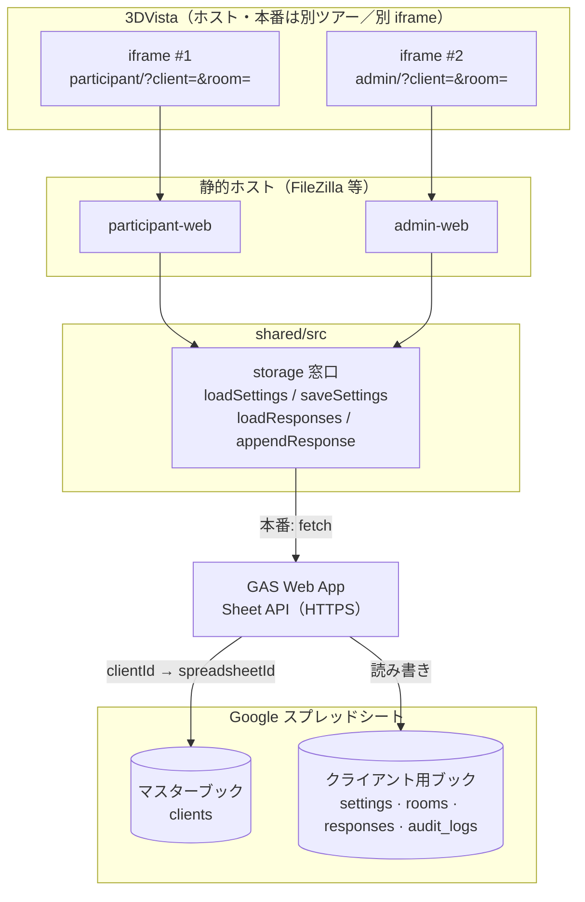
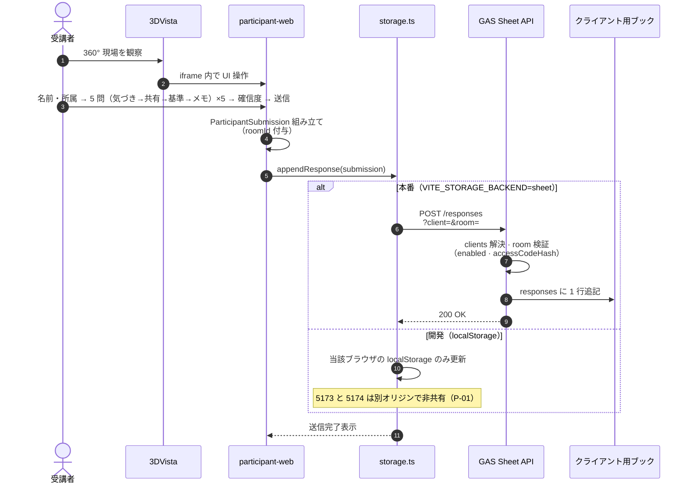
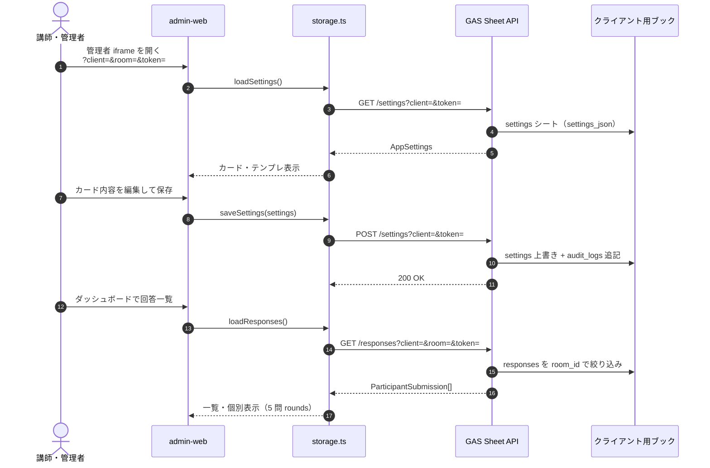
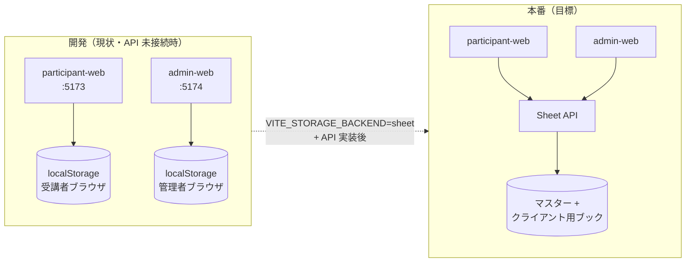
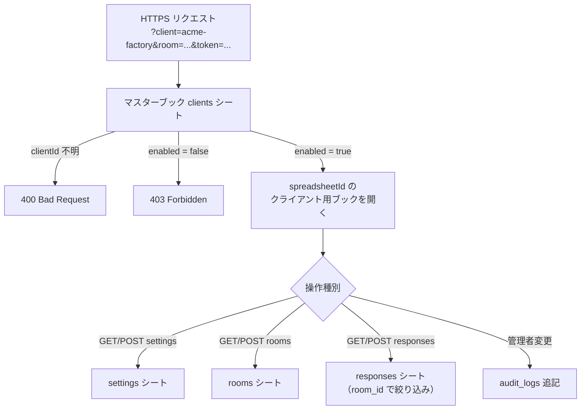
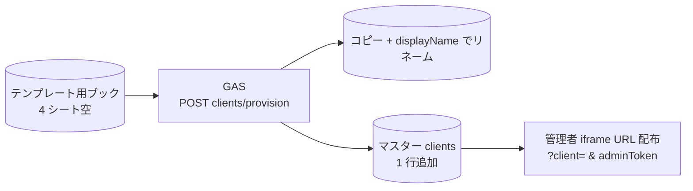

# ExpertEye360 技術仕様書

本書は、[README.md](../README.md) に記載のプロダクト要件を、実装・統合の観点で技術仕様として整理したものである。実装スタック（言語・フレームワーク・クラウド）が未定の項目は「要決定」とする。

---

## 1. 文書情報

| 項目 | 内容 |
| --- | --- |
| 対象システム | ExpertEye360（研修用Web。3DVista 360°ツアーに埋め込み） |
| 前提プロダクト | 3DVista（工場360°ツアー・任意で Live Guide） |
| 関連ドキュメント | [README.md](../README.md)、[SPREADSHEET-DATA.md](./SPREADSHEET-DATA.md) |

---

## 2. システム構成

### 2.1 論理構成

**受講者用 Web と管理者用 Web は別アプリ・別 iframe・別埋め込み URL とする。** 1 つの iframe に両方をまとめたり、受講者ツアーの 25% 帯に管理者 UI を載せたりしない。

```
┌──────────────────────────────────────────────────────────────┐
│ 3DVista 受講者向けツアー（ホスト）                              │
│  ┌────────────────────────────────────────────────────────┐  │
│  │ 360°パノラマ（ビューポート高さの約75%想定）                 │  │
│  └────────────────────────────────────────────────────────┘  │
│  ┌────────────────────────────────────────────────────────┐  │
│  │ iframe #1: 受講者 Web のみ（幅100% × 高さ25%）              │  │
│  │   src = 受講者エントリ URL（例 …/participant/）           │  │
│  └────────────────────────────────────────────────────────┘  │
└──────────────────────────────────────────────────────────────┘

┌──────────────────────────────────────────────────────────────┐
│ 3DVista 講師・管理者向けツアー／シーン（ホスト・別配置）          │
│  ┌────────────────────────────────────────────────────────┐  │
│  │ iframe #2: 管理者 Web のみ（サイズはツアー設計で決定）       │  │
│  │   src = 管理者エントリ URL（例 …/admin/）                 │  │
│  └────────────────────────────────────────────────────────┘  │
│  ※ 受講者ツアーと同一画面に管理者 iframe を置かない            │
└──────────────────────────────────────────────────────────────┘
         │ HTTPS（両 iframe とも同一 Sheet API を参照）
         ▼
┌──────────────────────────────────────┐
│ Sheet API（GAS Web App 想定）           │
│  → Google スプレッドシート（論理 DB）   │
└──────────────────────────────────────┘
         ▲
         │ 静的ファイル配信のみ可（FileZilla 等）
┌──────────────────┐
│ participant-web  │
│ admin-web        │
└──────────────────┘
```

### 2.2 責務境界

| 区分 | 担当 |
| --- | --- |
| 現場の空間表現・導線・遠隔案内 | 3DVista |
| テンプレート／回答／ダッシュボード／OJT出力 | 研修用Web（フロント＋バックエンド） |

3DVista 本体の内部 API を拡張して判断ロジックを載せる構成にはしない。研修用Webは外部ホストのアプリケーションとして動作し、3DVista から埋め込み表示する。

### 2.3 受講者／管理者の分離（アプリ・iframe・リポジトリ）

| 区分 | 受講者 Web | 管理者 Web |
| --- | --- | --- |
| 役割 | 現場を見ながら回答入力 | カード・テンプレ・回答の管理 |
| 3DVista 埋め込み | **専用 iframe 1 本**（受講者ツアー内） | **別 iframe 1 本**（講師／管理者用ツアー・シーン） |
| 埋め込み URL | 受講者エントリのみ | 管理者エントリのみ |
| 25% 高さ制約 | **適用する**（パノラマ下帯） | **受講者帯には載せない**（管理者側の枠サイズはツアー設計で決定） |
| 同一 iframe への混在 | **禁止** | **禁止** |

本リポジトリのプロトタイプでは、上記を **別アプリ・別ディレクトリ**として実装する（単一の `frontend/` にまとめない）。

| パス | 内容 | 本番埋め込み URL（例） |
| --- | --- | --- |
| `participant-web/` | 受講者 UI のみ（Vite + React） | `https://{host}/participant/`（要決定） |
| `admin-web/` | 管理者 UI のみ（Vite + React） | `https://{host}/admin/`（要決定） |
| `shared/src/` | 共有 TypeScript（型、シード、ストレージ） | — |

**永続化の前提**: 本番は **スプレッドシート（Google Sheets）+ Sheet API** で受講者・管理者・複数端末間を共有する（詳細は [SPREADSHEET-DATA.md](./SPREADSHEET-DATA.md)）。`localStorage` は **開発用フォールバック**のみ。ローカル開発（5173 / 5174）は別オリジンのため `localStorage` は非共有—本番同等の確認には Sheet API または同一オリジン + API を使う。

### 2.4 編集範囲の原則（README と同一前提）

- **3DVista のツアーコンテンツ**（360°画像、シーン構成、ホットスポット、導線、注釈、Live Guide、演出）は **既存3DVista側で維持**し、ExpertEye360 のアプリ・管理者画面から **編集しない**。
- **ExpertEye360 が変更するのは埋め込み Web のみ**（カード内容、ベテラン判断テンプレート、回答・ダッシュボード・OJT、および **3DVistaシーンとの紐づけ**＝ツアーURL・シーン名／識別名・管理用メタデータ）。
- **管理者画面**は 3DVista エディタではない。**既存シーンへの紐づけと研修データ管理**にスコープを限定する（詳細は README「管理者画面でやること／やらないこと」）。

---

## 3. 3DVista 統合仕様

### 3.0 役割別入口（3DVista 側ボタン）

3DVista のツアー内に **参加者ボタン** と **管理者ボタン** を置き、利用者の役割に応じてそれぞれの研修用 Web 画面へ誘導する。**ボタンの UI・配置・押下時の遷移（シーン切替・パネル表示・ホットスポットアクション等）はすべて 3DVista 側で実装**する。ExpertEye360（`participant-web` / `admin-web`）はボタンを提供しない。

| 操作 | 遷移先（3DVista 上） | 表示される Web |
| --- | --- | --- |
| **参加者**が参加者ボタンを押す | 参加者用レイアウト（パノラマ＋下部帯など、ツアー設計どおり） | **受講者 Web**（`participant` エントリ URL の iframe、§3.2.1） |
| **管理者**が管理者ボタンを押す | 管理者用レイアウト（パネル・別シーンなど、ツアー設計どおり） | **管理者 Web**（`admin` エントリ URL の iframe、§3.2.2） |

**設計上の整理**

- 入口ボタンは **同一 3DVista ツアー（プロジェクト）内** に両方あってよい。押下後は、それぞれ **正しい iframe（別 `src`・別配置）が載ったシーン／状態** に遷移させる。
- §3.1 の禁止（1 つの iframe で受講者 UI と管理者 UI を切り替える／同居させる）は変わらない。ボタンは **どちらの iframe を見せるか** を 3DVista 側で切り替える導線であり、Web アプリ内で役割を切り替える仕組みではない。
- 受講者向け **25% 帯に管理者 Web を載せない**（§3.2.2）ことも変わらない。

### 3.1 埋め込み方式（iframe は 2 系統）

| 項目 | 受講者 iframe | 管理者 iframe |
| --- | --- | --- |
| 方式 | HTML **iframe**（3DVista がサポートする埋め込みに準拠） | 同上（**別要素・別 src**） |
| `src` | **受講者 Web のエントリ URL のみ** | **管理者 Web のエントリ URL のみ** |
| 設置場所 | 参加者ボタンから開く参加者用レイアウト（シーン／パネル） | 管理者ボタンから開く管理者用レイアウト（**受講者 25% 帯とは別配置**。別シーンでも別プロジェクトでも可） |
| 通信 | 原則 HTTPS。証明書エラーは埋め込み失敗の原因になる | 同上 |

**禁止事項**

- 1 つの iframe の `src` で受講者 UI と管理者 UI を切り替える／同居させる
- 受講者向け 25% 帯に管理者 Web を埋め込む
- 「研修用 Web」とひとまとめにした単一 URL を 3DVista に渡す（必ず **participant 用**と **admin 用**の 2 URL を登録する）

**要決定**: 本番／検証のホスト名、パス、`frame-ancestors` 許可オリジン一覧。

### 3.2 埋め込み表示領域

#### 3.2.1 受講者 iframe（必須）

| 項目 | 仕様 |
| --- | --- |
| 幅 | 受講者ツアーのビューポートに対して **100%** |
| 高さ | 同ビューポートに対して **25%**（帯状 UI。パノラマ約 75% を確保） |
| 配置 | 上下いずれかは **ツアー設計で決定**（README では下部帯を想定） |
| 3DVista 側 | 参加者ボタンから遷移するレイアウトに、上記比率の **受講者専用**フレームを 1 本用意し、受講者エントリ URL を設定（§3.0） |
| 研修用Web 側 | **iframe に割り当てられた高さ内**で UI を完結（帯内スクロールは原則なし）。実装の詳細は **§3.2.3** |

#### 3.2.2 管理者 iframe

| 項目 | 仕様 |
| --- | --- |
| 受講者 25% 帯 | **使用しない** |
| サイズ | 講師／管理者用ツアー・シーンの設計に従う（全画面に近いパネル、別シーンの大きな iframe 等。**要決定**） |
| 3DVista 側 | 管理者ボタンから遷移するレイアウトに **管理者専用**フレームを 1 本（以上）用意し、管理者エントリ URL を設定（§3.0）。受講者 25% 帯とは別シーン／別配置とする |
| 研修用Web 側 | 管理・一覧向け UI。受講者帯の 25% 制約は **適用しない** |

#### 3.2.3 受講者 Web — レイアウト実装（必須）

3DVista が受講者ツアーに設けるフレームは、ビューポートに対しておおよそ **幅 100% × 高さ 25%** である。これは **ホスト側の配置比率** であり、研修用 Web の CSS が `25vh` や `height: 25%`（ビューポート基準）で組むこと**ではない**。

| 原則 | 内容 |
| --- | --- |
| 実装の基準ボックス | iframe 内の **`.p-shell`（`width:100%` `height:100%`）**。親 iframe の実ピクセル高に追従する |
| スケーリング単位 | **Container Query**（`.p-shell { container-type: size }`）の **`cqh` / `cqw` のみ**。帯が縮めば文字・余白・入力欄も比例して縮む |
| 禁止 | アプリ内での **`vh` / `vw` / `25vh` によるレイアウト**（iframe 内では親ページのビューポートを参照し、帯高とずれる） |
| 禁止 | **`clamp` の第 1 引数に大きな `rem` 下限**（帯が低くても要素が縮まず、はみ出す原因になる） |
| はみ出し | 帯内 **スクロールなし**（`overflow: hidden`）。`flex` / `grid` の **`min-height: 0`** で子を縮め、ナビバーまで含めて収める |
| スタイルの置き場 | `shared/styles/participant-app.css`（`p-*`）。旧 `participant.css`（`ee-*`）は使用しない |
| ローカル確認 | `participant-web/public/embed-preview.html` は外側に **25vh** のモック枠を置くだけ。アプリ本体は iframe **100%×100%** 前提。高さを変えてもコンテンツが収まることを確認する |

**受け入れ基準（目視）**

1. `embed-preview.html` でブラウザウィンドウの高さを変えても、step 0（名前・研修シーン）〜各カード／メモ／送信まで **帯内に収まり、内部スクロールが出ない**。
2. 開発者ツールで iframe 要素の高さを直接変更しても、同様に収まる（＝本番の 3DVista フレーム高の変動に追従できる）。

### 3.3 360°視界との関係

- パノラマ操作領域と Web 帯が **同一ビューポート上で競合しない** レイアウトを 3DVista 側で担保する。
- 研修用Web は「常時表示／ホットスポットで開閉」等の UX は **要決定**（プロダクト要件として README に追記可能）。

### 3.4 Live Guide との関係

- Live Guide の音声・映像・シーン同期は 3DVista 側機能。
- 研修用Web は Live Guide を制御しない。講師が口頭で「回答画面を開いてください」と誘導する等の運用、または **要決定**: シーン ID を URL クエリで渡し同期する等の連携仕様。

---

## 4. 研修用Web 機能仕様（技術観点）

README の機能番号に対応する実装単位の整理。

| ID | 機能 | 技術的ポイント |
| --- | --- | --- |
| F1 | ベテラン判断テンプレート管理 | CRUD。**3DVistaプロジェクト資産の編集は行わない**（紐づけメタのみ）。シーン単位のバージョン管理（**要決定**）、権限（管理者／講師／ベテラン） |
| F2 | 現場探索回答 | 選択肢マスタはテンプレートまたはシーン設定に紐付け。座標ではなく **ラベル付き注目点 ID** で記録する想定 |
| F3 | 気づきカード＋一言 | カード ID ＋ 自由記述。文字数上限・禁則文字（**要決定**） |
| F4 | 判断基準カード（並べ替え） | 優先順位は順序付きリストとして保存（JSON 配列等） |
| F5 | 共有・行動カード | 複数選択の可否（**要決定**）。単一なら radio 相当 |
| F6 | 確信度 | 5 段階または 0〜100 スライダー。保存型は UI と一致させる |
| F7 | 講師・管理者ダッシュボード | 集計クエリ、フィルタ（シーン／期／受講者グループ）。リアルタイム性（**要決定**） |
| F8 | OJT 引き継ぎ | テンプレートの OJT 確認項目と回答内容を整形・エクスポート（PDF／CSV 等 **要決定**） |

### 4.1 管理者画面のスコープ

- README に定義するとおり、管理者 API／UI は **ツアーURL登録・シーン識別子登録・カード／テンプレ設定・回答・OJT参照**に限定する。
- 360°画像差替え、ホットスポット編集、シーン遷移変更、Live Guide 設定、注釈・演出の変更など **3DVista 固有操作は提供しない**（バックエンドにそのためのエンドポイントも持たない設計とする）。

### 4.3 受講者回答フロー（5問 × 4画面サイクル）

受講者 iframe では、360° 現場を見ながら **5 問**（設問 1 〜 設問 5）に回答する。ここでの **「5 問」= 同じ 4 画面サイクルを 5 回繰り返す** ことを指す（確信度など別種の第 5 画面ではない）。

**1 問（1 ラウンド）**の画面遷移は **固定順**で、次のとおり。

1. **気づきカード選択** → `next`
2. **共有・行動カード選択** → `next`
3. **判断基準カード選択** → `next`
4. **一言メモ** → `next`
5. **次の設問**＝**次の気づきカード選択**（ラウンド 2 の先頭）

ラウンド 5 の一言メモの `next` のあと、**確信度・送信確認**へ進む（§4.3.4）。

#### 4.3.1 フロー全体

```
[事前] 名前・所属
    ↓
┌─ 設問 1（ラウンド 1）────────────────────────────┐
│  気づきカード → 共有カード → 判断基準 → 一言メモ  │
└────────────────────────────── next ─────────────┘
    ↓
┌─ 設問 2（ラウンド 2）────────────────────────────┐
│  気づきカード → 共有カード → 判断基準 → 一言メモ  │
└────────────────────────────── next ─────────────┘
    ↓
   … 同様に設問 3・4 …
    ↓
┌─ 設問 5（ラウンド 5）────────────────────────────┐
│  気づきカード → 共有カード → 判断基準 → 一言メモ  │
└────────────────────────────── next ─────────────┘
    ↓
[締め] 確信度（5 段階）→ 送信確認 → 保存完了
```

| 区分 | 画面 | 機能 ID | 入力 UI |
| --- | --- | --- | --- |
| 事前 | 名前・所属（いずれも必須） | — | テキスト 2 欄・アイコン付き 2 列（§4.3.9） |
| 各ラウンド ① | 気づきカード選択 | F3（カード） | 横並びカード・**単一選択** |
| 各ラウンド ② | 共有・行動カード選択 | F5 | 同上 |
| 各ラウンド ③ | 判断基準カード選択 | F4 | 横並びカード・**単一選択**（MVP。並べ替え UI は未実装・§4.3.10） |
| 各ラウンド ④ | 一言メモ | F3（記述） | 複数行テキスト（帯内固定高） |
| 締め | 確信度 | F6 | 1〜5 の 5 ボタン |

**カード選択肢の件数**: 各画面のマスタはシーン設定（`Scene`）に紐づけ、**最大 5 件**（`limitChoices`）。

| 画面 | マスタ（`Scene`） |
| --- | --- |
| 気づきカード | `awarenessCards` |
| 共有・行動カード | `actionCards` |
| 判断基準カード | `criteriaCards` |
| 一言メモ | —（自由記述） |

#### 4.3.2 保存データ（実装済み）

1 ラウンド分を 1 要素とし、**5 要素の配列**として永続化する。型定義は `shared/src/types.ts`、step 定数・変換は `shared/src/judgmentFlow.ts`。

```ts
// shared/src/types.ts
type JudgmentRound = {
  awarenessSelection: string[];  // MVP: 長さ 0 または 1
  actionSelection: string[];     // 同上
  criteriaOrdered: string[];     // 同上（フィールド名は将来の並べ替え用）
  roundNote: string;             // 当該ラウンドの一言メモ
};

// ParticipantSubmission.rounds: JudgmentRound[]  // length === JUDGMENT_ROUND_COUNT (5)
```

**後方互換**: `submit` 時に `awarenessSelections` / `criteriaOrdered` / `actionsSelected` 等の旧フラットフィールドへ **全ラウンドを flatMap 集約**しても冗長保存する。管理者の回答表示は `getSubmissionRounds()`（`judgmentFlow.ts`）で `rounds` を優先し、無い場合は `legacyToRounds()` で旧形式を 5 要素に展開する。

#### 4.3.3 各画面の要件

**気づきカード（各ラウンド先頭）**

- そのラウンドで「何に気づいたか」をカードで選ぶ（README §3）。
- 選択後は反転表示を維持。**別カードを選択したときのみ**解除（ホバーでは解除しない）。
- ラウンド 2 以降も **同じ UI** で、前ラウンドの選択は引き継がない（ラウンドごとに独立入力）。

**共有・行動カード**

- `next` で遷移。誰に共有しどう動くか（README §5）。単一選択を MVP 既定。

**判断基準カード**

- `next` で遷移。README §4 の「優先順位並べ替え」は **プロダクト目標**として残し、**現行 MVP は気づき・共有と同様の単一選択**（`selectSingle`）。選択は `criteriaOrdered` に 0 または 1 件で保持する。
- 並べ替え UI を入れる場合は同一フィールドに複数件＋順序を保存する想定（未実装）。

**一言メモ**

- `next` で遷移。**当該ラウンド**の気づき・共有・判断の補足を記述。**入力は任意**（空でも `next` 可・§4.3.7）。
- ラウンドごとにプレースホルダを切り替える（例: 設問 1「ラベル位置が通常と違う」… 設問 5「記録を残してから進めたい」）。
- **次の `next` で次ラウンドの気づきカード**へ（設問 5 完了後は確信度へ）。

#### 4.3.4 フロー外・締め処理

| 項目 | 説明 |
| --- | --- |
| 注目箇所（F2） | README §2。5 問サイクルの **前**に置くか、3DVista 誘導のみとするか **要決定**。 |
| 確信度・送信 | 設問 5 の一言メモの次。セッション全体への自信 → 確認 → 保存。 |

#### 4.3.5 プロトタイプ実装（`participant-web`）

`shared/src/judgmentFlow.ts` の step 定数と `ParticipantPage.tsx` の `rounds[5]` で実装。バリデーション・表示仕様は **§4.3.6〜4.3.13** を参照。

| step | 画面 |
| --- | --- |
| 0 | 名前・所属 |
| 1〜4 | 設問 1（気づき → 共有 → 判断基準 → 一言メモ） |
| 5〜8 | 設問 2（同上） |
| 9〜12 | 設問 3 |
| 13〜16 | 設問 4 |
| 17〜20 | 設問 5 |
| 21 | 確信度 |
| 22 | 送信確認 |
| 23 | 送信完了 |

設問 5 の一言メモで `next` → step 21（確信度）。`back` は直前画面へ。保存は `ParticipantSubmission.rounds`（長さ 5）。

#### 4.3.6 ナビゲーション

| 要素 | 仕様 |
| --- | --- |
| back / next | 各画面（intro 除く back 非表示）で表示。**右端**に配置し、順序は **back → next** を維持（進捗表示の追加でボタン位置を変えない） |
| 進捗メタ | カード・一言メモ step のみ。ナビバー**中央**に `設問 n/5 · {画面タイトル}`（`n` は 1 始まり） |
| 送信確認 | `next` のラベルを **「回答を送信」** に差し替え |
| 高さ | 全画面で `--p-nav-h`（§3.2.3） |

#### 4.3.7 必須入力・バリデーション（実装済み）

`ParticipantPage.tsx` の `validateStep()` と `tryNext()` で制御する。未充足時は **step を進めず**、`fieldWarn` にメッセージをセットしナビ直上（`.p-nav-warn`、`role="alert"`）に表示する。

| step / 画面 | 必須 | 未入力時のメッセージ（例） |
| --- | --- | --- |
| intro（名前） | ○ | `名前を入力してください` |
| intro（所属） | ○ | `所属を入力してください` |
| 気づきカード | ○（1 枚） | `気づきカードを1つ選んでください` |
| 共有・行動カード | ○（1 枚） | `共有・行動カードを1つ選んでください` |
| 判断基準カード | ○（1 枚） | `判断基準カードを1つ選んでください` |
| 一言メモ | × | —（`validateStep` でチェックしない） |
| 確信度 | ×（既定値あり） | 初期値 `3`。未操作でも `next` 可 |
| 送信確認 | — | 直前までの必須が満たされていれば表示 |

**その他の挙動**

- `goBack`、テキスト入力の `onChange`、カード選択時に `fieldWarn` をクリアする。
- 名前・所属は **trim 後が空なら不可**。無記名フォールバックは **行わない**（送信時も `participantName` / `affiliation` を trim して保存）。
- カードは **同一カードを再タップで選択解除**、別カードタップで切替（ホバーでは解除しない）。

#### 4.3.8 必須／任意の表示（実装済み）

| 場所 | 表示 |
| --- | --- |
| intro 入力ラベル | `名前（必須）` / `所属（必須）`（`.p-field__label-required`） |
| 一言メモ入力ラベル | `一言メモ（任意）`（`.p-field__label-optional`） |
| ナビ中央（カード step） | タイトル**右**に `（必須）`（`.p-step-meta__badge--required`、薄赤） |
| ナビ中央（一言メモ step） | タイトル**右**に `（任意）`（`.p-step-meta__badge--optional`） |

表示例: `設問 1/5 · 気づきカード（必須）` / `設問 1/5 · 一言メモ（任意）`

#### 4.3.9 事前画面（intro）の UI（実装済み）

| 項目 | 仕様 |
| --- | --- |
| 入力項目 | **名前**・**所属**の 2 欄のみ（研修シーン選択 UI は **なし**） |
| レイアウト | `p-intro-card` 内 **2 列 grid**。各欄はアイコン（人物／建物 SVG）＋ラベル＋入力 |
| 幅 | カード全体 `min(56%, 68cqw)` 程度（`--p-intro-card-w`） |
| シーンデータ | 常に `settings.scenes[0]` のカードマスタを使用（§4.3.11） |
| 未設定時 | `シーンが未設定です。管理者 iframe で登録してください。` を表示しフォームは出さない |

#### 4.3.10 判断基準の MVP と将来拡張

| 区分 | 内容 |
| --- | --- |
| README / F4 目標 | 判断基準を **優先順位付きで並べ替え**て保存 |
| 現行プロトタイプ | 気づき・共有と同様 **1 枚選択**。`criteriaOrdered` は 0〜1 要素 |
| 将来 | ドラッグ並べ替え等で `criteriaOrdered` に複数＋順序を入れる場合、バリデーションを「1 枚以上」等に変更 |

#### 4.3.11 シーン・データソースの制約（プロトタイプ）

| 項目 | 現状 |
| --- | --- |
| 利用シーン | `AppSettings.scenes[0]` **固定**（シーン切替・URL 連携なし） |
| カード件数 | `limitChoices()` で各マスタ **最大 5 件** |
| 注目箇所（F2） | 未実装。`attentionSelected` は送信時 **空配列** |
| 永続化 | 本番: スプレッドシート（[SPREADSHEET-DATA.md](./SPREADSHEET-DATA.md)）。開発: `localStorage`（`storage.ts`）。5173 / 5174 は API 未接続時のみ非共有 |

#### 4.3.12 送信・完了画面（実装済み）

| step | 画面 | 内容 |
| --- | --- | --- |
| 22 | 送信確認 | 文言 `内容を送信します（設問 5 件）`。`next` → 保存 |
| 23 | 送信完了 | `送信完了` / `回答を保存しました。講師は管理者画面で確認できます。` |
| 23 以降 | — | **別の回答を入力**で `resetForm()`（step 0・入力クリア） |

**保存時のメモ集約**: 各ラウンドの `roundNote` を `【設問n】{本文}` 形式で連結し、改行区切りで `awarenessNote` に格納（旧フィールド互換・管理者向け一覧用）。`criteriaNote` / `actionsNote` は空文字。

**確信度ラベル**（ボタン 1〜5、`title` 属性）: かなり不安 / 少し不安 / 一応判断できる / ある程度自信あり / 強く自信あり。

#### 4.3.13 スタイル変数（受講者 UI・主要）

`shared/styles/participant-app.css` の Container Query 変数（抜粋）。帯高に比例して縮む。

| 変数 | 用途 |
| --- | --- |
| `--p-nav-h` | ナビバー高さ |
| `--p-chips-h` | カードグリッド行の目安高さ |
| `--p-intro-card-w` / `--p-note-block-w` | intro カード・一言メモブロック幅 |
| `--p-border-field` | 入力枠線色 |
| `--p-conf-font` | 確信度ボタン文字サイズ |
| （クラス）`.p-nav-warn` | 未入力警告（ナビ直上・`p-nav-bar--warn` 時） |

---

## 5. データ所有と永続化

### 5.0 現状の課題と解決方針

詳細・API 契約は [SPREADSHEET-DATA.md](./SPREADSHEET-DATA.md) §0 を正とする。テストは [TEST-DESIGN.md](./TEST-DESIGN.md) §2.0・§4.2b。

**課題（現行 `localStorage` のみ）**

- 受講者回答が講師端末に届かない（別オリジン・別ブラウザ）
- クライアント・研修回のデータ分離がない
- 入室制限がない

**解決（優先順）**

1. **Sheet API + スプレッドシート** — 共有の正本（必須）
2. **`clientId`** — 複数クライアント分離（URL `?client=`）
3. **`roomId` / 研修コード** — 同一クライアント内の研修回分離（推奨）
4. **storage 抽象化** — 将来 PostgreSQL 等へ API 差し替え（[SPREADSHEET-DATA.md §7](./SPREADSHEET-DATA.md#7-将来-postgresql-等への移行)）

### 5.1 データの流れ（図解）

本節は、研修データが **どこからどこへ流れるか** を俯瞰する。API 契約・シート列の詳細は [SPREADSHEET-DATA.md §1.1](./SPREADSHEET-DATA.md#11-データの流れ図解) を正とする。

#### 5.1.1 全体像（本番）

受講者・管理者は **別 iframe・別アプリ** だが、永続化の正本は **同一 Sheet API → 同一クライアント用スプレッドシート** である。



**読み方**

- 3DVista は **360° 表示のみ**。回答・設定は iframe 内の Web が扱う（§2.2）。
- フロントは `storage.ts` の窓口のみを呼ぶ。裏は `localStorage`（開発）または Sheet API（本番）に切替（§5.2）。
- GAS はリクエストの `client` でマスター `clients` を引き、当該 `spreadsheetId` のブックを開く。

#### 5.1.2 受講者 — 回答送信の流れ

1 送信 = `responses` シートへの **1 行追記**。5 問分は `submission_json` 内の `rounds` 配列に格納（§4.3.2）。



#### 5.1.3 管理者 — 設定読取・保存と回答参照

管理者は **同一 `client` + `room`** のデータのみ参照する（`adminToken` 必須）。



#### 5.1.4 開発環境と本番の違い



| 観点 | 開発（localStorage） | 本番（Sheet API） |
| --- | --- | --- |
| 受講者 ↔ 管理者 | **共有されない**（別オリジン） | **同一 API・同一ブックで共有** |
| 正本 | 各ブラウザ内のみ | スプレッドシート |
| 結合確認 | API 接続後に実施（[TEST-DESIGN.md](./TEST-DESIGN.md) Phase 2.5） | 研修運用の前提 |

#### 5.1.5 API によるクライアント解決（GAS）

すべての API リクエストは `client`（`clientId`）を必須とする。



#### 5.1.6 新規クライアント追加（プロビジョニング）

運用者が手でブックを毎回作る必要はない（推奨: テンプレート自動複製）。詳細は [SPREADSHEET-DATA.md §2.2.1](./SPREADSHEET-DATA.md#221-クライアント用ブックは事前に手作り必須か)。



### 5.2 物理ストア（採用）

| 環境 | ストア | 備考 |
| --- | --- | --- |
| **本番** | **Google スプレッドシート** | マスター 1 冊 + クライアントごと 1 冊（各: settings / rooms / responses / audit_logs） |
| **API** | **GAS Web App**（推奨） | フロントは静的配信可。読み書きは HTTPS |
| **開発** | `localStorage` | `shared/src/storage.ts` の現行実装。オフライン・Vitest 用 |

シート名・列・API 契約・`clientId` は [SPREADSHEET-DATA.md](./SPREADSHEET-DATA.md) を正とする。

### 5.3 研修用Web が永続化するデータ（論理）

- 利用者（受講者／講師／管理者）および認証情報（**要決定**: IdP。シート API の `token` は暫定）
- 研修シーン定義（3DVista のシーン名／識別子との対応表）→ `settings` シート
- ベテラン判断テンプレート（全フィールド）→ `settings` シート内 JSON
- 受講者セッション・回答イベント・履歴 → `responses` シート（1 行 = 1 送信）
- OJT 引き継ぎ用の出力スナップショット（**要決定**: シート列追加 or 都度生成）

### 5.4 3DVista が保持するデータ（論理）

- 360°画像資産、ツアー XML／プロジェクト、ホットスポット、シーン遷移、注釈、Live Guide 設定

### 5.5 シーン識別子の連携（要決定）

3DVista のシーンと Web 側の「研修シーン」を結ぶため、以下のいずれかまたは併用を設計時に決める。

- シーン名の完全一致（運用上リスクあり）
- 3DVista 側で定義した **シーン ID** を URL パラメータで Web に渡す
- 研修開始時に講師がシーンを選択し Web に POST

---

## 6. 埋め込み Web の非機能要件

| 区分 | 要件案 |
| --- | --- |
| パフォーマンス | 初回ロードは帯状領域内で **数秒以内** を目標（回線依存のため SLA は別途）。以降は画面遷移を軽量に |
| オフライン | 原則オンライン前提（**要決定**: オフラインキャッシュの要否） |
| アクセシビリティ | タブレット想定のタップ UI。コントラスト・フォーカス順（**要決定**: WCAG レベル） |
| 多言語 | **要決定**（初期は日本語のみでも可） |
| ログ | 監査用に回答変更履歴（**要決定**） |

---

## 7. セキュリティ

| 項目 | 方針 |
| --- | --- |
| 埋め込み | 受講者・管理者 **それぞれ**の配信 URL に `frame-ancestors` を設定。受講者ツアー用オリジンと管理者ツアー用オリジンが異なる場合は **両方を許可**（**要決定**: 一覧） |
| 認証 | iframe 内でのセッション Cookie は `SameSite`／サードパーティ Cookie 制約を検証（**要決定**: トークンは localStorage ＋ Bearer 等の代替案） |
| API | Sheet API は `client` + `token`（書込）。認可はロールベース（**要決定**）。受講者は回答 POST のみ、管理者は settings / responses 読書 |
| スプレッドシート | 共有リンクを限定。クライアント間でブックを分離（[SPREADSHEET-DATA.md](./SPREADSHEET-DATA.md) §2） |

---

## 8. 未決定・オープン項目（一覧）

実装着手前にプロダクト／インフラで確定すること。

1. 研修用Web のホスティング（静的 + GAS URL。FileZilla 可）
2. 認証方式（SSO、メール招待、研修コードのみ等）および Sheet API `token` 配布
3. 3DVista → Web の **シーン同期** の有無とパラメータ契約
4. 同一ツアー複数受講者の **セッション分離** モデル
5. 個人情報の取り扱い（GDPR／国内法）とデータ保持期間
6. 負荷試算（同時受講者数・Live Guide 併用時）

---

## 9. 改訂履歴

| 版 | 日付 | 内容 |
| --- | --- | --- |
| 1.0 | 2026-05-20 | §5.1 データの流れ（図解）を追加（全体・受講者送信・管理者参照・開発/本番・クライアント解決・provision） |
| 0.9 | 2026-05-20 | スプレッドシート構成: マスター `clients` + クライアント別 settings/rooms/responses/audit_logs |
| 0.8 | 2026-05-20 | §5.0 現状の課題と解決方針（Sheet API / clientId / roomId）を追記 |
| 0.7 | 2026-05-20 | 本番永続化を **Google スプレッドシート** とする方針を §5 に追記。[SPREADSHEET-DATA.md](./SPREADSHEET-DATA.md) を追加 |
| 0.6 | 2026-05-19 | 受講者 5 問フローの実装詳細を追記（§4.3.2 実装済み化、§4.3.7〜4.3.13：バリデーション、必須/任意表示、intro UI、MVP 単一選択、送信・スタイル変数） |
| 0.5 | 2026-05-18 | 受講者 Web のレイアウト実装原則を **§3.2.3** に追加（iframe 100% 追従・cqh のみ・25% はホスト比率） |
| 0.4 | 2026-05-15 | 受講者／管理者を **別 iframe・別埋め込み URL** とする要件を明文化（§2.1, §2.3, §3.1, §3.2） |
| 0.3 | 2026-05-15 | MVP リポジトリ構成（`participant-web` / `admin-web` / `shared` / `lite`）と localStorage 前提を追記 |
| 0.2 | 2026-05-15 | 編集範囲・管理者画面スコープを明文化（README 前提と整合） |
| 0.1 | 2026-05-15 | 初版（README ベースの技術整理） |
